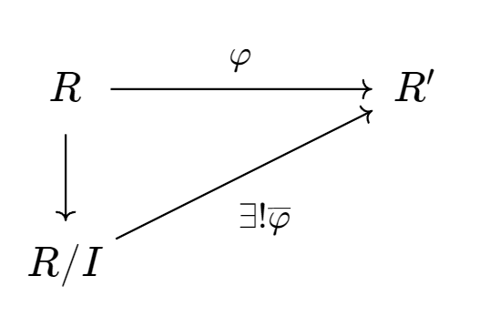
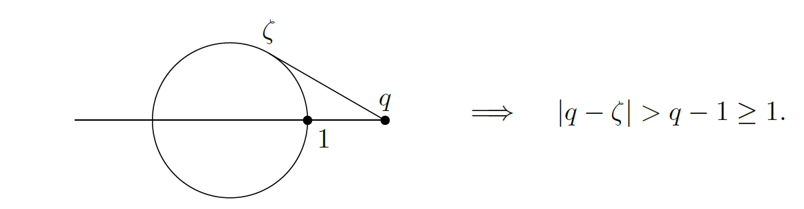
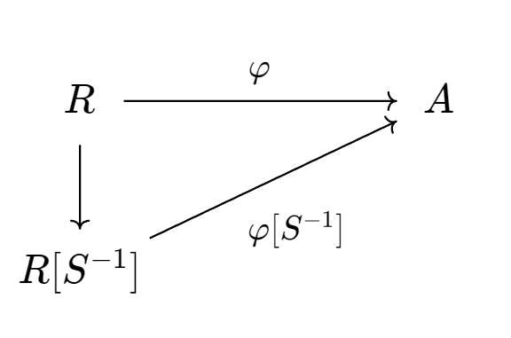
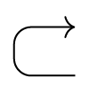

[TOC]

# 序言

## 引言

《抽代复习要点》是结合靳平老师发的《抽代教学要点》进行复习用的笔记，笔记涉及到部分群表示论，范畴论内容.

## 参考资料

[1]Hungerford, T. W. (1974). Algebra. 德国: Springer.

[2]近世代数引论. (2009). 中国: 中国科学技术大学出版社.

[3]近世代数. (2009). 中国: 科学出版社.

[4]李. (2021). 代数学方法. 中国: 高等教育出版社.

# 群论部分

## 证明一个集合在给定的运算下构成群, 分若干步骤验证群的公理定义.

[证明] 对于集合$A$以及$A$上的代数运算$\cdot$
对于$\cdot$若其满足结合律，即对于任意的$a,b,c \in A$有$(a\cdot b)\cdot c = a \cdot (b\cdot c)$并且对于任意的$a,b \in A$其满足$a \cdot b \in A$(封闭性，或称代数运算的良定义)，则其构成一个半群(semi-group)若对于半群$A$存在一个单位元(identity，也常常称为幺元)$e \in A$满足$\forall a \in A$都有$ea = a = ae$则称$A$为幺半群(monoid). 

若对于幺半群$A$，其每个元素均可逆，即对于任意的$a \in A,\exists a^{-1} \in A$$\Rightarrow$ $aa^{-1} = a^{-1}a = e$则称$A$为一个群(Group).

其定义可以简化为：
对于给定资料$(A,\cdot)$,若其满足以下条件，我们将其称之为群:

1. (封闭性)$\forall a,b \in A, a\cdot b \in A$ .

2. (结合律)$\forall a,b,c \in A$，$(a\cdot b)\cdot c = a\cdot (b\cdot c)$.

3. (左[右]单位元 $\exists e \in A$，$\forall a \in A ,ea = a$.

4. (左[右]逆元) $\forall a \in A$，$\exists a^{-1} \in A, a^{-1}a = e$.

接下来验证该定义合理.
由前两个条件不难得出$A$对于代数运算$\cdot$构成一个半群.
接下来验证3.和4.使$A$构成一个群.
对于任意的$a\in A$，由于存在$a' \in A, a'a = e$
于是对于$a'\in A,\exists a'' \in A, a''a' = e$
于是有$ea = (a''a')a = a''(a'a) = a''e = a$,
接下来证明左单位元也是右单位元
$ae = a(a'a) = (aa')a = e(aa')a = (a''a')aa'a = a''(a'a)a'a = a''e = a = ae$
于是不难得出$ae = ea$，即$a'' = a''e = ae = a$即$aa' = e\land a'a =e$.$\Box$

此外还有一些其他等价定义，在此不过多赘述.

此外验证一个假的，容易造成混淆的定义:
对于给定资料$(A,\cdot)$,若其满足以下条件:

1. (封闭性)$\forall a,b \in A, a\cdot b \in A$ .

2. (结合律)$\forall a,b,c \in A$，$(a\cdot b)\cdot c = a\cdot (b\cdot c)$.

3. (左单位元) $\exists e \in A$，$\forall a \in A ,ea = a$.

4. (右逆元) $\forall a \in A$，$\exists a^{-1} \in A, aa^{-1} = e$.

  

问:我们是否能将其称为群(见GTM73.Chapter 2.1 Exercise 3)
首先，显然有$A$是一个半群，接下来验证$A$是否能够构成一个群.
$\forall a \in A$由于其存在一个$a'$使得$aa'= e$于是有
$$
ea = (aa')a
$$
对于$a'$存在一个$a'' \in A$使得$a'a'' = e$于是有
$$
e = aa' = a'a''
$$
即有
$$
ae = a(a'a'') =(aa')a'' = a''
$$
于是有
$$
a''a' = aea' = aa' = e
$$
即
$$
a''a' = a'a''
$$
于是有对于$a'$其满足左逆元即右逆元
接下来由于
$$
a'e = a'a''a' =a''a'a' = (a''a')a' = ea'
$$
于是对于$a'$其满足左单位元即右单位元
__但是我们忽略了一点__，即$a'$不一定可以覆盖整个集合$A$，虽然对于每一个元$a$都有一个$a'$但是$a'$所构成的集合不一定为$A$，这在半群中是可能的(比如存在两个元素共用一个逆元的情况).所以上述定义只能验证$a'$所组成的集合$A'$构成一个群但是无法验证$A$是一个群$\Box$

## 子群的定义以及判别条件.

由集合与子集的定义，线性空间与子空间不难推知出子群的定义.
即在保持群结构的前提下(即保持单位元，结合律，逆元)群$G$的一个子集.
于是不难得到子群的定义如下:
设$G$为群，子集$H \subset G$被称为$G$的子群，如果

1. $H$是一个子幺半群

2. 对于任意的$x \in H$满足$x^{-1}\in H$.

接下来我们研究如何快速地判别子集$H$是$G$的子群

1. $H$对于代数运算封闭，即代数运算限制在$H$上是$H$上的代数运算
2. $H$具有单位元$e$使得对于任意的$h \in H$有$e_Hh = h = he_H$
3. 对于任意的$h\in H$存在$h^{-1}$使得$h^{-1}h = e$

不难得知由于对于所有的$h\in H$显然有$h\in G$($H \subset G$)
于是有$e_Hh = h = he_H$，由于$h \in G$于是不难得出$e_H = e_G$.

若有$\forall a,b \in H$，$a^{-1}b \in H$则自然有$a^{-1}a = e\in H$并且对于任意的$a^{-1},b \in H$有$a,b \in H$这也保证了封闭性.并且满足逆元$a^{-1}e \in H$，于是$H$满足我们先前所述的三个条件，即$H$为$G$的一个子群.
于是我们证明了子群的判别条件为$\forall a,b\in H,a^{-1}b\in H$.$\Box$
另外，若$H$是$G$的子群，我们将其记为$H \leq G$

## 正规子群的定义以及判别条件

正规子群是一种特殊的子群，这是我们在研究商集以及群同态时所广泛用到的一类子群.
对于子群$H$，若其满足$\forall x \in G,xH = Hx$则将其称为$G$的一个正规子群，将其记为$H \lhd  G$，不难发现对于正规子群，其定义可以写为以下这种更容易进行判别的定义:
$\forall x \in G, xHx^{-1} \subset H$，接下来我们来验证这个定义进行判别的合理性.设$H$是一个子群，并且其满足$\forall x \in G,xHx^{-1} \subset H$则对于任意的$x \in G,h \in H$存在$h' \in H$使得$xhx^{-1} = h'$即$xh = h'x$即$xH = Hx$即$H\lhd G$.
于是我们验证了正规子群的定义可以改写为$\forall x \in G,xHx^{-1} \subset H$是正规子群的定义，不难发现相比于原来的正规子群定义，该定义更有利于确定子群$H$是$G$的正规子群.$\Box$

## 群同构概念, 群的同构分类(即验证同构为等价关系).

群同构: 同构为保持结构的双射，于是群上的同构应当为保持群结构的一个双射，接下来我们讨论群同构是怎样的一个映射?
首先，显然有同构是一个双射，其次由于同构保持群结构.
于是对于群$G$和$G'$有同构$f : G \to G'$有其保持结合律，逆元以及单位元，由于$G'$对其乘法保持结合律，于是同构映射不必考虑结合律有关的问题，接下来考虑逆元以及单位元.由于同构需要保持结构不变，于是对于$G$中成立的$g_1,g_2 \in G$,$g_1g_2 = g_1 \cdot g_2$有$f(g_1g_2) = f(g_1)f(g_2)$.
即对于单位元$e_G$有$f(g)f(e_G) = f(g)$即$f(e_G) = e_{G'}$，并且由于群是集合上的特殊结构，于是群同构的前提是其对应集合能够保持同构，即映射必须为双射.

于是我们得到了群同构的定义:
设$G$和$G'$为群，映射$f: G \to G'$如满足下述条件则称为同构.

1. $\forall x,y \in G , f(xy) = f(x)f(y)$.

2. $f(e_G) = e_{G'}$.

3. $f$为双射

对于只满足前两条关系的映射我们称其为群同态，是最主要的保持群结构的映射.

接下来我们验证同构为等价关系，考虑群范畴$\text{Grp}$的对象集$Ob(\text{Grp})$即所有的群所构成的集合，记同构关系为$\sim$于是不难得出以下结论:

1. (自反性，亦称反身性)对象到自身的恒等映射$\text{id}$为一个同构，即$\forall G \in Ob(\text{Grp})$有$G \sim G$
2. (对称性) 考虑$\text{Hom}(G,G')$中的双射$f$，显然有$f$为一个同构(群范畴中所有的态射均为群同态)于是由于$f$为一个双射，不难对其取逆得到$f^{-1} : G \to G'$，显然有$f^{-1}$也为双射，接下来需要验证$f^{-1} \in \text{Hom}(G',G)$，由于$\forall a',b' \in G',\exists ! a,b \in G, f(a) = a',f(b) = b'$于是有$a = f^{-1}(a'),b = f^{-1}(b')$于是显然有$f^{-1}(e_{G'}) = e_G$并且$f^{-1}(a'b') = ab = f^{-1}(a')f^{-1}(b')$于是有$f^{-1}$为同构，即若$G \sim G'$有$G' \sim G$.
3. (传递性) 考虑同构$f:G \to G',g:G' \to G''$由于同构均为双射，于是有$g \circ f$也为双射($\circ$为态射的合成)，接下来验证$g \circ f$为同构，由于范畴中态射合成满足如下公理$$\begin{eqnarray} \text{Hom}(G,G') \times \text{Hom} (G',G'') &\to& \text{Hom}(G,G'') \\ (f,g) &\mapsto& g\circ f\end{eqnarray}$$于是有$g\circ f$显然为一个同态，于是$g\circ f$为一个同构，即同构的合成仍然为同构.
   于是同构满足等价关系的三条性质的定义，即同构为一个等价关系.
   我们可以利用同构的概念将群范畴$\text{Grp}$中对象集的元素划分为若干个同构类.这些同构类也称为本质类.

## 叙述并证明Lagrange 定理.

定理(Lagrange) 设$G$为一个群，$H$为$G$的一个子群，于是有$|G| = [G:H]|H|$.

[证明] 由于$G$为一个群，$H \leq G$于是可以对于$G$做出如下分拆$G = \bigcup_{i\in I}g_i H_i$，$I$为指标集，并且有$g_iH \cap g_j H = \varnothing$(验证:若存在$g \in g_iH \cap g_j H$于是存在$h' \in H,h'' \in H$，$g_i h' = g_j h'' = g$即$g_i \in gH,g_j \in gH$而$|gH| = |H| = |g_iH| = |g_jH|$即$g_i H = g_j H$)于是得到$|G| = |I| |H|$由于$|I| = \frac{|G|}{|H|} = [G:H]$于是Lagrange定理成立$\Box$

## 群元素的阶公式$o(g^n) = \frac{o(g)}{(o(g),n)}$探讨在什么条件下$o(ab) = o(a)o(b)$

[证明]
以$g^n$为生成元生成一个循环群$G_n$，$g$为生成元生成一个循环群$G$
于是对于任意的$h \in G_n$有$h = (g^n)^r$于是$G_n \leq G$
有Lagrange定理可知$|G|= [G:G_n]|G_n|$即$o(g) = o(g^n)[G:G_n]$
令$r = (o(g),n)$不难得出$r|o(g)$且$r|n$并且由于$G$是一个循环群，所以由$g^r$所生成的群$G_r$为一个循环群，并且有$G_r$为$G$的一个子群.
构建映射$f: G_r \to G_n$，它将$h \mapsto h^{\frac{n}{r}}$不难验证这是一个同构映射并且不难验证这是与$G_n$同构的最小$G_r$，记$m = \frac{o(g)}{r}$显然有$o(g^r) = m$于是有$o(g^r)r = |G_n|r = |G_n|(o(g),n) = o(g)$.
即
$$
o(g^n) = \frac{o(g)}{(o(g),n)}
$$
$\Box$
接下来探讨$o(ab) = o(a)o(b)$所需要满足的条件:
断言:$o(ab) = [o(a),o(b)]$
[证明] 
对于$a,b$显然有$a^{[o(a),o(b)]} = b^{[o(a),o(b)]}= e$于是$(ab)^{[o(a),o(b)]} = a^{[o(a),o(b)]}b^{[o(a),o(b)]} = ee = e$于是有
$$
o(ab) | [o(a),o(b)]
$$
由于$\forall r|[o(a),o(b)]$有
$$
(ab)^r = a^r b^r \neq e
$$
于是有$[o(a),o(b)] | o(ab)$即$[o(a),o(b)] = o(ab)$
由于$o(a)o(b) = [o(a),o(b)](o(a),o(b))$于是若$(o(a),o(b)) =1$则有$[o(a),o(b)] = o(ab) = o(a)o(b)$$\Box$

## 证明子群的乘积公式: $|AB| = \frac{|A||B|}{|A\cap B|}$

[证法1 GTM73]

由于$A$和$B$都是子群，于是有$A\cap B \neq \varnothing$不难验证得到$A\cap B$是子群.

接下来对于$AB$中$B$的部分有
$$
B = \bigcup_{i\in I}A\cap Bb_i
$$
再对于$AB$可以分解为
$$
AB = A\bigcup_{i\in I} A\cap Bb_i = \bigcup_{i \in I} A\cdot A\cap Bb_i = \bigcup_{i\in I} Ab_i
$$
于是有下式成立
$$
|AB| = |I||A|
$$
由对$B$的分拆不难得出$|I| = [B:A\cap B] = \frac{|B|}{|A\cap B|}$

于是可以得知
$$
|AB| = \frac{|A||B|}{|A\cap B|}
$$
$\Box$

[证法2 ]

易知$AB = \bigcup_{a\in A}B$于是不妨记$\Sigma = \{aB | a\in A\}$则有$|AB| = |\Sigma||B|$

于是自然得到一映射
$$
\begin{eqnarray}
\phi : A/A\cap B &\to& \Sigma\\
x(A\cap B) &\mapsto& xB \notag
\end{eqnarray}
$$
接下来对其进行验证

1. 验证映射为良定义(well-defined) 若$x(A\cap B) = y(A\cap B)$则存在$g,g' \in A\cap B$使得$xg = yg'$即$y^{-1}x \in A\cap B$于是对于$xB$和$yB$由于$y^{-1}x \in A\cap B \subset B$于是有$x \in yB$即$xB = yB$于是得到映射为良定义的.
2. 下一步验证映射为单射，若有$xB = yB$且$\phi(x(A\cap B)) = xB$，$\phi(y(A\cap B))=yB$,由于$xB = yB$于是有$y^{-1}x \in B$并且由于$\Sigma$中$x \in A$于是必然有$y^{-1}x \in A$即$y^{-1}x \in A\cap B$即$x(A\cap B) = y(A\cap B)$.
3. 由于对于任意的$x\in A$有$x(A\cap B) \in A/A\cap B$于是对于任意的$xB \in \Sigma$存在$x(A\cap B)\in A/A\cap B$使得$\phi(x(A\cap B)) = xB$即为满射.

于是我们验证了$\phi$是一个双射，即$|\Sigma| = |A/A\cap B| = \frac{|A|}{|A\cap B|}$

于是
$$
|AB| = \frac{|A||B|}{|A\cap B|}
$$
$\Box$

## 证明群同态基本定理(群的第一同构定理)

在证明群的同态基本定理之前，我们先提出几个引理并且验证其合理性.

### 引理部分

引理1 : 若存在一个群同态$\varphi : G \to G'$使得$(x\sim y) \Rightarrow \varphi(x) = \varphi(y)$ ，于是必然存在唯一的同态$\overline{\varphi} : G/\sim \to G'$使得下图表交换(即态射合成)称$\overline{\varphi}$为诱导同态.

[证明]

易证$\sim$是一个等价关系.

存在性: 

定义$\overline{\phi}$如下
$$
\begin{eqnarray}
\overline{\varphi}: G/\sim &\to& G'\\
[x] &\mapsto& \varphi(x)\notag
\end{eqnarray}
$$

接下来验证$\overline{\varphi}$良定义，对于$[x] = [y]$有$x\sim y \Rightarrow \varphi(x) = \varphi(y)$于是有$\overline{\varphi}([x]) =  \overline{\varphi}([y])$于是映射是良定义的.

下一步验证$\overline{\varphi}$是同态
$$
\overline{\varphi} ([xy]) = \varphi(xy) = \varphi(x)\varphi(y) =\overline{\varphi}([x])\overline{\varphi}([y])
$$
即$\overline{\phi}$是一个同态.

唯一性:

假设还存在$\psi : G/\sim \to G'$也为同态

于是有$\psi([xy]) = \psi([x])\psi([y])$,于是有$\psi([e]) = e_{G'} = \overline{\phi}([e])$.

若有$\psi([x]) \neq \overline{\varphi}([x])$

则有
$$
\psi([x]) \neq \varphi(x)
$$
则对于$\theta :G \to G/\sim$有$\psi \neq \overline{\varphi} \circ \theta = \varphi$即$\psi$不能使图表交换.$\Box$

引理2 : 设$\varphi: G \to G'$是满同态.定义$M$上的等价关系$x\sim y \Leftrightarrow \varphi(x) = \varphi(y)$.则$\sim$满足$(x\sim x')\land (y\sim y') \Rightarrow xy \sim x'y'$,而且其诱导同态$\overline{\varphi}: G/\sim \to G'$是同构.

[证明]

首先，显然有$\overline{\varphi}$是一个同态(根据引理1)

其次，由于其满足$x\sim y \Leftrightarrow \varphi(x) = \varphi(y)$.于是对于$xy$有若$x\sim x'$且$y\sim y'$则$\varphi(x) = \varphi(x')$且$\varphi(y) = \varphi(y')$即$\varphi(xy)= \varphi(x)\varphi(y) = \varphi(x')\varphi(y') = \varphi(x'y')$其满足条件$(x\sim x')\land (y\sim y') \Rightarrow xy \sim x'y'$.

接下来验证其诱导同态是一个同构.

从前文的证明中我们知道只需要验证诱导同态是一个双射即可.

由于$\overline{\varphi} : G/\sim \to G'$若有$\varphi(x) = \varphi(y)$则有$[x]  = [y]$于是有$\overline{\varphi}$是一个单射.

由于$\varphi$是一个满同态，于是不难验证$\overline{\varphi}$是满射.

即$\overline{\varphi}$是双射亦即$\overline{\varphi}$是一个群同构.

接下来，记$N :=\{x \in G : 1\sim x\}$于是可以得到
$$
x\sim y \Leftrightarrow (x^{-1}y \in N)
$$
因此等价关系完全由集合$N$所确定.反之，给定集合$N$可以直接验证上式给出一个等价关系当且仅当$N$包含单位元$e$并且对于取逆与乘法封闭，由我们前文对于子群的讨论可以得知，$N$是一个子群.若引理$1$成立，即$\varphi$是一个同态时，自然有$\text{Ker} \varphi := N$是一个正规子群.其证明如下:
$$
\forall a\in \text{Ker}\varphi, x \in G\Rightarrow \varphi(xax^{-1})=\varphi(x)\varphi(a)\varphi(x^{-1}) =e_{G'} \Rightarrow xax^{-1} \in \text{Ker} \varphi \Rightarrow x\text{Ker}\varphi x^{-1}\subset \text{Ker}\varphi
$$
接下来便有双射
$$
\begin{eqnarray}
G/\sim &\xrightarrow{\sim}& G/\text{Ker}\varphi\\
[x] &\mapsto& x\text{Ker}\varphi = \text{Ker} \varphi x
\end{eqnarray}
$$
于是便得到商群的定义(把$\text{Ker} \varphi$记作$N$).

定义(商群) 设$G$为群,$N$为其正规子群.在陪集空间$G/N$上定义二元运算
$$
xN\cdot yN = xyN , x,y\in G
$$
这使得$G/N$构成一个群，称为$G$模$N$的商群，其中单位元是$e\cdot N$其逆由$(xN)^{-1} = x^{-1}N$给出，不难验证其合理性，群同态
$$
\begin{eqnarray}
\pi : G &\to& G/N\\
x &\mapsto& xN \notag
\end{eqnarray}
$$
称为商同态.

不难发现由于对于任意的$xN \in G/N$总存在$x \in G$使得$\pi(x)= xN$即这是一个满同态.并且此时有$\text{Ker} (\pi) = N$.

接下来，我们便可以引出同态基本定理.

### 同态基本定理

定理(同态基本定理) : 设$\varphi:G_1 \to G_2$是群同态，则$\varphi$诱导出同构$\overline{\varphi} :G_1/\text{Ker}\varphi \xrightarrow{\sim} \text{Im} \varphi$,它映射陪集$g \cdot \text{Ker}\varphi$为$\varphi(g)$

[证明]

证明该定理即证明$\text{Im}\varphi$是$G_2$的一个子群，由于对于$a,b \in G_1$且$\varphi$是群同态，于是有$\varphi(a^{-1}b) = \varphi(a)^{-1}\varphi(b) \in \text{Im }\varphi$.即$\text{Im} \varphi$是$G_2$的一个子群.

于是不难得出$\varphi : G_1 \to \text{Im} \varphi$是一个满同态，使用引理2直接得到
$$
\overline{\varphi} : G/\text{Ker} \varphi \xrightarrow{\sim} \text{Im} \varphi
$$
$\Box$

有了同态基本定理以及两大引理，证明后面的同构第二定理以及第三定理是容易的.

## 证明群的第二同构定理

定理(第二同构定理) 设$H$是$G$的子群，$K$为$G$的正规子群，则$H \cap K$是$H$的正规子群且
$$
H/(H\cap K) \xrightarrow{\sim} HK/K
$$
[证明]

欲证
$$
H/(H\cap K) \xrightarrow{\sim} HK/K
$$
即需要构建一个同态$\varphi$使得$\text{Ker} \varphi = H\cap K$.观察需要证明的公式发现，需要构建一个$H \to HK/K$的同态$\varphi$.并且有$HK/K$的单位元为$K$.

于是不难得出$\varphi$为
$$
\begin{eqnarray}
\varphi: H &\to& HK/K\\
h &\mapsto& hK\notag
\end{eqnarray}
$$
即$\text{Ker} \varphi = \{h \in H : \varphi(h) \in K\}$即为$H\cap K$.

再证明$\varphi$为同态.

由于$\varphi(h_1h_2) = h_1h_2K = h_1Kh_2 K = \varphi(h_1)\varphi(h_2)$于是有$\varphi$为同态.

并且由于对于任意的$hK \in HK/K$有$h \in H$使得$\varphi(h) = hK$即$\varphi$为满同态，使用引理2或同态基本定理直接得到
$$
H/(H\cap K) \xrightarrow{\sim} HK/K
$$
$\Box$

## 证明群的同构第三定理

定理(同构第三定理) : 设$H \lhd G,K \lhd G$且有$K \subseteq H$则
$$
G/H \simeq (G/K)/(H/K)
$$
[证明] 

由于$H \lhd G$且$K\lhd G$于是对于$g \in G$有$gKg^{-1} \subset K$并且$H \lhd G,K \subseteq H$即$\forall h \in H$有$\forall h \in H,hKh^{-1} \subset K$即$K \lhd H$

于是$H/K$为一个商群.

接下来欲证上式，发现自左而右的证明较为复杂，所以我们可以自右而左进行证明，即证明
$$
(G/K)/(H/K)\simeq G/H
$$
不难发现我们只需要构建一个映射$\varphi : G/K \to G/H$使$\text{Ker} \varphi = H/K$即可，自然得到
$$
\begin{eqnarray}
\varphi : G/K &\to& G/H\\
gK &\mapsto& gH\notag
\end{eqnarray}
$$
于是有$\text{Ker}\varphi = \{gK \in G/K : gH \in H\}$于是有$gK \in H/K$.即$\text{Ker} \varphi = H/K$

接下来验证$\varphi$是满同态.

由于对于任意的$gH \in G/H$有$gK \subseteq gH$于是存在$gK \in G/K$使得$\varphi(gK) = gH$

并且
$$
\varphi(g_1g_2K) = g_1g_2H = g_1Hg_2H = \varphi(g_1K)\varphi(g_2K)
$$
即$\varphi$是一个满同态，使用引理2不难证得
$$
(G/K)/(H/K)\simeq G/H
$$
$\Box$

## 描述商群$G/N$ 的子群和正规子群

对于商群，我们先回顾其运算法则，其乘法定义如下，对于$aN,bN \in G/N$
$$
\begin{eqnarray}
\cdot : G/N \times G/N &\to& G/N\\
(aN)\cdot(bN) &\mapsto& (ab)N\notag
\end{eqnarray}
$$
其合理性我们在前文中已然探讨过.

接下来我们描述$G/N$的子群以及正规子群的概念，由于$G/N$也是一个群，其元素为$gN$的形式，于是其子群应当为$gN$所构成的子集的形式.并且其对于商群的乘法保持封闭，单位元以及可逆.

不难看出其单位元为$N$，若$H/N \leq G/N$则显然有$N \subset H$.

1. 对于任意的$aN,bN \in H/N$有$abN \in H/N$，得到$a,b \in H$时有$ab \in H$.
2. $e \cdot N \in H/N$，即$e \in H$，且任意的$n \in N$有$n\in H$.
3. $aN \in H/N$，有$a^{-1}N \in H/N$使得$aNa^{-1}N = N$.即$a\in H$有$a^{-1}\in H$

于是$H$是$G$的一个子群并且有$N \subset H$.

得到以下断言

若$H /N \lhd G/N$的充分必要条件是: $H \lhd G$，$N \subset H$.

[证明]

($\Leftarrow$)此时对于任意的$x\in G$有$xHx^{-1} \subset H$于是可以推广到商群

有$xNhNx^{-1}N  = xhx^{-1}N \in H/N$于是有$xNhNx^{-1}N \subset H/N$即

$H/N \lhd G/N$

($\Rightarrow$)由于$H/N \lhd G/N$于是对$xN \in G/N,hN \in H/N$有$xNhNx^{-1}N = xhx^{-1}N \in HN$，由于不一定有$xhx^{-1} \in N$于是有$xhx^{-1}\in H$于是$xHx^{-1} \subset H$于是由正规子群的定义可知$H \lhd G$.$\Box$

## 循环群的结构定理, 写出其所有子群

### 循环群复习

先回顾循环群的定义.

若群$G$是循环群(cyclic group),则存在$a \in G$使得$G = \left<  a\right> $,称$a$为$G$的一个生成元(generator).当$G$的元素个数无限时，称$G$为无限循环群;当$G$的元素为$n$时，称$G$为$n$阶循环群.

### 题外话 1 模$p$原根(初等数论)

不难发现，若$p$为素数，则$\mathbb{Z}^*_p$为一个$p-1$阶循环群(初等数论).

[证明]

若$p$为素数，由Fermat小定理(由$|\mathbb{Z}_p^*| = p-1$直接证明)得知对于任意的$\overline{a} \in Z^*_p$有$\overline{a}^{p-1} = \overline{1}$接下来只需要证明存在$\overline{g} \in \mathbb{Z}_p^*$使得其阶恰为$p-1$.

对于$\mathbb{Z}_p^*$中的所有元素取其阶构成一个集合为$\{\gamma_1,\gamma_2,\cdots,\gamma_r\}$，记$\gamma = [\gamma_1,\gamma_2,\cdots,\gamma_r]$.

不难发现$\gamma \in \mathbb{Z}_{\geq 0}$于是由唯一分解定理可以得知$\gamma = q_1^{a_1}q_2^{a_2}\cdots q_k^{a_k}$.

接下来证明存在$\overline{g}$使得$o(\overline{g}) = \gamma = p-1$.

由于$\gamma$是最小公倍数，并且由Fermat小定理可以推出$\gamma | (p-1)$接下来证明$\gamma \geq (p-1)$.

由最小公倍数的性质可以得知对于每个$s$($1\leq s \leq k$)记$\lambda_i = aq_s^{a_s}$有一元$\overline{x}$的阶为$\gamma_i = aq_s^{a_s} = \lambda _i$(由唯一分解定理可以推出)，取$x_s = \overline{x}^a$即$o(x_s) = q_s^{a_s}$.于是在$Z_p^*$中存在$k$个数$x_1',x_2',\cdots,x_k'$使得其阶分别为$q_i^{a_i}$($i=1,2,\cdots,k$)由于$(q_i^{a_i},q_j^{a_j}) = 1$于是令$g = x_1'x_2'\cdots x_n'$有
$$
o(g) = \gamma
$$
由于$\gamma$为最小公倍数，于是对于任意的$x\in Z_p^*$有$x^\gamma \equiv 1(\mod p)$，即至少有$p-1$个解，由数论上的Lagrange定理(若$p$为一个素数，$f(x)$是整系数多项式，模$p$的次数为$n$则同余方程$f(x)\equiv 0(\mod p)$至多有$n$个互不相同的解，将$x^\gamma \equiv 1(\mod p)$变为$x^{\gamma} - 1 \equiv 0(\mod p)$即可)可知$x^{n} \equiv 1(\mod p)$至多有$n$个解，于是$\gamma \geq p-1$

于是可以得到$\gamma = p-1$$\Box$

$\overline{g}$称为$Z$的一个模$p$原根(primitive root modulo $p$)

### 题外话 2 生成元(课内)

接下来揭示一个定理

定理: 设$G = \left<a\right>$为循环群，则

1. 如果$|G| = \infty$则$a$与$a^{-1}$是$G$两个仅有的生成元
2. 如果$|G| = n$则$G$恰有$\varphi(n)$个生成元，且$a^r$是$G$的生成元的充分必要条件是$(n,r) = 1$其中$\varphi(n)$是Euler函数.

[证明]

1. 存在性是显然的，接下来证明唯一性 : 设$a^k$也是$G$的生成元，存在$n\in Z$使$(a^k)^n  = a^{kn} = a$于是自然有$kn =1$即$k = \pm 1$
2. 由前文可知$o(a^r) = \frac{n}{(n,r)}$于是若$(n,r)=1$则自然可以推出$a^r$为$G$的生成元.于是由Euler函数的定义可知$G$的生成元个数为$\varphi(n)$

### 循环群的子群

定理: 循环群的子群也是循环群，其证明是显然的

[证明]

若$H = \{e\}$，则$H = \left<e\right>$是循环群

若$H \neq \{e\}$，则$H$必含有某个$a^k,k \neq 0$，因此$H$也含有$a^{-k}$，从而$H$也必然包含$a$的某些正整数幂，设$r$为$a^r \in H$的最小正整数，下面证明
$$
H = \left<a^r\right>
$$
对任意的$a^k \in H$，$k \in \mathbb{Z}$，存在$s,t \in \mathbb{Z}$,$0 \leq t <r$，使
$$
k = sr+t
$$
则有
$$
a^t = a^{k -sr} = a^k(a^{r})^{-s} \in H
$$
因为$t<r$所以由$r$的选取知$t=0$.于是
$$
a^k = a^{sr} = (a^r)^s \in \left<a^r\right>
$$
又显然有$\left<a^r\right> \subset H$

于是有
$$
H = \left<a^r\right>
$$
为循环群$\Box$

### 循环群的结构定理

设$G$为循环群

1. 如果$G = \left<a\right>$是无限循环群，则$G \simeq (\mathbb{Z},+)$
2. 如果$G = \left<a\right>$是$n$阶循环群，则$G \simeq (\mathbb{Z}_n ,+)$

[证明]

1. 令
   $$
   \begin{eqnarray}
   \varphi : \mathbb{Z} &\to& G\\
   k &\mapsto& a^k \notag
   \end{eqnarray}
   $$
   对于$k_1 = k_2$有$\varphi(k_1) = a^{k_1} = a^{k_2} = \varphi(k_2)$即$\varphi$是 一个良定义的映射.

   对于$a^{k_1} = a^{k_2}$有$k_1 = k_2$于是$\varphi$为单射，由于$k \in \mathbb{Z}$于是有$\varphi$显然是满射

   对于任意的$k_1,k_2$有
   $$
   \varphi(k_1+k_2) = a^{k_1+k_2} = a^{k_1}a^{k_2} = \varphi(k_1)\varphi(k_2)
   $$
   于是$\varphi$是一个同态映射

   综上所述:$\varphi$是一个群同构

2. 令
   $$
   \begin{eqnarray}
   \varphi : \mathbb{Z}_n &\to& G\\
   \overline{k} &\mapsto& a^k \notag
   \end{eqnarray}
   $$
   仿照前文的证明同理可以证明.$\Box$

### 循环群的所有子群

对于循环群$G = \left<a\right>$,其所有子群为$a$以$o(a)=n$的所有因子为幂生成的群(自然有单位元群).

## 设$G$ 为群, 如果$G/\text{Z}(G)$ 为循环群, 则$G $为交换群.

[证明] 若有$G/\text{Z}(G)$为一个循环群，则存在一个生成元$a\text{Z}(G)$使得任意的$g\text{Z}(G), h\text{Z}(G)\in G/\text{Z}(G)$有$g\text{Z}(G) = (a\text{Z}(G))^n$即$g\text{Z}(G) = a^n\text{Z}(G)$，同理$h\text{Z}(G) = a^m\text{Z}(G)$于是存在$c_1,c_2$，$g = a^nc_1$，$h = a^mc_2$
$$
gh = a^nc_1a^mc_2 = c_2a^{m+n}c_1 = a^mc_2a^nc_1 =hg
$$
于是$G$是一个Abelian group.

## 设$A,B \lhd G$且$A \cap B = \{e\}$，则$ab = ba,\forall a\in A,b\in B$

[证明]

由于$A,B \lhd G$并且$A \cap B= \{e\}$于是对于$a\in A$,$b\in B$有$ab = b'a = ba'$于是有
$$
b^{-1}b' = a'a^{-1} \in A\cap B=\{e\}
$$
于是有$b' = b,a'=a$即$ab = ba$$\Box$

## 置换部分

### 序言

由于《抽代复习要点》pdf中关于置换部分的排序并不合理，我们将置换群部分统一置于此处进行讨论.

此处将引用多本书的内容进行讨论(Tomas W . Hungerford ,GTM73 . Algebra,冯克勤《近世代数引论》,韩士安《近世代数》,李文威《代数学方法-基础架构》)另外GTM73部分的内容为笔者自行翻译，可能存在部分不准确之处.

### 置换

定义(置换 from GTM73) ： 在$I_n = \{1,2,\cdots,n\}$中取$r$个互异的数$i_1,i_2,\cdots,i_r$($r \leq n$)，那么$(i_1i_2\cdots i_r)$表示由以下映射所构成的置换(permutation):$i_1 \mapsto i_2$,$i_2\mapsto i_3$,$\cdots$,$i_{r-1} \mapsto i_r$,$i_r \mapsto i_1$并且将$I_n$中的一切其他元素映射至自身的原来位置(即若$r\neq i_j$,$j=1,2,\cdots,r$,有$r \mapsto r$).$(i_1,i_2,\cdots,i_r)$便称为一个长为$r$的轮换(cycle)或称其为一个$r$-轮换,一个长度为$2$的轮换称为对换(transposition).

但是置换往往不局限于$I_n$上(表示论)，比如集合$\Sigma$到自身的一个一一对应也可以称作$\Sigma$上的一个置换，以$\mathfrak{S}_\Sigma$表示$\Sigma$上所有置换所构成的集合称其为集合$\Sigma$的对称群($\mathfrak{S}$为哥特体$S$)，不难发现$|\mathfrak{S}_\Sigma| = |\Sigma|!$.由于当$\Sigma_1$与$\Sigma_2$的基数相等时，有$\mathfrak{S}_{\Sigma_1} \simeq \mathfrak{S}_{\Sigma_2}$于是当$|\Sigma| = n$时可以得到$\mathfrak{S}_\Sigma = \mathfrak{S}_{I_n}$于是研究$\mathfrak{S}_{I_n}$便可以同时研究所有基数为$n$的集合的置换群.简便起见，将$\mathfrak{S}_{I_n}$记为$S_n$.这是我们熟知的对称群的形式.对于$\mathfrak{S}_\Sigma$其每个子群都称为$\Sigma$上的置换群. 

一个置换的标记(即写成$(i_1i_2,\cdots,i_r)$的形式)并非是唯一的，严格来说，一个置换的标记通常是模棱两可的，因为$(i_1i_2\cdots i_r)$可能是$n \geq r$的$S_n$上的置换，但是这并不会造成歧义，一个$1$-轮换$(k)$是恒等置换(identity permutation,即恒等映射).显然有，一个$r$-轮换是$S_n$中一个阶为$r$的元素并且可以轻松得到如果$\tau$是一个 __轮换__ 并且有$\tau(x)\neq x$对于一些$x\notin I_n$则对于一些$d \geq 1$有$\tau = (x\tau(x)\tau^2(x)\cdots\tau^d(x)$，并且不难得到置换$(i_1i_2\cdots i_r)$的逆置换为$(i_ri_{r-1}\cdots i_2i_1) = (i_1i_ri_{r-1}\cdots i_3i_2)$

我们对其进行验证:

对于置换$(i_1i_2\cdots i_r)$有其将$i_1 \mapsto i_2$,$i_2\mapsto i_3$,$\cdots$,$i_{r-1}\mapsto i_r$于是若存在一个置换使其态射合成为一个恒等置换则需要由一族形如$i_1\mapsto i_r$,$i_r \mapsto i_{r-1}$,$i_{r-1}\mapsto i_{r-2}$,$\cdots$,$i_{2}\mapsto i_1$的映射组成一个新的置换，由前文中置换的定义便可以得知其为$(i_1i_r\cdots i_3i_2)$将前文中$i_1 \mapsto i_r$放到最后(显然不改变效果，是等价的)，则其由定义组成的置换应该为$(i_ri_{r-1}\cdots i_2i_1)$所以不难发现$(i_ri_{r-1}\cdots i_2i_1) = (i_1i_ri_{r-1}\cdots i_3i_2)$$\Box$

 不难发现存在一些置换它们可以分解成一些互不相交的轮换的乘积例如$(i_1i_2i_3)(i_4i_5)$由于它并不会将$i_3$映射至$i_4$，$i_5$映射至$i_1$而根据轮换的定义可知$(i_1i_2i_3)$和$(i_4i_5)$确构成轮换，于是存在一些置换，它们并不是轮换.

不妨对于这类置换进行定义

定义(无交置换, from GTM 73) :如果$S_n$中的一组置换$\sigma_1,\sigma_2,\cdots,\sigma_r$满足以下性质: 对于任意的$1 \leq i \leq r$，对于每个$k \in I_n$由$\sigma_i(k) \neq k$可以推出对于所有的$i \neq j$有$\sigma_j(k) = k$.则称这组置换是无交的(disjoint).

换句话说，$\sigma_1,\sigma_2,\cdots,\sigma_r$是无交的当且仅当$I_n$中的元素至多只被$\sigma_1,\sigma_2,\cdots,\sigma_r$移动一次.

接下来我们便可以回答复习要点中把一个置换写成两两无交的轮换的乘积这一问题.

定理(轮换分解 from GTM 73) : $S_n$中每一个不是恒等置换的置换都可以唯一地写成(取决于因子的顺序)长度至少为$2$的不相交轮换的乘积.

[证明] 

存在性:

取$\sigma \in S_n$，$\sigma \neq (1)$对于$I_n$定义以下关系:$x,y \in I_n $，$x\sim y \Leftrightarrow y = \sigma^m(x)$其中$m \in \mathbb{Z}$.

1. 由于$\sigma$都有阶数，记$o(\sigma) = n$于是可以得到$x = \sigma^{n}(x)$于是其满足自反性$x \sim x$
2. 若有$y =\sigma^m(x)$则$x =\sigma^n(x) = \sigma^{n-m}(y)$于是其满足对称性$x \sim y \Leftrightarrow y \sim x$
3. 若有$y = \sigma^{m}(x)$，$z = \sigma^{k}(y)$则有$z= \sigma^{m+k}(x)$即其满足传递性$x \sim y , y \sim z \Leftrightarrow x\sim z$

于是$\sim$是一个等价关系，它将$S_n$分成若干等价类.我们将其记为$\{B_i : 1\leq i \leq s\}$我们将其称为$\sigma$的轨道(orbit，群表示论内容).并且不难发现轨道可以作为$S_n$的一个商集.记$x\in B_i$则$B_i$可以写成$B_i = \{u: x\sim u\} = \{\sigma^{m}(x):m\in\mathbb{Z}\}$.

记$B_1,B_2,\cdots,B_r$,($1\leq r \leq s$)为一个包含着高于一个元素的轨道(其存在性由$\sigma \neq (1)$保证).

对于每个$i \leq r$定义一个$\sigma_i \in S_n$如下
$$
\sigma_i (x) = 
\left\{ 
\begin{array}{c}
\sigma(x) , &\text{若} & x\in B_i\\
x, &\text{若} & x\notin B_i\\
\end{array}
\right.
$$
由于限制$\sigma | B_i$是一个$B_i \to B_i$的双射，这无非就是$\sigma_i$于是每一个$\sigma_i$都是$I_n$上良定义的并非恒等置换的置换.

由于$B_i \cap B_j = \varnothing,i\neq j ,1 \leq i,j \leq r$于是有$\sigma_1,\sigma_2,\cdots,\sigma_r$是无交的轮换.

于是有$\sigma = \sigma_1\sigma_2\cdots \sigma_r$为其轮换分解.

唯一性:

对于$x \in B_i (i \leq r)$，接着由于$|B_i|$有限于是至少会存在一个正整数$d$使得$\sigma^d(x) = \sigma^j(x)$对于$0 \leq j <d$.

由于$\sigma^{d-j}(x) = x$并且$0 \leq d-j <j$于是得到$j = 0$时$\sigma^d(x) = x$

于是有$(x\sigma(x)\cdots,\sigma^{d-1}(x))$是一个良定义的轮换并且长度大于等于$2$.

若有$\sigma^m(x) \in B_i$则有$m = ad+b$其中$a,b \in \mathbb{Z}$即$\sigma^{m}(x) = \sigma^b(x) \in\{x,\sigma(x),\cdots,\sigma^{d-1}(x)\}$

即$B_ i = \{x,\sigma(x),\cdots,\sigma^{d-1}(x)\}$，不难得出$\sigma^i$是$(x\sigma(x)\cdots,\sigma^{d-1}(x))$.

接下来假设$\tau_1,\tau_2,\cdots,\tau_t$是互不相交的一组轮换并且有$\sigma = \tau_1\tau_2\cdots\tau_t$

取$x\in I_n$并且有$\sigma(x) \neq x$于是由于$\tau_i$的互不相交性可以得知存在一个唯一地$1 \leq j \leq t$使得$\sigma(x) = \tau_j(x)$

因为$\sigma\tau_j = \tau_j \sigma$于是我们得到了$\sigma^{k}(x) = \tau_j^{k}(x)$对于任意的$k \in \mathbb{Z}$.

因此$x$在$\tau_j$下的轨道即为$x$在$\sigma$下的轨道，记为$B_j$.

于是对于任意的$y\in B_i$有$\tau_j(y) = \sigma(y)$并且由于$\tau_j$是一个轮换，于是只有一个非平凡的轨道(即长度大于$1$的轨道，这是显然的，若不只有一个轨道则取另一个轨道的元素可以发现这两个轨道构成两个互不相交的轮换).

由于$x\neq \sigma(x) = \tau_j(x)$其必然是$B_i$.

因此对于所有的$y\notin B_i$都有$\tau_j(y) = y$即$\tau_j = \sigma_i$于是证明了唯一性.$\Box$

#### 题外话:群作用和计数原理(表示论，范畴论)

此处采用李文威《代数学方法——基础架构》的内容对于群作用以及计数原理进行描绘

定义(幺半群作用) 设$X$为集合，$M$为幺半群.$M$在$X$上的作用定义为一个映射
$$
a : M\times X \to X
$$
称为作用映射，它必须满足以下性质

1. 对所有的$g.g'\in M$和$x\in X$有$a(g',a(g,x)) = a(g'g,x)$(结合律)
2. 对所有的$x\in X$有$a(1,x) = x$

带有$M$作用的集合称为$M$-集.对于所有的$m,x$皆有$a(m,x) = x$的作用称为 __平凡作用__.

$M$-集间的映射$f:X \to Y$若满足
$$
f(a(m,x)) = a(m,f(x)) ,m\in M,x\in X
$$
则称为$M$-等变映射.若等变映射$M_1 \xleftrightharpoons[g]{f} M_2$满足$fg = \text{id}_{M_2},gf = \text{id}_{M_1}$(类似于函子)，则称$f,g$为互逆的同构.由此便可以定义$M$-集间同构的概念.

注记 : 给定$M$，全体$M$-集连同等边映射构成一个范畴$M-\text{Set}$.这里严格来说需要限定$M$-集$X$的大小，为了安全性考虑，必须假设$M$，$X$同属于选定宇宙$\mathcal{U}$.

习惯将$M$-集带有的作用映射略去，并将$a(m,x)$写成$m\cdot x$或者$mx$.作用映射的条件和等变性也可以自然地写成
$$
\begin{eqnarray}
m'(mx) = (m'm)x\\
1\cdot x = x\\
f(mx) = mf(x)
\end{eqnarray}
$$
其中有$m',m \in M$并且$x\in X$.这般定义称为$M$的左作用，因以$M$的左乘表示.

同样地，可以定义$M$的右作用$(x,m)\mapsto xm$.

例1 : 对于任意集合$X$,其对称群$\mathfrak{S}_X$当然地作用在$X$上 : $a:(\sigma,x) \mapsto \sigma(x)$类似地，实$n \times n$矩阵所构成的幺半群$M_n(\mathbb{R})$作用于$\mathbb{R}^n$:视$\mathbb{R}^n$元素为$n\times 1$阶列向量，则作用$(A,x)\mapsto Ax$无非就是矩阵乘法.

例2 : 若群$G$左作用于$X$，而$Y$是任意集合，则$G$在$\{f: \text{映射} X \to Y\}$上有自然的左作用$a(g,f) = [x\mapsto f(g^{-1}x)]$;

验证: 

对于$g'gf = a(g',[x\mapsto f(g^{-1}x)]) = [x\mapsto f(g^{-1}g'^{-1}x)] = [x\mapsto f((g'g)^{-1}x)]$即满足结合律.

并且有$1\cdot f = [x \mapsto f(1^{-1}x)] = f$

于是确为左作用.$\Box$

接下来讨论作用中的特殊元素.

定义 设幺半群$M$作用于$X$.定义

* 不动点集$X^M := \{x\in X:\forall m\in M ,mx =x\}$
* 对于$x\in X$，轨道$Mx := \{mx:m\in M\}$，其元素称为该轨道的代表元，轨道$Mx$是$X$的$M$-子集
* 承上，其稳定化子定为$M$的子幺半群$\text{Stab}_M(x) := \{m\in M:mx = x\}$

不难发现不动点集和中心的定义类似(不过是在集合$X$上)，稳定化子和$x$的中心化子的定义类似.

当然，最常见的作用还是群作用.对于群$G$，作用的基本构件是形如$G/H$的陪集空间，其作用映射由$(g,xH) \mapsto gxH$给出.以下结果告诉我们如何将一般的$G$-集分解为陪集空间中的无交并.这也正是计数原理的出发点.

引理 设群$G$作用于$X$，则

1. 有轨道分解$X = \bigsqcup_x Gx$($\bigsqcup$表示无交并)，其中我们对于每个轨道选定代表元$x$

2. 对每个$x\in X$，映射
   $$
   \begin{eqnarray}
   G/\text{Stab}_G(x) &\to& Gx\\
   g \cdot \text{Stab}_G(x) &\mapsto& gx
   \end{eqnarray}
   $$
   是$G$-集间的同构;

3. 特别地，我们有基数的等式
   $$
   |X| = \sum_x [G:\text{Stab}_G(x)]
   $$

4. 对所有$x\in X$和$g\in G$有
   $$
   \text{Stab}_G(gx) = g\text{Stab}_G(x)g^{-1}
   $$

[证明]

1. 假设$Gx,Gy$有交，则$h \in Gx \cap Gy$于是有$h = gx = g'y$由于$gx \in X$于是有$Gg = \{gx:g\in G\}$于是有$x,y\in gH$于是$Gx = Gy$并且由于$1\cdot x = x$可知对于任意的$x \in X$，存在$Gx$使得$x\in Gx$于是轨道分解成立.

2. 由于稳定化子$\text{Stab}_G(x) := \{g\in G:gx = x\}$于是有$g \cdot \text{Stab}_G(x) \mapsto gx$映射为良定义的(对于$g_1\cdot \text{Stab}_G(x) = g_2\cdot\text{Stab}(x)$有$g_2^{-1}g_1\in \text{Stab}(x)$，即$g_2^{-1}g_1x = x$即$g_1x = g_2x$)

   映射满射(对于任意的$g\in G,g \in g\text{Stab}_G(x)$)

   映射单射(若有$g_1x = g_2x$则$g_2^{-1}g_1 \in \text{Stab}_G(x)$于是是单射)

   于是映射是$G$-集之间的同构.

3. 由轨道分解配合2.直接得到

4. $\text{Stab}_G(gx) = \{g'\in G : g'(gx) = x\}  = \{gg'g^{-1} \in G: g'x = x\}= g\text{Stab}_G(x)g^{-1}$

不难发现性质"$x,y$属于同一轨道"给出$X$上的等价关系.相应的商集叫做轨道空间记为$G\setminus X$;对于右作用，轨道空间记为$X/G$.

留意到 __$G$在$X$上的作用相当于给定同态$G \to \mathfrak{S}_X$，它将$g$映射为$[x\mapsto gx]$是一个置换__.

定义:
设$G$为群，$X$为$G$-集，我们称$G$在$X$上的作用是
* 忠实的，如果相应的$G \to \mathfrak{S}_X$是单射，这相当于$\bigcap_{x\in X}\text{Stab}_G(x) = \{e\}$.
* 自由的或单的，如果对于任意的$x\in X$都有$\text{Stab}_G(x) = \{e\}$
* 传递的，如果$X$仅有一个轨道，这相当于要求$X$非空，并且对于所有的$x,y \in X$皆存在$g \in G$使得$gx = y$
* 推而广之，若对于每个$1\leq m \leq n$，群$G$在$\{(x_1,\cdots,x_m)\in X^m:\text{相异元}\}$上的作用皆为传递的，则称$G$在$X$上的作用为$n$传递.
* 传递的$G$-集又称为$G$-齐性空间，自由的$G$-齐性空间称为$G$-主齐性空间或挠子(在模论中将广泛使用)
根据引理不难发现陪集空间$G/H$在同构意义上穷尽了所有的齐性空间.

例3 (平移作用与陪集) 设$G$为群而$H$为其子群，则$H$在$G$上的左作用为$(h,g) \mapsto hg$为平移作用.易见
1. 相应的轨道无非是陪集$Hg(g\in G)$
2. 轨道空间无非是陪集空间$H\setminus G$
3. 此作用是自由的，它是传递的当且仅当$H = G$
这些断言对于右平移作用也成立，只需要将其改为$(g,h) \mapsto gh$相应的轨道空间无非是$G/H$
现在设$H,K$为$G$的子群，双陪集有类似的解读: __考虑$H \times K^{op}$在$G$上的左作用__
$$
((h,k),g) \mapsto hgk, (h,k) \in H \times K^{op} ,g\in G
$$
其相应的轨道正好就是双陪集$HgK(g\in G)$，轨道空间等同于$H\setminus G/K$.

例4(共轭作用) 依旧设$G$为群，伴随自同构$\text{Ad} : G \to \text{Aut}(G)$给出的作用称为$G$的共轭作用$G \times G \to G$定义展开后无非是
$$
(g,x) \mapsto ^gx := gxg^{-1}
$$
共轭作用下的轨道称为$G$的共轭类.

推而广之，对任意的子集$E \subset G$我们业已定义子群$N_G(E)$(正规化子)，它在$E$上的作用也叫共轭.若两子集$E$,$E’$满足$\exists g \in G, E’ = gEg^{-1}$则称$E$与$E’$共轭.

非交换群共轭作用一般非常复杂.对于$x\in G$，其稳定化子群正是中心化子$Z_G(x)$.而不动点集正是中心$Z_G$.

挠子是一个特别常见的$G$-集，这套语言需要有合适的几何背景

例5 设$G_1,G_2$为群，置
$$
\text{Isom}(G_1,G_2) := \{\text{同构} \varphi :G_1 \to G_2\}
$$
当$\text{Isom}(G_1,G_2)$非空时，其上有$\text{Aut}(G_2)$的左作用$(g,\varphi) \mapsto g\circ \varphi$,其中$g \in \text{Aut}(G_2)$这使得$\text{Isom}(G_1,G_2)$称为$\text{Aut}(G_2)$-挠子.虽然这里只考虑群同构，但是类似的构造可以在任何的范畴中进行.

我们当然不必局限于左作用，$\text{Aut}(G_1)$也借合成右作用于$\text{Isom}(G_1,G_2)$，两侧作用满足$(g\circ \varphi)\circ g’ = g\circ (\varphi \circ g’)$，故可并作$\text{Aut}(G_1)^{op}\times \text{Aut}(G_2)$-作用，无论从左还是从右来看$\text{Isom}(G_1,G_2)$都是挠子，这样的结构称为双挠子.

引理 : 设$X$为非空$G$-集，则$X$为挠子当且仅当映射
$$
\begin{eqnarray}
\Phi : G \times X &\to& X \times X\\
(g,x)&\mapsto& (x,gx)
\end{eqnarray}
$$
为双射.
[定义] 根据定义有$\Phi^{-1}(x,y) =\{g\in G: gx = y\}$取$y = x$时为$\text{Stab}_G(x)$，将$x$遍历$X$因此$\Phi$是单射当且仅当$X$自由，并且由于$\Phi : G \times X \to X\times X$于是若对于任意的$(x,y)$若存在一个$(g,x)$使得$\Phi(x,gx) = (x,gx) =(x,y)$于是当$y$遍历$X$时,不难发现$X$上仅有一个轨道，即$X$是传递的.
由于$\Phi$为双射时，$X$既是自由的又是传递的，即$X$是一个挠子$\Box$

接下来我们便可以解决如下问题:

##### 叙述Cayley 定理.

Cayley定理是Yoneda引理在群上的表现.

定理(Cayley) 每个群$G$均同构于对称群$\mathfrak{S}_G$的子群(表示论).

###### 表示论证法

证明： 由于正则表示$\rho : G \to \mathfrak{S}_G$是忠实的($\rho$为单同态).根据同态基本定理，$G$同构于$\rho(G)$,显然有$\rho(G)$是$\mathfrak{S}_G$的子群，证毕$\Box$

###### 范畴论证法

使用Yoneda引理证明(范畴论可表函子) :
考虑只有一个对象$*$的广群$C$,于是有$End(*,*)$是群$G$，对于函子$F : C \to \text{Set}$，其对象集为一个集合$X$其态射集为一个群同态$G \to \mathfrak{S}_X$,$\mathfrak{S}_X$是$X$的一个对称群，换句话说，$X$是一个$G$集，对于$G$集之间的保构态射$\alpha :X \to Y$有性质$\alpha (g \cdot x) = g \alpha(x)$对于所有的$g \in G$和$x \in X$.

考虑$h_C(*)$和群$G$到自身集合($\mathfrak{S}_G$)的作用,由米田引理有$Hom_{C^{\land}}(h_C(*),h_C(*)) \simeq End(*)$.

于是对于$G$集到自身的保构态射是一个$G$内的元素.

于是不难发现这些同态在态射的合成下构成$\mathfrak{S}_G$的子群. $\Box$

#### 言归正传 置换分解

由于前文我们已然证明了$o(ab) = [o(a),o(b)]$并且轮换实为一个置换.于是有以下结论

结论(置换的阶) : 置换$\sigma\in S_n$的阶为其唯一分解式中所有$\sigma_i$的阶的最小公倍数.

由于前文说明了置换可以进行分解，但事实上我们经常使用的是将其分解为可以相交的对换之积的形式，以便讨论它们的奇偶性，接下来我们先证明一个结论.

结论: $S_n$中任何一个置换都可以分解为对换的乘积(不一定无交)

[证明]

根据之前的定理可以得知置换$\sigma \in S_n$可以分解为若干个轮换的乘积，接着只需要证明轮换$(i_1i_2\cdots i_r)$可以分解为若干对换的乘积即可，由于$(i_1i_2\cdots i_r)$实际上为一个映射$i_1 \mapsto i_2$,$i_2\mapsto i_3$,$\cdots$,$i_r \mapsto i_1$于是其可以进行拆分为$(i_1i_r)(i_1i_{r-1})\cdots(i_1i_3)(i_1i_2)$.$\Box$

### 奇置换和偶置换

接下来根据$\sigma \in S_n$能被拆分成的对换的个数进行讨论.

定义(置换的奇偶性) $S_n$中的一个置换$\tau$被称为是偶置换(奇置换)如果$\tau$可以被写成偶数个(奇数个)对换的乘积.

接下来我们证明$S_n$中的置换要么是奇置换要么是偶置换.

定理: 一个$S_n$中的置换不可能既是奇置换又是偶置换.

[证明]

以$i_1,i_2,\cdots,i_n$以某种顺序表示$1,2,\cdots,n$，并且定义$\Delta(i_1,i_2,\cdots,i_n)$为整数$\prod(i_j - i_k)$,这个乘积覆盖了所有形如$(j,k), 1\leq j < k \leq n$的对.

不难发现$\Delta(i_1,i_2,\cdots,i_n) \neq 0$，接下来我们取$S_n$中的一个对换$\sigma = (i_ci_d),c<d$计算$\Delta(\sigma(i_1),\sigma(i_2),\cdots,\sigma(i_n))$.

于是我们得到$\Delta(i_1,i_2,\cdots,i_n) = (i_c - i_d)ABCDEFG$

其中$ABCDEFG$分别如下所示
$$
\begin{eqnarray}
A &=& \prod_{\begin{array}{c}j<k\\j,k \neq c,d\end{array}}(i_j - i_k)\\
B &=& \prod_{\begin{array}{c}j<c\end{array}}(i_j - i_c)\\
C &=& \prod_{\begin{array}{c}j<c\end{array}}(i_j - i_d)\\
D &=& \prod_{\begin{array}{c}c<j<d\end{array}}(i_j - i_d) \\
E &=& \prod_{\begin{array}{c}c<k<d\end{array}}(i_c - i_k) \\
F &=& \prod_{\begin{array}{c}d<k\end{array}}(i_c - i_k) \\
G &=& \prod_{\begin{array}{c}d<k\end{array}}(i_d - i_k)
\end{eqnarray}
$$
于是我们可以得到
$$
\sigma(A) =  \prod_{\begin{array}{c}j<k\\j,k \neq c,d\end{array}}(\sigma(i_j) -\sigma( i_k)
$$
对$B$和$C$以及其他元素做类似操作得到$\sigma(B)$和$\sigma(C)$等

不难发现由于$\sigma = (i_ci_d)$有$\sigma(A) = A$，$\sigma(B) = C$，$\sigma(C) = B$，$\sigma(D) = (-1)^{d-c-1} E$，$\sigma(E)  = (-1)^{d-c-1}D$，$\sigma(F) = G$，$\sigma(G)=F$另外$\sigma(i_c - i_d) = -(i_c-i_d)$

于是我们得到$\Delta(\sigma(i_1),\sigma(i_2),\cdots,\sigma(i_n)) = (-1)^{2d-2c-2+1}\Delta(i_1,i_2,\cdots,i_n) = -\Delta(i_1,i_2,\cdots,i_n)$.

于是对于$\tau \in S_n$，根据之前的结论对其进行对换分解得到$\tau= \tau_1\tau_2\cdots\tau_r = \sigma_1\sigma_2\cdots\sigma_s$其中$\tau_i$和$\sigma_j$都是对换并且$r$为偶数$s$为奇数

于是有$\Delta(\tau(1),\cdots,\tau(n)) = \Delta(\tau_1\tau_2\cdots\tau_r(1),\cdots,\tau_1\tau_2\cdots\tau_r(n)) = \Delta(\sigma_1\sigma_2\cdots\sigma_s(1)\cdots,\sigma_1\sigma_2\cdots\sigma_s(n))$.

不难得出$\Delta(\tau_1\tau_2\cdots\tau_r(1),\cdots,\tau_1\tau_2\cdots\tau_r(n)) = \Delta(1,2,\cdots,n)$

但是$\Delta(\sigma_1\sigma_2\cdots\sigma_s(1)\cdots,\sigma_1\sigma_2\cdots\sigma_s(n)) = -\Delta(1,2,\cdots,n)$造成矛盾.

于是一个置换不能既是奇置换又是偶置换.$\Box$

于是奇置换和偶置换便可以对$S_n$中所有的置换进行划分.

对于奇偶置换，我们通常使用一个标志(sign)进行表示，用sgn表示
$$
\text{sgn} \tau =
\left\{
\begin{array}{c}
-1,&\tau\text{是奇置换}\\
1,&\tau\text{是偶置换}\\
\end{array}
\right.
$$

### 型理论(置换共轭)
节选自冯克勤《近世代数引论》Ｐ27
现在研究$S_n$中元素的共轭分类.设$\sigma \in S_n$由分解定理可知$\sigma$可以唯一的分解为若干个不相交的轮换的乘积.如果其中长为$r$的轮换共有$\lambda_i$个($1\leq r \leq n$)，于是则称置换$\sigma$的型为$1^{\lambda_1}2^{\lambda_2}\cdots n^{\lambda_n}$当$i^{\lambda_i} = i^0$时可以略去.
接下来得到
定理: 对称群$S_n$中两个置换共轭的充要条件是它们具有相同的型.
[证明] 
($\Rightarrow$)设$\sigma$和$\sigma’$是$S_n$中两个置换.若$\sigma$与$\sigma’$共轭，则存在一个$\tau \in S_n$使得$\sigma’ = \tau \sigma \tau^{-1}$将$\sigma$表示成无公共元素的轮换之积:
$$
\sigma = (a\,b\,\cdots\,c)\cdots(\alpha\,\beta\,\cdots\,\gamma)
$$
则有
$$
(\tau\sigma\tau^{-1})(\tau(a)) = (\tau(a)\,\tau(b)\,\cdots\,\tau(c))\cdots(\tau(\alpha)\,\tau(\beta)\,\cdots\,\tau(\gamma))
$$
这是因为
$$
(\tau\sigma\tau^{-1})(\tau(a)) = (\tau\sigma)(a) = \tau(b)
$$
于是$\sigma’$与$\sigma$由相同的型.
($\Leftarrow$)若$\sigma’$与$\sigma$有相同的型，于是可以令
$$
\begin{eqnarray}
\sigma &=& (a\,b\,\cdots\,c)\cdots(\alpha\,\beta\,\cdots\,\gamma)\\
\sigma’&=& (a’\,b’\,\cdots\,c’)\cdots(\alpha’\,\beta’\,\cdots\,\gamma’)
\end{eqnarray}
$$
于是得到
$$
\tau = 
\left(\begin{array}{c}
a\, \quad b\,\quad\cdots \quad c\, \quad \cdots \quad \alpha\, \quad \beta\,\quad \cdots \quad \gamma\,
\\
a’ \quad b’ \quad \cdots \quad c’ \quad \cdots \quad \alpha’ \quad \beta’\quad \cdots\quad\gamma’
\\
\end{array}\right)
$$
便有$\tau\sigma\tau^{-1} = \sigma’$$\Box$

接下来我们以$[1^{\lambda_1}\cdots n^{\lambda_n}]$来表示$S_n$中型为$1^{\lambda_1}2^{\lambda_2}\cdots n^{\lambda_n}$的全部置换$(1\lambda_1+2\lambda_2+\cdots + n\lambda_n = n)$组成的共轭元素类，接下来我们以$S_4$为例进行探究
$$
\begin{eqnarray}
[1^4] &:& I \\
[1^22^1] &:& (12),(13),(14),(23),(24),(34)\\
[1^13^1] &:& (123),(132),(124),(142),(234),(243),(134),(143)\\
[2^2] &:& (12)(34),(13)(24),(14)(23)\\
[4^1] &:& (1234),(1243),(1324),(1342),(1423),(1432)
\end{eqnarray}
$$

### 交错群与单群
定理 : 对于每一个$n \geq 2$，将$S_n$中的所有偶置换组成一个集合$A_n$，那么$A_n$是$S_n$的一个指数为$2$的正规子群，并且有$|A_n| = \frac{|S_n|}{2} = \frac{n!}{2}$，此外$A_n$是$S_n$中指数为$2$的唯一子群.这样的$A_n$称为$n$个字母的交错群或者称为$n$度交错群.

[证明]
考虑$C$作为一个只包括$\{-1,1\}$的一个乘法群考虑一个映射
$$
\begin{eqnarray*}
\phi : S_n &\to& C\\
\sigma &\mapsto& \text{sgn}(\sigma)
\end{eqnarray*}
$$
不难验证这是一个群同态，且有$\text{Ker} \phi = \{\sigma : \text{sgn}(\sigma) = 1\} = A_n$于是由同态基本定理得到$A_n$是一个正规子群，并且由于$S_n$包含奇置换，于是$\text{Im}\phi = C$于是有
$$
\begin{eqnarray}
S_n/A_n &\simeq& C\\
\end{eqnarray}
$$
于是有$[S_n:A_n] = |C| = 2$.$\Box$

接下来我们便可以解决以下问题.

##### 证明$A_4$没有$6$阶子群

[证明]

假设$A_4$有$6$阶子群$H$，则由于$|A_4| = \frac{4!}{2} = 12$有$[A_4:H] = 2$即$H \lhd A_4$.所以对于任意的$\sigma H$有$\sigma^2 H = (\sigma H)^2 = H$.即有$\sigma^2 \in H$

于是有
$$
\begin{eqnarray}
\Sigma &=& \{\sigma^2 : \sigma \in A_4\}\\
&=&\{(1),(123),(132),(124),(142),(134),(143),(234),(243)\}
\end{eqnarray}
$$
显然有$|\Sigma | > 6$即$A_4$没有$6$阶子群.$\Box$

接下来我们研究$A_5$是最小的非交换单群，于是我们需要先回顾一下单群的定义.

定义(单群) 如果群$G$没有非平凡正规子群则称$G$为单群.

阿贝尔单群只有$\mathbb{Z}_p$其中$p$为素数(易证).但是有一些非阿贝尔单群，我们接下来便进行研究.

### $A_5$是最小的非交换单群验证

定理:当且仅当$n \neq 4$的时候交错群$A_n$是单群
对于这个定理，我们将通过几个引理进行证明
引理1 令$r,s$是$I_n$中互异的两个元素.则有$A_n(n \geq 3)$由$3$-轮换$\{(rsk):1\leq k \leq n,k\neq r,s\}$
[证明] 
假设$n>3$($n=3$的情况下是显然的)由前文的对换分解定理可知，对于$A_n$中的每个元素都可以写成$(ab)(cd)$或者$(ab)(ac)$的形式，其中$a,b,c,d$是$I_n$中互异的元素.
不难发现$(ab)(cd) = (acb)(acd)$以及有$(ab)(ac) = (acb)$，于是有$A_n$是由$3$-轮换构成的，接下来我们需要证明$3$-轮换都可以表示称$(rsk)$的乘积的形式.我们取$a,b,c \neq r,s$于是有$(ras) = (rsa)^2$并且有$(rab) = (rsb)(ras) = (rsb)(rsa)^2$于是有$(abc) =(ras)(rsc)(rbs)(rsa) =(rsa)^2(rsc)(rsb)^2(rsa)$于是有$A_n$可以由一族$3$-轮换$\{(rsk):1\leq k \leq n , k \neq r,s\}$来表示.$\Box$

引理2 如果$N$是一个$A_n$($n \geq 3$)的正规子群，并且$N$包含一个$3$-轮换，则有$N = A_n$
[证明]
假设$(rsc) \in N$
于是对于任意的$k \neq r,s,c$，
有$(rsk) = (rs)(ck)(rsc)^2(ck)(rs) = [(rs)(ck)](rsc)^2[(rs)(ck)]^{-1} \in N$
于是不难发现$N$中包含一族$3$-轮换$\{(rsk)|1\leq k\leq n,k\neq r,s\}$于是由引理1不难得到$N=A_n$$\Box$

接下来我们便可以证明定理
[证明]
由于$A_2 = (1)$并且$A_3$是一个$3$阶单循环群，并且由于$\{(1),(12)(34),(13)(24),(14)(23)\}$是$A_4$的一个正规子群.
接下来研究$n \geq 5$的情况.假设$A_n$存在一个非平凡正规子群$N$我们将要证明$N =A_n$通过以下几种可能的情况.
1. $N$包含一个$3$-轮换，由引理2直接得到$N$即$A_n$
2. $N$包含一个元素$\sigma$它可以表示为不相交轮换的乘积至少有一个长度为$r\geq 4$的轮换.于是有$\sigma = (a_1a_2\cdots a_r)\tau$(不相交)并且令$\delta = (a_1a_2a_3) \in A_n$则由于$N$为正规子群有$\sigma^{-1}(\delta\sigma\delta^{-1})\in N$.但是又有$$\sigma^{-1}(\delta\sigma\delta^{-1}) = \tau^{-1}(a_1a_ra_{r-1}\cdots a_2)(a_1a_2a_3)(a_1a_2\cdots a_r)\tau (a_1a_3a_2) = (a_1a_3a_r)\in N$$于是$N$包含一个$3$-轮换，由引理2便可以得到$N = A_n$
3. $N$包含一个由不相交轮换乘积所组成的并且至少有$2$个$3$-轮换的置换$\sigma$,即$\sigma = (a_1a_2a_3)(a_4a_5a_6)\tau$，令$\delta = (a_1a_2a_4)\in A_n$接着还是由于$N$是一个正规子群可以得出$\sigma^{-1}$即$$\sigma^{-1}(\delta\sigma\delta^{-1}) = \tau^{-1}(a_4a_6a_5)(a_1a_3a_2)(a_1a_2a_4)(a_1a_2a_3)(a_4a_5a_6)\tau(a_1a_4a_2) = (a_1a_4a_2a_6a_3)$$于是这就变为了2的情况，即包含一个长度大于4的轮换.
4. $N$包含一个由一个$3$-轮换和若干个$2$-轮换所组成的$\sigma$，接下来便可以记$\sigma = (a_1a_2a_3)\tau$其中$\tau$是由一些$2$-轮换所构成的一个置换由$\sigma^2 \in N$由于$\sigma^2 = (a_1a_2a_3)\tau(a_1a_2a_3)\tau = (a_1a_3a_2) \in N$于是由引理2得知$N = A_n$
5. 对于$N$中的每一个元素都是由$2$-轮换的情况(偶数个)，对于$\sigma \in N$有$\sigma = (a_1a_2)(a_3a_4)\tau$接着令$(a_1a_2a_3)\in A_n$于是由前文过程不难推广出$\sigma^{-1}(\delta\sigma\delta^{-1}) = (a_1a_3)(a_2a_4)\in N$.并且$\xi = (a_1a_3b)\in A_n$并且$\zeta = (a_1a_3)(a_2a_4)\in N$由于$\zeta(\xi\zeta\xi^{-1}) \in N$并且由$\zeta(\xi\zeta\xi^{-1}) = (a_1a_3b)\in N$于是由引理2可以得知$N = A_n$
由于前面的$5$个方面已然给出了所有的可能情况，于是$A_n$没有非平凡正规子群.$\Box$

## 题外话 Sylow定理

引入$p$-群的概念

定义: 设$p$为素数.满足$|G| = p^m$,$m\in \mathbb{Z}_{\geq 0}$的群$G$称为$p$-群

由于$|G| = p^m$于是有$|G|$的所有子群均为$p$-群，并且有$|G|$的商群也为$p$-群.

命题:设$G$为非平凡$p$-群，则任意有限$G$-集$X$皆满足
$$
|X| \equiv |X^G| \mod p
$$
[证明]

 对任意$x\in X$由于$\text{Stab}_G(x)$为$G$的稳定化子有$\text{Stab}_G(x) = \{g\in G : gx =x\}$

于是对于任意的$a,b \in \text{Stab}_G(x)$，由于$ax = x$于是不难得到$a^{-1}ax = ex = x$

于是有$a^{-1} \in \text{Stab}_G(x)$并且有$a^{-1}bx = a^{-1}x = x$即$a^{-1}b \in \text{Stab}_G(x)$

即$\text{Stab}_G(x)$为$G$的子群，于是有$|\text{Stab}_G(x)|$为$p$的方幂

若有$x\in X^G$则有$\text{Stab}_G(x) = G$于是有$[G:\text{Stab}_G(x)] \equiv 1$同理推出
$$
[x\notin X^G]\Leftrightarrow [\text{Stab}_G(x) \neq G] \Leftrightarrow [G: \text{Stab}_G(x)] \equiv 0\mod p
$$
于是由于$|X| = \sum_x [G:\text{Stab}_G(x)]$.

得到$|X| \equiv |X^G| \mod p$$\Box$

于是不难推出

推论 设$G$为非平凡$p$-群，则有$Z_G \neq \{e\}$.

[证明] 

考虑$G$的共轭作用.不难发现$Z_G$即为其不动点集
$$
0\equiv |G| \equiv |Z_G| \mod p
$$
于是有$|Z_G|$为$p$的倍数，自然有$|Z_G|> 1$$\Box$

可以用上述结论递归地研究$p$-群的结构.

推论: 设$G$为$p$-群而$H \subsetneq G$为真子群，则$H \subsetneq N_G(H)$.特别地$[G:H] = p$蕴含$H \lhd G$

[证明]

由于$G$为$p$-集于是得知$Z_G$非平凡.

显然有$Z_G \subset N_G(H)$.若有$Z_G$不是$H$的子集，则有$H \subsetneq Z_GH \subset N_G(H)$

不妨假设$Z_G \subset H$，现在对于$|G|$进行递归验证:定义$\overline{G} := G/Z_G$,$\overline{H} := H/Z_G$，可假设
$$
\overline{H} \subsetneq N_G(\overline{H})
$$
容易看出$N_G(H)/Z_G = N_{\overline{G}}(\overline{H})$可以得到$H \subsetneq N_G(H)$$\Box$

接下来证明另外一个推论

定理  (Cauchy) : 设$G$为有限群，素数$p$整出$|G|$，则存在$x\in G$使得$o(x) =p$

[证明]

定义集合
$$
X_p := \{(g_i)_{1\leq i \leq p} \in G^p :g_1\cdots g_p = 1\}
$$
不妨将下标$1\leq i \leq p$看成$\mathbb{Z}/p\mathbb{Z}$中的元素.如此一来循环群$\mathbb{Z}/p\mathbb{Z}$便作用在$X_p$上: 陪集$m+p\mathbb{Z}$的作用是平移下标
$$
(g_i)_{i\in \mathbb{Z}/p\mathbb{Z}} \mapsto (g_{i+m})_{i\in \mathbb{Z}/p\mathbb{Z}}
$$
须证明此作用不逸出$X_p$，进仅需要检查$m = 1$的情形:对于等式$g_1\cdots g_p = 1$左乘$g^{-1}_1$，右乘$g_1$即是.

由此导出$(X_p)^{\mathbb{Z}/p\mathbb{Z}} = \{(x,\cdots,x) :x^p = 1\}$.注意到$x^p = 1$且$x \neq 1$等价于$o(x) = p$.(由于$p$是素数)

由于$g_1\cdots g_p =1$于是有$g_p= (g_1\cdots g_{p-1})^{-1}$，投影映射$X_p \to G^{p-1}$，$(g_i)_{1\leq i \leq p} \mapsto (g_i)_{1\leq i < p}$是双射于是有
$$
|X_p| = |G|^{p-1} \equiv 0 \mod p
$$
 另一方面，命题给出
$$
|X_p| \equiv |(X_p)^{\mathbb{Z}/p\mathbb{Z}}= 1+|\{x\in G :o(x) = p\}| \mod p
$$
于是有$\{x\in G : o(x) = p\}$非空，即存在$x\in G$使得$o(x) = p$$\Box$

约定 :设$p$为素数，$n \in \mathbb{Z}_{\geq 1}$若有$p^{a}\mid n$而且$p^{a+1}\nmid  n$则写作$p^a \parallel n$.

定义 : 设$G$为$n$阶有限群，$p$为素数.设$p^m \parallel n$满足$|H| = p^m$的子群$H$成为$G$的$\text{Sylow}\, p$-子群.

不难发现以上定义意为在Lagrange 定理的约束下$p$-子群所可能达到的最大阶数.此定义显然在$p\mid n$时才有实际意义.

接下来我们证明一个关于二项式同余的引理

引理 设$p$为素数，对于任意的非负整数$b \leq a$,$a \neq 0$和$m$，二项式系数满足同余式
$$
{p^m a \choose p^m b } \equiv {a \choose b} \mod p
$$
[证明]

不妨考虑以$T$为变元的整系数多项式.由于$0 < c <p \Rightarrow p \mid {p\choose c}$于是
$$
(T+1)^{pa} = (T^p+p(\cdots)+1)^a \equiv (T^p+1)^a \mod p
$$
上述性质在$Char(D) = p$的环中的二项式展开中也会用到.

于是不难得出两式逐系数模$p$同余.于是将两式以二项式定理展开，不难发现当左式展为$pb$次右式展开$b$次式得到
$$
{p a \choose p b} \equiv {a\choose b}\mod p
$$
这是$m =1$时的情况，接下来我们进行迭代便可以得到$m\in \mathbb{Z}_{\geq 0}$的情况.

接下来我们便可以引出Sylow 定理

定理(Sylow 第一定理) 对于任意的素数$p$，任意有限群$G$含有$\text{Sylow}\, p$-子群.

[证明] (H.Wielandt)

置$n := |G|$，不妨假设$p^m \parallel n$，$m \geq 1$.定义
$$
Y := \{\text{子集}E \subset G:|E| = p^m\}
$$
由引理不难得知
$$
|Y| = {n \choose p^m}\equiv {p^{-m}n\choose 1} =p^{-m}n \neq 0\mod p
$$
群$G$以左平移$(g,E) \mapsto gE$作用于$Y$.由于$|Y| = \sum_E [G: \text{Stab}_G(E)]$并且由于$|Y| \neq 0\mod p$于是至少存在一个$E$使得$p \nmid [G : \text{Stab}_G(E)]$于是可以做出断言:$H:=\text{Stab}_G(E)$是Sylow p-子群.首先注意到$p \nmid \frac{|G|}{|H|}$.于是得到$p^m$整除$|H|$.任取$g\in E$由于稳定化子的性质可知$Hg \subset E$并且由于$|H| = |Hg|$不难得到$|H| \leq |E| = p^m$于是得到$|H| = p^m$.$\Box$

定理 设$p$为素数，而$P$是$G$的$\text{Sylow}\, p$-子群.若$G$的$p$-子群$H$满足$H \subset N_G(P)$则有$H \subset P$.

[证明]

对于群$HP$使用同态基本定理的推论可以得到$HP/P \simeq H/H\cap P$，故$HP$仍是$p$-群.又因为$P \subset HP \subset G$并且$P$为Sylow p-子群于是有$HP = P$为$\text{Sylow}\, p$-子群即$H \subset P$.$\Box$

定理(Sylow第二定理)令$G$为有限群，$p$为素数.则

1. 任意的$p$-子群$H\subset G$均包含于某个$\text{Sylow}\, p$-子群
2. $G$的任意两个$\text{Sylow}\, p$-子群$P,P'$均共轭;

特别地，$G$中存在正规的$\text{Sylow}\, p$-子群当且仅当$G$有唯一的$\text{Sylow}\, p$-子群.

[证明]

选定$\text{Sylow}\, p$-子群$P \subset G$并考虑它们在$G$的共轭作用下的轨道
$$
X:= \{gPg^{-1}:g\in G\}
$$
任意$Q\in X$都是$G$的$\text{Sylow}\, p$-子群，而且其稳定化子群是$N_G(Q)$.于是可以得到$G$-集的同构(群作用的引理)
$$
\begin{eqnarray}
G/N_G(P) &\xrightarrow{\sim}& X\\
gN_G(P) &\mapsto& gPg^{-1}\notag
\end{eqnarray}
$$
由于$P\subset N_G(P)$于是我们有$|X| \not \equiv 0 \mod p$.

现在假设$H \subset G$为 $p$-子群，那么$H$也共轭作用于$X$上.由于$|X| \equiv |X^H| \mod p$于是有$X^H$非空.取$Q\in X^H$不难得到$H \subset N_G(Q)$于是有$H \subset Q$.若$H$为$\text{Sylow}\, p$-子群则自然有$H = Q$.由于$X$中的元素相互共轭，于是可以得到第二个断言.$\Box$

定理(Sylow 第三定理) $G$中的$\text{Sylow}\, p$-子群的个数$\equiv 1\mod p$

[证明] 延续上一个证明的框架，选定$\text{Sylow}\, p$-子群$P$并取$H=P$，以上已然证明了$X^P$中的元素必为包含$P$的$p$-子群，故$X^P=\{P\}$.

于是有$|X| \equiv |X^p| \mod p$即$|X| \equiv 1 \mod p$.$\Box$

最后得到一个命题

命题 对每个素数$p$，有限群$G$的每个$\text{Sylow}\, p$-子群皆正规的充分必要条件是$G = \prod_{p\mid |G|}H_p$，其中$H_p$是$p$-子群

[证明]

设$p_1< \cdots<p_r$为素数.若$G$同构于直积$\prod _{i=1}^r H_{p_i}$，其中$|H_{p_i}| = p^{a_i}$($a_i\in \mathbb{Z}_{\geq 1}$)，那么不难发现$H_{p_i}$可以自然嵌入为$G$的正规$\text{Sylow}\, p_i$-子群，而$|G| = \prod_{i=1}^rp_i^{a_i}$

反过来设$|G| = p_1^{a_1}p_2^{a_2}\cdots p_r^{a_r}$而且对于每个$1\leq i \leq r$皆有正规$\text{Sylow}\, p_i$-子群$H_{p_i}$它们的阶数两两互素，使用Lagrange定理可以验证$H_{p_i}\cap \prod_{j \neq i} H_{p_j} =\{e\}$于是由$G$的内直积分解不难得到同构$\prod_{i=1}^r H_{p_i} \xrightarrow{\sim}H_{p_1}\cdots H_{p_r} \subset G$根据阶数可以得知$G = H_{p_1}\cdots H_{p_r}$.$\Box$.

## 卷末

自此除了群的直积以及半直积，自由群以外，本科阶段群论部分的所有内容均已复习完毕.至于正合列，合成列等内容属于研究生的代数范畴，在此不做赘述，日后会专门开一篇笔记进行讲解.

# 环论部分

## 序言

以李文威. (2021). 代数学方法. 中国: 高等教育出版社.为主进行环的基础概念直到莫比乌斯反演部分的讲述.

## 基础概念

环(Ring)是一种具备加、减与乘法运算的代数结构，亦可以视为一种叠架在一个交换群(运算上作为叫法)上的乘法结构.

接下来给出环的定义.

定义(环) (含幺)环是指一组资料$(R,+,\cdot)$，其中

1. $(R,+)$是交换群，二元运算用加法符号记作$(a,b)\mapsto a+b$，加法幺元记为$0$，称之为$R$的加法群;
2. 乘法运算$\cdot$:$R\times R \to R$简记为$a \cdot b = ab$，满足以下性质:对所有的$a,b,c \in R$
   * $a(b+c) = ab+ac$ , $(b+c)a = ba+ca$(分配律或称双线性)
   * $a(bc) = (ab)c$ (乘法结合律)
3. 存在元素$1\in R$使得对于所有的$1\in R$皆有$a\cdot 1 = a = 1\cdot a$，称作$R$的(乘法)幺元.

除去和幺元相关性质得到的$(R,+,\cdot)$称为无幺环.若子集$S\subset R$对$(+,\cdot)$也构成环并且和$R$共用同样的乘法幺元$1$，则称$S$为$R$的子环，或称$R$是$S$的环扩张或者扩环

上述定义蕴涵了$(R,\cdot)$构成幺半群，故幺元$1$是唯一的，必要时标注$1_R$.子环$S\subset R$的定义相当于说$(S,+)$为子群而$(S,\cdot)$为子幺半群.

左乘映射$b \mapsto ab$对于每个$a\in R$都是加法群$(R,+)$的自同态，故环论的公理蕴涵$a \cdot 0 = 0$;同理$0 \cdot a =0$.此外$(-1)a+a = (-1+1)a =0$蕴涵$(-1)a = -a$同理$a(-1) = -a$.

留意到满足$1=0$的环只有一个元素$0$我们将其称为零环.若不另做说明，环皆指非零的含幺环，并将$(R,+,\cdot)$简记为$R$，其中对于乘法可逆的元素全体记为$R^{\times}$;这和先前关于幺半群的可逆元的符号是一致的.

既然$(R,\cdot)$构成一个幺半群，若其乘法运算是交换的，那么我们还可以确立一类环.

定义 : 设$R$为环，定义其相反环$R^{op} = (R,+,\odot)$，其中仅乘法运算$\odot$改为
$$
a\odot b = ba
$$
若$R^{op} = R$(即$ab = ba$恒成立)，则$R$称为交换环.

定义 : 设$R,S$为环，映射$\varphi : R\to S$若满足下列条件则称为环同态: 对所有的$a,b \in R$

* $\varphi(a+b) = \varphi(a)+ \varphi(b)$，这相当于说$\varphi$是加法群的同态
* $\varphi(ab) = \varphi(a)\varphi(b)$
* $\varphi(1_R) = 1_S$，以上两条相当于说明$\varphi$是乘法幺半群的同态.

于是若去掉$1_R,1_S$的相关条件，就可以得到无幺环之间的同态.

既定义了同态，自然可以进一步推导出同构(双射，即可逆同态)、自同态(集)$\text{End}_{\text{Ring}}(R): = \text{Hom}_{\text{Ring}}(R,R)$、自同构$\text{Aut}_{\text{Ring}} (R) : = \text{Isom}_{\text{Ring}}(R,R)$.

一个同态$\varphi: R\to S$是同构当且仅当它是双射，$\varphi$的像$\text{Im}(\varphi)$是$S$的子环.对环同态已然有核$\text{Ker}(\varphi) := \varphi^{-1}(0)$.

例1. 非交换环的经典例子是矩阵环: 设$n \in \Z_{\geq 1}$而$R$为环，定义矩阵环$M_n(R)$使其元素为$n \times n$阶矩阵
$$
(a_{ij})_{1\leq i ,j \leq n} = 
\left(
\begin{array}{c}
a_{11} \quad \cdots \quad a_{1n}\\
\vdots \quad \quad \quad \quad \vdots\\
a_{n1} \quad \cdots \quad a_{nn}\\
\end{array}
\right), \forall i,j ,\,a_{ij} \in R
$$
加法、乘法定义为常见的矩阵运算；注意到这里不要求$R$交换.矩阵环的幺元即
$$
1 =
\left( \begin{matrix}
	1_R&		&		\\
	&		\ddots&		\\
	&		&		1_R\\
\end{matrix} \right)
$$

例2 设$(A,+)$为交换群，则$A$的自同态集$\text{End}(A)$具有自然的环结构: 自同态的合成给出乘法$\phi \psi = \phi \circ \psi$，其中$\phi,\psi \in \text{End}(A)$而加法可以"逐点地"定义为
$$
\phi + \psi : a\mapsto \phi(a) + \psi(a)
$$
由于加法保持交换律，于是自然得到$\text{End}(A)$中的加法可以作为一个交换群.并且其具有单位元$\text{id}_A$，乘法构成一个幺半群，即$(\text{End}(A),+,\cdot)$成环.

## 题外话 : 理想以及理想的性质

既然有了环和子环的概念，接下来我们试着去定义环上的"正规子群"概念，不难发现正规子群和商有关，于是我们应该借助环上的商来得到环上的"正规子群".

给定一个集合$R$上的等价关系$\sim$，试问在什么条件下能够赋予$R/\sim$典范的环结构，使得商映射$R \to R/\sim,r\mapsto [r]$为环同态？

不难发现，环同态首先是一个加法群的同态，因此等价关系必然由加法子群$I \subset R$确定，使得对于所有的$r,r' \in R$有
$$
(r\sim r')\Leftrightarrow (r-r'\sim 0) \Leftrightarrow (r-r' \in I)
$$
现在计入乘法,$\sim$满足条件
$$
(r\sim r')\land (s\sim s') \Rightarrow (rs\sim r's')
$$
不难得出$0\sim (rs - r's') = r(s-s') + (r-r')s'$于是结合加法的条件有$r(s-s') + (r-r')s'\in I$并且由于$(r\sim r')\land (s\sim s')$有$(s-s') \in I$且$(r-r') \in I$即$rI \subset I,Is\subset I$不难将$r$和$s$推广到$R$中的所有元素便有:$\forall r\in R$，有$rI \subset I,Ir \subset I$;这里
$$
\begin{eqnarray}
rI &:=& \{ra : a\in I\}\subset R\\
Ir &:=& \{ar : a\in I\}\subset R
\end{eqnarray}
$$
两者皆为$R$的加法子群.事实上由$R$的含幺元可知以上条件等价于$IR = I = RI$于是我们可以提炼出以下定义.

定义 : 设$R$为环，$I\subset R$为一加法子群

1. 若对每个$r\in R$皆有$rI \subset I$，则称$I$为$R$的__左理想__
2. 若对每个$r\in R$皆有$Ir\subset I$，则称$I$为$R$的__右理想__
3. 若$I$兼为左、右理想，则称作__双边理想__

满足$I \neq R$的左、右或双边理想称为真理想.交换环的左、右理想部分，简称为理想.

命题 : 理想定义中关于加法子群的前提可以放宽为$I$对于加法封闭且非空.

[证明]

若$I$对于加法封闭且非空，于是有$I$为一个半群.

由于对于每个$r\in R$有$rI \subset I$于是对于$0\in R$有$0\in I$于是$I$为一个幺半群.

接下来取$r = -1$由于环的公理可知$(-1)r = -r $于是有$(-1)I \subset I$即对于任意的$i\in I$有$(-1)i = -i \in I$即$I$对于加法形成一个群，即$I$为一个加法子群.$\Box$

接下来，我们研究理想所具有的部分运算性质:

* 若$I_1,I_2$为环$R$的左理想(或右理想、双边理想)，则$I_1+I_2$与$I_1\cap I_2$亦然.

  [证明1]

  只证明为左理想的情况，其他情况类似可证.

  由于环的加法满足交换律，于是显然有$I_1 ,I_2\lhd (R,+)$于是有$I_1+I_2$构成一个加法子群，$I_1\cap I_2$作为一个加法子群是显然的.

  接下来考虑$i \in I_1+I_2$不难发现由于对于任意的$r\in R$由双线性可知$r(I_1+I_2) = rI_1+rI_2 \subset I_1+I_2$.

  对于$i\in I_1 \cap I_2$有$(i\in I_1) \land (i\in I_2)$于是有$(ri \in I_1)\land(ri \in I_2)$于是由集合论的公理体系中的分离公理模式和替换公理模式得到$ri \in I_1\cap I_2$即$rI\subset I_1\cap I_2$. $\Box$

  [证明2，加法情况]

  由于环的加法满足交换律，于是显然有$I_1 ,I_2\lhd (R,+)$于是有$I_1+I_2$构成一个加法子群，$I_1\cap I_2$作为一个加法子群是显然的.

  接下来考虑$i \in I_1+I_2$不难发现由于对于任意的$r\in R$由$r(I_1+I_2) = rI_1+rI_2 \subset I_1+I_2$$\Box$

  

  

  接下来我们可以对其进行推广得到对于任意一族$R$的左理想(或右理想、双边理想)$\{I_t:t \in T\}$，定义其和为
  $$
  \sum_{t\in T} I_t := \{r_{t_1}+r_{t_2}+\cdots+r_{t_n}: \begin{array}{c} n \in \Z_{\geq 1},t_1,\cdots,t_n \in T\\\forall 1\leq j \leq n , r_{t_j}\in I_{t_j} \\\end{array}\}
  $$
  当$T= \varnothing$时约定空和为$\{0\}$,则$\sum_{t\in T}I_t$也是左理想(或右理想、双边理想).同理，当$T \neq \varnothing$时，类似的断言对于交$\bigcap_{t\in T}I_t$也成立.

  [证明]

  对于加法的情况，将$I_1+I_2+I_3$视为$(I_1+I_2)+I_3$其中$I_1+I_2$为一个左理想，$I_3$也为一个左理想，于是可以用上面的证明得到$I_1+I_2+I_3$也为一个左理想，使用超穷归纳法不难得到$\sum_{t\in T}I_t$也为一个左理想.

  对于交集的情况类似可证$\Box$

  

* 对于$R$的任意子集$S$，定义由$S$生成的左理想(或右理想、双边理想)为包含$S$的最小左理想(或右理想、双边理想)，即$\bigcap_{I \supset S}I$其中$I$取遍所有左理想(或右理想、双边理想).

  [证明]

  由上一条性质不难得出$\bigcap_{I\supset S}I$确为左理想(右理想、双边理想)

  接下来对于左理想的情况进行证明.

  接下来记$\mathfrak{I} :=\bigcap_{I\supset S}I$，($\mathfrak{I}$是哥特字体的$I$)由于任意的$I\supset S$有$\mathfrak{I} \subset I$.并且$\forall s\in S$有$s\in I$于是$s\in \mathfrak{I}$于是不难得出确有$S\subset \mathfrak{I}$,于是$\mathfrak{I}$为包含$S$的最小左理想，可以称为由$S$生成的左理想.$\Box$

  

* 设$I$为双边理想，$S$为子环，则$S+I$亦为子环.

  [证明1]

  由于$S$为子环，并且$I$为一个加法子群，于是有$S+I$中包含零元和$1_R$.

  接下来取$r \in S+I$,由于$S$为子环，$I$为理想，所以 $r(S+I) = rS+rI \subset S+I$于是有$S+I$对于左乘封闭，接着由于$I$是双边理想，其对于右乘也同样封闭.

  接下来考虑左乘变换$(-1)(S+I)$由于$S$为子环,$I$为理想，于是有$(-1)(S+I) \subset S+I$.

  由于$S$和$I$均为加法子群，于是有$S+I$也是一个加法子群，即$S+I$是一个子环$\Box$

  

  [证明2]

  由于$S$为子环，并且$I$为一个加法子群，于是有$S+I$中包含零元和$1_R$.

  接下来去$r \in S+I$存在$s\in S$和$i\in I$使得$r = s+i$于是对于任意的$r,r'\in S+I$，

  $r+r' = s+i+s'+i' \in S+I$于是有$r+r' \in S+I$

  于是有$S+I$对于加法封闭，并且由于$-s\in S ,-i = (-1)i \in I$于是有$(-1)(s+i) = (-1)s+(-1)i \in S+I$.

  于是不难验证$S+I$是一个加法子群.

  接下来验证对于乘法其构成一个幺半群.

  $rr' = (s+i)(s'+i') = ss' +is'+si'+ii’$由于$I$是双边理想，于是有$is' ,si',ii' \in I$并且$ss'\in S$于是有$S+I$对于乘法封闭，且具有单位元$1_R$.

  即$S+I$为一个子环$\Box$

  

* 设$S$为子环，$I$在$R$中为左理想(或右理想、双边理想，子环)，则$S\cap I$在$S$中亦然

  [证明]

  只证明左理想的情况，其他情况类似可证

  $\forall r \in S\cap I$有$(r\in S)\land (r\in I)$,不难发现$S\cap I$是一个加法子群.

  接下来验证$S\cap I$是一个$S$上的左理想.

  由于对于任意的$s\in S$有$sr \in S$且$sI \subset I$即$sr \in I$于是有$sr\in S\cap I$即$s(S\cap I) \subset(S\cap I)$$\Box$

  

* 定义双边理想$I,J$的积$IJ$是由子集$\{xy : x\in I,y\in J\}$生成的理想，注意到$IJ$的元素能表为这些$xy$的和.

  [证明]

  由于$IJ$是由$\{xy:x\in I,y\in J\}$所生成的理想.

  于是$IJ = \bigcap_{\{xy:x\in I,y\in J\} \subset K}K$.其中$K$为双边理想

  若$\exists k \in IJ$其不能表示为$x\in I$和$y\in J$组成的$xy$的和，那么存在$z \in IJ$使得$z \notin \{xy:x\in I,y\in J\}$使得$k = z+ (xy)$,$(xy)$表示$k-r$的余项，其可以由若干个$x\in I,y\in J$所组成的$xy$来表示.

  对于此时取$r\in R$，对于任意的由$xy \in \{xy:x\in I,y\in J\}$的和所形成的集合记为$\mathfrak{IJ}$(哥特字体的$IJ$)接下来我们验证$\mathfrak{IJ}$构成一个双边理想.

  由于其显然对于加法封闭且非空($I$和$J$为双边理想).接着由于对于任意的$r\in R$，取任意的$g \in \mathfrak{IJ} = x_1y_1+x_2y_2 + \cdots + x_ny_n$有$rg = rx_1y_1+rx_2y_2 + \cdots + rx_ny_n$于是由于$x_i\in I$于是有$rx_1 \in I$，即$rx_i\in I$即$rg \in \mathfrak{IJ}$同理验证右乘运算得到$gr \in \mathfrak{IJ}$即$\mathfrak{IJ}$确为双边理想.

  并且显然有$\mathfrak{IJ}\supset \{xy:x\in I,y\in J\}$即$IJ \subset \mathfrak{IJ}$与前文中$z \in IJ$不符.于是有$IJ$的元素可以表为$xy$的和$\Box$

  

  积运算有以下简单的性质:
  $$
  \begin{eqnarray}
  IJ \subset I &\cap& J \subset I+J\\
  (\sum_{t \in T}I_t)J = \sum_{t\in T}(I_tJ) &, &J(\sum_{t \in T}I_t) = \sum_{t\in T}(JI_t)\\
  I(JK) &= &(IJ)K
  \end{eqnarray}
  $$
  这些性质的证明是显然的.

  结合最后一条结合律，可以定义有限多个理想的积$I_1\cdots I_n$;理想$I$的幂次可以递归地将$I^0 = R$和$I^k = I\cdot I^{k-1}$来定义，此处$k \in \Z_{\geq 1}$.

一般将有限个元素$r_1,\cdots,r_n \in R$生成的双边理想记为$\left<r_1,\cdots,r_n\right>$.在交换环的情形下也习惯写作$(r_1,\cdots,r_n)$

定义 设$I$为$R$的双边理想，赋予加法群$R/I$乘法运算如下
$$
(r+I)(s+I) := (rs+I) , r,s\in R
$$
则$R/I$构成一个环，称为$R$模$I$的商环.商映射$R \twoheadrightarrow  R/I$为商同态.

我们需要验证一下定义的合理性，即$R/I$确构成一个环并且其乘法运算是自然的.

[证明]

显然有$R/I$是一个加法群，并且其加法运算为商群的乘法运算，即
$$
(r+I)+(s+I) = r+s+I
$$
接下来我们考虑乘法
$$
(r+I)(s+I)
$$
的情形，不难得到断言:
$$
(r+I)(s+I) = (rs+I)
$$
接下来证明断言: 取任意的$i_1,i_2\in I$都有$(r+i_1)(s+i_2) = rs + ri_2 +i_1s + i_1i_2 \in rs+I$于是有
$$
(r+I)(s+I)\subset rs+I
$$
并且对于任意的$rs +I$不难发现$|rs+I| = |I| = |(r+I)| = |(s+I)|$于是有$|(r+I)(s+I)| \geq |rs+I|$于是有
$$
(r+I)(s+I) = rs+I
$$
于是$R/I$对于乘法封闭.

不难发现存在单位元$1_{R/I} = 1_R+I$对于任意的$r+I \in R/I$有$(1_R+I)(r+I) = (1_Rr+I) = (r+I) = (r1_R+I)$$=(r+I)(1_R+I)$于是有$R/I$对于乘法确实构成一个幺半群，即$R/I$确为环

接下来验证$R \twoheadrightarrow R/I$是一个同态.

不难发现具有自然的映射
$$
\begin{eqnarray}
\theta : R &\to& R/I\\
 r &\mapsto& r+I  \notag
\end{eqnarray}
$$
接下来验证其确为同态

1. 验证其确为映射，对于$r \in s+I$由于$0\in I$于是显然有$r = r+0 \in r+I$接下来证明$r+I = s+I$，于是有$(r+I) \cap (s+I) \ni r$即存在$i \in I$使得对于任意的$s\in s+I$有$s = r+i$于是有$r = s-i$且$-i \in I$于是有$s \in r+I$即$s+I\subset r+I$同理证明$r+I \subset s+I$即$r+I = s+I$于是$\theta$确为一个映射.
2. 对于$r+s$有$\theta(r+s) = r+s+I = r+I + s+I = \theta(r)+\theta(s)$且$\theta(rs) = rs+I = (r+I)(s+I) = \theta(r)\theta(s)$于是其对于加法和乘法满足同态
3. $\theta(1_R) = 1_R+I = 1_{R/I}$

于是$\theta$确为环同态$\Box$

不难发现$R/I$是零环当且仅当$R=I$，我们通常仅考虑$I$是真理想的情形.取商$R/I$的操作有时候也叫做$\mod I$

例3 设$n \in \Z$，则$n\Z$是$\Z$的理想.当$n \neq 0$时商环$\Z/n\Z$中的运算无非是数论中的同余操作.反过来看，对于任意理想$I \subset \Z$必为$I = m\Z$的形式.

[证明]

1. $I = \{0\}$有$I = 0\Z$

2. $I \neq \{0\}$于是由于$I$是一个理想，取$n :=\min (I\cap \Z_{>0})$.于是由带余除法可知，对于任意的$i \in I$其必然会被$n$整除，不然设$i = kn+r ,0\leq r < n$若$r \neq 0$则由于$r<n$有$r = \min(I\cap \Z_{>0})$与前文的假设矛盾.于是$n$是唯一确定的.并且$I$可以由$\{n\}$生成.

   $\Box$

## 环的同态基本定理

商环自然也与商群一般，有一些共通的性质.

引理1 设$I \subset R$为双边理想，则对于任意的环同态$\varphi :R\to R'$满足$\varphi(I) = 0$者，存在唯一的同态$\overline{\varphi}: R/I \to R'$使得下图交换(仍然称$\overline{\varphi}$为诱导同态).

[证明] 

(存在性)

和群论一般，我们令$\overline{\varphi}(r+I) = \varphi(r)$.

接下来我们验证$\overline{\varphi}$确实是一个同态.

1. 对于$r+I = s+I$存在$i\in I$使得$r+i = s$于是有$\varphi(r+i) = \varphi(r) + \varphi(i) = \varphi(r) +0 =\varphi(s)$又有$\overline{\varphi}(r+I) = \varphi(r)$$\overline{\varphi}(s+I) = \varphi(s)$即$\overline{\varphi}(r+I) = \varphi(r) = \varphi(s) = \overline{\varphi}(s+I)$于是映射是良定义的.
2. 对于任意的$r+I,s+I\in R/I$有$\overline{\varphi} (r+s+I)= \varphi(r+s) = \varphi(r)+\varphi(s) = \overline{\varphi}(r+I) +\overline{\varphi}(s+I)$于是有其对于加法为同态.
3. $\overline{\varphi}(rs+I) = \varphi(rs) = \varphi(r)\varphi(s) = \overline{\varphi}(r+I)\overline{\varphi}(s+I)$即其对于乘法作为一个同态
4. $\overline{\varphi}(1_R+I) = \varphi(1_R) = 1_{R'}$于是其保持单位元不变.

于是$\overline{\varphi}$确为一个同态.

(唯一性)

假设存在$\psi:R/I \to R'$使得图表交换

于是有对于商同态映射$\theta : R \to R/I$有$\psi \circ \theta = \varphi$于是有$\psi(\theta(r)) = \psi(r+I) = \varphi(r)$于是有$\psi = \overline{\varphi}$.(对于群论部分的同态基本定理引理也可以这样证明)$\Box$

 

定理(环的同态基本定理):  设$\varphi : R \to R'$为环同态，则$\text{Ker} (\varphi) := \varphi^{-1}(0)$是$R$的双边理想，且诱导同态$\overline{\varphi} :(R/I) \to \text{Im}(\varphi)$是环同构.

[证明]

先验证$\text{Ker}(\varphi):= \varphi^{-1}(0)$确实为$R$的双边理想.

对于任意的$k\in \text{Ker}(\varphi)$由于环同态本身也是一个群同态(只看加法)，于是$\text{Ker}(\varphi)$是$R$的一个加法子群.

接着，对于任意的$r\in R$有$\varphi(rk) = \varphi(r)\varphi(k) = 0$即$rk \in \text{Ker}(\varphi)$同理证得$kr \in \text{Ker}(\varphi)$即$\text{Ker}(\varphi)r \subset \text{Ker}(\varphi) ,r\text{Ker}(\varphi) \subset \text{Ker}(\varphi)$.

即$\text{Ker}(\varphi)$是$R$的双边理想.

接下来验证诱导同态$\overline{\varphi}$是一个环同构，由引理1可知其为一个环同态，接下来我们验证$\overline{\varphi}$是一个双射.

1. 对于任意的$r' \in \text{Im}(\varphi)$，存在$r\in R$使得$\varphi(r) = r'$又有商同态是一个满同态.即存在$r+I \in R/I$使得$\overline{\varphi}(r+I) = r'$即$\overline{\varphi}$是一个满同态.
2. 若有$\varphi(r) = \varphi(s)$则有$\varphi(r-s) =0$即$r-s \in I$即$\overline\varphi$是一个单射.

于是$\overline{\varphi}$是一个环同构$\Box$

类似地，可以推出环的第二同构和第三同构定理

定理(环的第二同构定理) : 设$S$是$R$的子环，$I$为$R$的理想，则$S\cap I$是$S$的理想且
$$
S/(S\cap I )\simeq (S+I)/I
$$
[证明]

欲证$S/(S\cap I) \simeq (S+I)/I$

需构造一个同态$\varphi :S \to (S+I)/I$

不难得到自然的映射
$$
\begin{eqnarray*}
\varphi : S &\to& (S+I)/I\\
s &\mapsto& (s+I)+I 
\end{eqnarray*}
$$
不难验证$\varphi$是一个环同态.

有$\text{Ker}(\varphi) = \{s\in S: \varphi(s) = 0+I\} = S\cap I$.

接着验证$\varphi$是一个满同态，由于对于任意的$(s+I)+I \in (S+I)/I$有$s\in S$于是$\varphi$是一个满同态.

于是有$S/(S\cap I)\simeq (S+I)/I$$\Box$

定理(环的第三同构定理) : 设$I$和$J$均为$R$的双边理想,$I \subseteq J$，则$J/I$是$R/I$的理想并且有环同构
$$
(R/I)/(J/I)\simeq R/J
$$
[证明]

类似于群的第三同构定理.

可以定义一个自然的映射
$$
\begin{eqnarray*}
\varphi : (R/I) &\to& (R/J)\\
r+I &\mapsto& r+J
\end{eqnarray*}
$$
不难验证$\varphi$是一个满同态.

接着由于$\text{Ker}(\varphi) = \{r+I \in R/I : r+J = 0+J\} = J/I$

由环的同态基本定理得知
$$
(R/I)/(J/I) \simeq R/J
$$
$\Box$

### 题外话 : 同态诱导理想的映射

接着观察到对于任意的环同态$\varphi : R_1 \to R_2$，理想间有相应的原像映射:

$$
\begin{eqnarray}
\{R_2 \text{的双边理想}\} &\to& \{R_1 \text{的双边理想}\} \\
I_2 &\mapsto& \varphi^{-1}(I_2)\notag
\end{eqnarray}
$$
此映射满足
$$
I_2 \subset I_2' \Rightarrow \varphi^{-1}(I_2)\subset \varphi^{-1}(I_2')
$$
[证明]

由于$I_2$是$R_2$的双边理想，于是不难得到对于任意的$r\in R_1$有$\varphi(r)I_2 \subset I_2$即$r \varphi^{-1}(I_2) \subset \varphi^{-1}(I_2)$.

接下来验证$\varphi^{-1}(I_2)$是一个加法子群

对于$r_1,r_2\in R$使其满足$\varphi(r_1),\varphi(r_2)\in I_2$于是有$I_2\ni -\varphi(r_1) = \varphi(-r_1)$即$-r_1,r_2 \in \varphi^{-1}(I_2)$由于$I_2$为理想，于是有$\varphi(r_2 - r_1)\in I_2$于是$r_2 - r_1 \in \varphi^{-1}(I_2)$即$\varphi^{-1}(I_2)$为加法子群.

于是得到$\varphi^{-1}(I_2)$是$R_1$的双边理想

对于$I_2 \subset I_2'$有$r\in R$若$\varphi(r)\in I_2$则有$\varphi(2)\in I_2'$即$\varphi^{-1}(I_2) \subset\varphi^{-1}(I_2')$

$\Box$

如取$\varphi$为子环的包含映射$R_1 \hookrightarrow R_2$，便得到$I_2 \mapsto I_2 \cap R_1$.

接下来考虑另一个极端，即商同态或者满同态的情况.

命题 : 设$\varphi : R_1 \to R_2$是满的环同态，则[(42)](#(42))诱导出双射
$$
\begin{eqnarray*}
\{\text{双边理想}I_2 \subset R_2\} &\xleftrightarrow{\quad 1:1\quad}& \{\text{双边理想}I_1 \subset R_1 : I_1 \supset \text{Ker}(\varphi)\}\\
I_2 &\mapsto & \varphi^{-1}(I_2)\\
\varphi(I_1) &\leftarrow& I_1 
\end{eqnarray*}
$$
而且合成同态$R_1\xrightarrow{\varphi} R_2\twoheadrightarrow R_2/I_2$诱导出环同构$R_1/\varphi^{-1}(I_2)\xrightarrow{\sim}R_2/I_2$.

[证明]

我们业已证明$I_2 \mapsto \varphi^{-1}(I_2)$的情况

接下来我们证明$I_1 \mapsto \varphi(I_1)$是其逆映射即可(类似于Yoneda引理)

对于$i,r\in I_1$有$\varphi(i-r) = \varphi(i)+\varphi(-r) \in \varphi(I_1)$

于是有$\varphi(I_1)$是一个加法子群.

对于任意的$r' \in R_2$由于$\varphi$是一个满同态，于是存在$r \in R_1$使得$\varphi(r) = r'$

由于$rI_1\subset I_1$于是有$r'\varphi(I_1)\subset \varphi(I_1)$即$\varphi(I_1)$是一个双边理想.

接着，对于$\varphi(I_1) = I_2$时.

于是任意的$i' \in I_2$有$i \in I_1$使得$\varphi(i) = i'$即$i = \varphi^{-1}(i')$

且对于所有的$i \in I_1$有$\varphi(i) \in I_2$于是有$\varphi^{-1}(I_2) = I_1$

并且有$\varphi^{-1}\circ \varphi  = \text{id}_{R_1}$，$\varphi\circ \varphi^{-1}=\text{id}_{R_2}$

即映射为双射.

接下来令$\overline{\varphi}: R_1\to R_2/I_2$

有$\text{Ker}(\varphi) = \{r\in R_1: \varphi(r) \in I_2\}$于是有
$$
R_1/\varphi^{-1}(I_2)\xrightarrow{\sim}R_2/I_2
$$
$\Box$

## 特殊的环

### 中心化子

设$R$为环，以下皆假设$R$非零，对任意$x\in R$定义其中心化子
$$
Z_R(x) := \{r\in R: rx = xr\}
$$
环$R$的中心定为
$$
Z_R:=\{r\in R: \forall s\in R,rs=sr\} =\bigcap_{x\in R}Z_R(x)
$$
这些都是$R$的子环，而且$Z_R$是交换环.

既然$R$对乘法构成幺半群，故可以定义其中元素的左逆和右逆. 设$r\in R$非零，若$r$可逆，其逆记为$r^{-1}$;全体可逆元构成的乘法群记为$R^{\times}$.

若存在$r' \neq 0$使得$rr' = 0$则称$r$为左零因子;当条件改作$r'r=0$则称$r$为右零因子.

为$R$中的左零因子或者右零因子统称$R$的零因子.

命题 : 元素$r\in R\setminus \{0\}$非左零因子当且仅当$r$的左乘满足消去律

 [证明] 

($\Rightarrow$)若$r\in R\setminus \{0\}$非左零因子，于是若有$r' \in R$使得$rr'=0$于是有$r' = 0$于是对于$ra = rb$有$r(a-b) = 0$不难推出$a-b = r' =0$即$a=b$即$r$对于左乘满足消去律

($\Leftarrow$)若$r$满足消去律，于是对于$a= b$有$ra=rb$于是对于任意的$a,b \in R$若有$r(a-b) = 0$则自然有$ra = rb$即$a=b$于是有$r$非左零因子.$\Box$

对于右零因子即为$r$的右乘满足消去律.

### $\Z$在环$R$上的作用

由于环对于加法成群，于是对于其中任何一个元素都可以取任意整数倍:如$(-1)r = -r$,$nr = \underset{n\text{项}}{\underbracket{r+r+\cdots +r}}$,$(-n)r = -nr$等等(设$n \geq 0$).不难验证映射
$$
\begin{eqnarray*}
\Z &\to& R\\
a &\mapsto & a\cdot 1_R
\end{eqnarray*}
$$
为环同态；这也是从$\Z$到$R$上的唯一同态.

[验证]

假设存在其他的同态$\psi : \Z \to R$

于是有$\psi(1) = 1\cdot 1_R = 1_R$.

并且对于$\psi(a+b) = \psi(a)+\psi(b)$

由于$\psi(a) = \psi(a\cdot 1)= \underset{a\text{项}}{\underbracket{ \psi(1)+\psi(1)+\cdots +\psi(1)}}$即$\psi(a) = a\cdot 1_R$.

于是同态唯一.$\Box$

不难发现其像包含于$Z_R$.不难得知，其像必然同构于某个$\Z/p\Z$，其中$p \in \Z_{\geq 0}$是唯一的.此时必有$p \neq 1$，否则在$R$中出现$1 = 0$必然导致$R$为零环.

记$char(R) :=p$

接下来我们给出特征的定义.

定义 : 设$R$为非零环，定义其特征为上述的$char(R)$.

如果$R$中没有零因子，则$\Z/p\Z$亦然，后者成立当且仅当$p=0$或素数.

### 环上二项式公式

设交换环$R$的特征值为素数$p$，则
$$
(u+v)^{p^m} = u^{p^m}+v^{p^m}, u,v\in R,m \geq 0
$$
[证明]

我们对于$(u+v)^{p^m}$进行二项式展开可以得到$(u+v)^{p^m} = ({p^m\choose 0}u^{p^m}+{p^m\choose 1}u^{p^m-1}v + \cdots +{p^m\choose p^m}v^{p^m} )$

由于对于任意的${p^m \choose r},r \neq 0,p^m$有$p| {p^m \choose r}$

于是在$char(R)=p$的条件下有其为$0$即$(u+v)^{p^m} = u^{p^m}+v^{p^m}$.$\Box$

### 整环、除环、域、素子域

定义 : 无非零因子的交换环称为整环.

定义 : 若环$R$中的每个非零元皆可逆，则称$R$为除环.交换除环称为域.

例1 设$p$为素数，则商环$\Z/p\Z$是域，一般记为$\mathbb{F}_p$.诚然，若$x\in \Z$和$p$互素，则辗转相除法表明$xy + pz = 1$有整数解$y,z$，因而$y+p\Z$给出了$x+p\Z$的乘法逆元.

#### 素子域

在除环$D$中可作除法，故存在包含$1$的最小子域称为$D$的素子域;

当$char(D) =0$时，$\Z \hookrightarrow D$，故其素子域同构于有理数域$\Q$；若$char(D) = p>0$其素子域是上述$\mathbb{F}_p$

#### 关系

环上的拓扑、几何结构或有限性等条件往往与其代数性质有着微妙的关系，接下来我们试着研究这些关系.

接下来我们研究整环、除环和域之间的关系.

命题 : 有限环$D$若无非零的零因子，则$D$必然为除环

[证明]

由于有限环$D$中无非零的零因子，

于是我们可以对于每个$x\in D$构建一个$D$到自身的左乘映射$L_x : r \mapsto xr$由于其无非零的零因子，于是$L_x$为单射.

由于$D$有限，即$L_x$自动为双射，于是可以得到存在一个$r\in D$使得$xr = 1_R$于是$x$有右逆.

同理构建右乘映射$R_x$得到$x$有左逆.

于是得出对于任意的$x\in D$其既有右逆又有左逆则$D$为一个除环.$\Box$

接下来我们证明《教学要点》中的命题

命题 : 有限整环必为域.

[证明]

由整环的定义知有限整环必为交换除环，即有限整环为域$\Box$

##### 题外话 Wedderburn小定理

定理(Wedderburn小定理) 有限除环必为域

[证明]

设$D$为有限除环. 对任意$r \in D^{\times}$，应用$r^{\pm 1}$在$D$上的共轭作用可知对于任意的$x\in D$，
$$
xr = rx \Leftrightarrow r^{-1}x =xr^{-1}
$$
由此不难得到两个推论.

1. $Z_D(x) \setminus \{0\}$对于取逆封闭，因而$Z_D(x)$是一个子除环(由$rx = xr$得到$r\in Z_D(x)$,由于其能推出$r^{-1}$存在即$Z_D(x)\setminus \{0\}$对于取逆封闭)
2. $Z_D\setminus \{0\}$也对于取逆封闭，从而$Z_D$是一个域(由于中心元素必然可以交换)

以下置$F:= Z_D$，记$|F| = q\in \Z_{\geq 2}$

注意到$D$在$F$的作用下构成一个$F$-向量空间，由假设可知$n := \dim_F D$有限.

下面证明$n=1$.由此可以得证$D=F$交换.

对于乘法群$D^{\times} = D\setminus\{0\}$的共轭作用使用轨道公式进行分解(群作用)得到(不难发现$\text{Stab}_{D^\times}(x)= Z_D(x)$)
$$
q^{n}-1 = \underset{=|F^{\times}|}{\underbracket{q-1}}+\sum_{x}[D^{\times}:Z_D(x)^{\times}]
$$
其中有$x$取遍$D^{\times} \setminus F^{\times}$在共轭作用下的一组代表元.注意到$Z_D(x)$也是$F$-向量空间，维数记为$n(x) \in \Z_{\geq 1}$也是$F$-向量空间，维数记为$n(x) \in \Z_{\geq 1}$，故$n(x)<n$.而
$$
[D^\times : Z_D(x)^{\times}] = \frac{q^{n}-1}{q^{n(x)}-1}
$$
兹断言$n(x)\mid n$.

根据初等数论的结果可知$q^n - 1$和$q^{n(x)}-1$的最大公因子是$q^{(n,n(x))}-1$

因此由于$\frac{q^{n}-1}{q^{n(x)}-1} = [D^\times : Z_D(x)^\times] \in \Z$，必然由$n(x)\mid n$，此时有$(n,n(x)) = n(x)$.

下面使用分圆多项式(丘维声《高等代数》中多项式一章似乎有提到)的理论：这是一族最高次项为$1$(简称首一)的整系数多项式$\Phi_r(X),r \in \Z_{\geq 1}$,使得
$$
\begin{eqnarray*}
X^m -1 &=& \prod_{r\mid m}\Phi_r(X) , m \in \Z_{\geq 1}\\
\deg \Phi_r = \varphi(r) &:=& |(\Z/r\Z)^\times| , (\text{Euler 函数})
\end{eqnarray*}
$$
恒成立.直接的定义是
$$
\begin{eqnarray*}
\Phi _m(X) &=& (X^m -1) \cdot \prod_{\begin{array}{c}p:\text{素数} \\ p\mid m \\ \end{array}}(X^{m/p}-1)^{-1} \cdot \prod_{\begin{array}{c}p\neq q:\text{素数} \\ pq\mid m \\ \end{array}}(X^{m/pq}-1)^{-1}\cdots \\
&=& \prod_{d\mid m}(X^d - 1)^{\mu(m/d)}\\
\deg \Phi_m &=& \sum_{d\mid m}d \mu(\frac{m}{d}) = \sum_{h\mid m}\frac{m}{h}\cdot \mu(h)\\
&=& \varphi(m)
\end{eqnarray*}
$$
其中$\mu$是$\text{M}\ddot{\text{o}}\text{bius}$函数
$$
\mu(d) = 
\left\{
\begin{array}{c}
(-1)^{d\text{的素因子个数}}, &d\text{无}1\text{以外的平方因子}\\
0, &d\text{有平方因子} \neq 1\\
\end{array}
\right.
$$
由于在整系数多项式环中$X^{(a,b)}-1$是$X^a -1$和$X^b -1$的最大公因子(之前用到过)

这般定义的$\Phi_m(X)$确实是首一整系数多项式，它实际是运用容斥定理从$X^m -1$移除所有来自$X^d -1(d\mid m,d\neq m)$的首一因子后的硬核.

在复数域$\C$上$\Phi_m(x)$可以分解为$\prod_\zeta (X-\zeta)$.其中$\zeta$取遍$\C^\times$中$m$次单位原根.

因为$n(x)\mid n$而$n(x) < n$，我们有整系数首一多项式之间的整除关系.
$$
\Phi_n(x) \mid X^n -1, \Phi_n(X) \mid \prod_{\begin{array}{c} d \mid n\\d\nmid n(x) \\\end{array}}\Phi_d(X) = \frac{X^n -1}{X^{n(x)-1}}
$$
上式也可以通过对于$\C$上的分解进行证明.

代入$X\rightsquigarrow  q\in \Z$以后可见$q^n-1$以及$\frac{q^n-1}{q^{n(x)}-1}$都被$\Phi_n(q)$整除，因而$\Phi_n(q)\mid q-1$.

另一方面，若$n >1$则对于每个$\C^\times$中的$n$次原根$\zeta$皆有

于是$|\Phi_n(q)| = \prod_\zeta|q-\zeta| >q-1$导出矛盾.$\Box$

##### 四元数

考虑以$1,i,j,k$为基的实向量空间$\H :=\R1 \oplus \R i\oplus \R j \oplus \R k$.其上具有良定的乘法使得$\H$成环并且满足

* 乘法$(x,y) \mapsto xy$是$\H$上的双线性映射
* $1$是乘法单位元，故我们可以将$\R$等同于$\R\cdot 1$嵌入到$Z_{\H}$中
* $i^2=j^2 = -1$
* $ij = k = -ji$

于是不难推导出$k^2 = (ij)(-ji) = -ij^2i = i^2 = -1$，$jk = j(-ji) = -j^2i = i = -kj$，$ki = -ji^2 = j = -ik$.

由向量空间的结构结合前两条性质我们也说$\H$是一个"$\R$-代数".

此外，亦可将复数域$\C = \R\oplus\R i$嵌入$\H$.

下面验证$\H$是一个除环:定义共轭运算.
$$
z = a+bi+cj+dk \mapsto \overline{z} = a-bi -cj -dk
$$
则有性质$\overline{zw} = \overline{w}\,\overline{z}$，$z \overline{z} = \overline{z}z = a^2+b^2+c^2+d^2 \in \R$.

[验证]

设$w = a'+b'i+c'j+d'k$有
$$
\begin{eqnarray*}
zw = (a+bi+cj+dk)(a'+b'i+c'j+d'k) &=& aa'+ab'i+ac'j+ad'k+ba'i-bb'+bc'k-bd'j \\
 &+&a'cj-b'ck -cc' +cd'i +ad'k +b'dj-c'di -dd'\\
 &=& aa'-bb'-cc'-dd' +(ab'+ba'+cd'-c'd)i\\
 &+& (ac' -bd' +a'c +b'd)j +(ad'+bc'-b'c+ad')k\\
\end{eqnarray*}
$$

接下来无非是简单的运算，不过多验证$\Box$

由此不难得到
$$
z^{-1} = (z\overline{z})^{-1}\overline{z} =\underset{\neq 0}{\underbracket{(a^2+b^2+c^2+d^2)^{-1}}}\overline{z}, z\in \H \setminus\{0\}
$$
这里用到的关键性质可以归结为$a^2+b^2+c^2 = -1$在实数域$\R$内无解，更强的陈述是$-1$在$\R$中非平方和;具有后一条件的域称作形实域.

## 题外话 : 交换环初探

交换环的理论与一般的非交换的情形面貌迥异，一方面体现于交换环独有的一些概念与技术，另一方面归结于交换环在代数几何、代数数论以及代数组合学等领域中的关键地位.

由于我们只讨论含幺交换环，于是以下的理想不分左右.

### 素理想与极大理想

定义 : 环$R$的真理想$I$称为

* 素理想，如果$xy \in I$蕴涵$x\in I$或$y\in I$.
* 极大理想，如果$I\neq R$且不存在严格包含$I$的理想

分别记$R$中素理想和极大理想所组成的集合为$\text{Spec} R$和$\text{MaxSpec}R$，称为$R$的素谱和极大理想谱.

对任意环都能对左、右和双边理想定义极大性的概念，但是其用途往往不如交换的情形来的广泛.

引理 1: 对于任意的环同态$\varphi : R_1 \to R_2$,[(44)](#(44))将素理想映射为素理想；换而言之，由$\varphi$导出映射
$$
\begin{eqnarray*}
\varphi^{\#}: \text{Spec}R_2 &\to& \text{Spec}R_1\\
I_2 &\mapsto& \varphi^{-1}(I_2)
\end{eqnarray*}
$$

使用范畴的语言进行阐释即为，映射
$$
\begin{eqnarray*}
R & \to & \text{Spec} R,\\
[\varphi : R_1 \to R_2] &\mapsto& [\varphi^{\#}:\text{Spec}R_2 \to \text{Spec}R_1] 
\end{eqnarray*}
$$
定义出一个函子$\text{Spec} : \textbf{CRing}^{op} \to \textbf{Set}$，其中$\textbf{CRing}$表示交换环所成的范畴.

[证明]

设$I_2$为$R_2$的素理想.

若在$R_1$中有$xy \in \varphi^{-1}(I_2)$，于是有$\varphi(x)\varphi(y) \in I_2$.从而必有$x,y$中一者落在$\varphi^{-1}(I_2)$(结合素理想定义)得到$\varphi^{-1}(I_2)$为素理想.

接下来证明$\text{Spec}$给出函子$\textbf{CRing}^{op}\to \textbf{Set}$.

对于态射集进行验证即可，对于任意一对可合成的同态$\varphi,\psi$.以及其合成$\varphi \circ \psi$不难得出其必为$\psi : R_1 \to R_2$,$\varphi : R_2 \to R_3$

不难得出$\text{Spec}(\varphi) = \varphi^{\#} : I \mapsto \varphi^{-1}(I)$并且$\text{Spec}(\psi) = \psi^{\#}:I \mapsto \psi^{-1}(I)$，

由于$(\varphi \circ \psi)^{-1} = \psi^{-1} \circ \varphi^{-1}$并且对于任意的理想$I$都成立其自然包含了素理想.

在反范畴$\text{CRing}^{op}$中$\varphi \circ \psi = \psi \circ^{op} \varphi$.并且有$\psi \in \text{Hom}_{\textbf{CRing}^{op}}(R_2,R_1)$

不难得出$\varphi^{\#}: \text{Spec}R_3 \to \text{Spec}R_2$，$\psi^{\#}:\text{Spec}R_2 \to \text{Spec}R_1$.

即$\text{Spec}: \text{Hom}_{\textbf{CRing}}(R_1,R_2) =  \text{Hom}_{\textbf{CRing}^{op}}(R_2,R_1)\to \text{Hom}_{\textbf{Set}}(\text{Spec}R_2, \text{Spec}R_1)$

有对于任意的素理想$I \in \text{Spec}R_3$有$I'' \in \text{Spec}R_1$使得$(\varphi \circ \psi)^{\#}(I) = I'' = \psi^{\#}\circ \varphi^{\#}$

即$\text{Spec}(\varphi \circ \psi) = \text{Spec}(\psi \circ^{op}\varphi) = \text{Spec}(\psi)\circ \text{Spec}(\varphi)$.

即$\text{Spec}$确为函子$\Box$

注: 对于$\text{MaxSpec}$中却一般没有相应的结果.

命题 : 设$I$是$R$的真理想，则

1. 双射
   $$
   \begin{eqnarray*}
   \{J \subset R : \text{理想} , J \supset I\} &\to& \{\overline{J}\subset R/I :\text{理想}\}\\
   J &\mapsto & \overline{J} := J/I
   \end{eqnarray*}
   $$
   中,$\overline{J}$是素理想(极大理想)当且仅当$J$亦然.

2. $R/I$为整环当且仅当$I$为素理想

3. $R/I$为域当且仅当$I$为极大理想.

[证明]

1. 

   若$\overline{J}$是一个素理想则$xyI \in \overline{J}$有$xI\in \overline{J}$或者$yI\in \overline{J}$.

   于是自然有$x\in J$或者$y\in J$.

   若$\overline{J}$是一个极大理想，则若有理想$\mathfrak{I}$使得$J$是其真理想，于是存在$i\in \mathfrak{I}$并且$i\notin J$

   由[满的环同态诱导理想上双射](#命题)可知

   存在一个逆映射$\overline{J} \to J$故必然存在一个$\overline{\mathfrak{I}} \to \mathfrak{I}$.

   不难发现$\overline{\mathfrak{I}}\supset \overline{J}$由于$\overline{J}$是一个极大理想，于是有$\mathfrak{I}=J$于是$J$是一个极大理想.

   同理可以进行反推.

2. 接下来假设$J \in \text{Spec}\, R,J\supset I$.

   则在$R/I$中有$\overline{x}\overline{y} \in \overline{J}$当且仅当$xy \in J$.

   此处的$x,y$为$\overline{x},\overline{y}$的任意原像，这就表明$\overline{J} \in \text{Spec} R/I$

   即$\overline{J}$为一个素理想.

   接着取$J = I$，不难得到$J/I = \{0\}$

   则剩下的两个命题化为(将$R/I$视为$R$):

   $R$是整环(域)当且仅当$\{0\}$是素理想(极大理想).

   说$\{0\}$是素理想(极大理想)无非是说$xy = 0$当且仅当$x=0$或者$y=0$,这正是整环的定义

   另一方面说$\{0\}$是一个极大理想等价于$R$仅有一个真理想$\{0\}$，这相当于说对于任意的非零元$x\in R$有$Rx = \left<x\right>$只能是$R$全体.

   换而言之必然存在$y$使得$xy = 1 = yx$即$R$是一个交换除环，即$R$是一个域.$\Box$

 

接下来得到一个推论: 极大理想必为素理想，由于域必然是一个整环.

其逆一般不成立由于整环不一定就是域.

命题: 设$R$为任意环(未必交换). 对于$R$的任意真双边理想$I$，存在极大双边理想$\mathfrak{m}$使得$\mathfrak{m} \supset I$

 [证明] 

以下理想皆指双边理想.

根据[满的环同态诱导理想上双射](#命题)将$R$映射至商环$R/I$上即可得到$I = \{0\}$的形式.

于是不难推出极大理想的存在性.

先观察到$R$的真理想构成一个偏序集$(\mathcal{P},\leq)$:定义$I_1\leq I_2 \Leftrightarrow  I_1 \subset I_2$

于是有$\mathcal{P}$中的极大元正好就是$R$的极大理想.

欲验证$\mathcal{P}$确有极大元，可以通过$\text{Zorn}$引理(若$\mathcal{P}$中的任意链都有极大元，则$\mathcal{P}$有极大元)进行证明.

设$\mathcal{C}\subset \mathcal{P}$为链，由于$\subset$关系显然是一个全序关系，于是得知$\mathcal{C}$是一条全序链.

有全序性质可知$J = \bigcup_{I \in \mathcal{C}}I$亦为$R$中的理想;若$J = R$，则存在$I \in \mathcal{C}$使得使得$1\in I$,亦即$I = R$与$\mathcal{P}$的定义相矛盾.

于是$J \in \mathcal{P}$提供了$\mathcal{C}$的上界.

于是由$\text{Zorn}$引理可知$\mathcal{P}$确有极大元，即$R$确有极大理想.$\Box$

定义 : 设$I$是$R$的理想，若存在$a \in R$使得$I = \left<a\right>=Ra$则称$I$为主理想.若整环$R$的所有理想皆为主理想，则称$R$为主理想环.

### 局部化

接下来探讨交换环的局部化，思路是形式地在环里增添进一些乘法逆元.

定义 : 设$R$是交换环，子集$S \subset R$若对于环的乘法构成一个幺半群，则称$S$为$R$的乘性子集.

构建对于乘性子集$S$的局部化$R[S^{-1}]$如下.

首先在集合$R \times S$上定义关系
$$
(r,s)\sim (r',s') \Leftrightarrow [\exists t\in S,trs' = tr's]
$$
易证$\sim$是一个等价关系，相应的商集可以记为$R[S^{-1}]$，其中等价类$[r,s]$应当设想成"商"$r/s$.

且对任意$t\in S$皆有$[r,s] = [rt,st]$.以下定义环运算因而是顺理成章的.
$$
\begin{eqnarray*}
[r,s]+[r',s'] = [rs'+r's,ss']\\
[r,s]\cdot[r',s'] = [rr',ss']
\end{eqnarray*}
$$
接下来验证$R[S^{-1}]$对此确实构成一个交换环.

首先验证$R[S^{-1}]$成环.

对于加法有$[r,s] +[r',s'] = [rs',ss'] +[r's,s's]=[rs'+r's,ss']$

于是有$[r',s']+[r,s] = [r's,s's]+[rs',ss'] = [rs'+r's,s's]$

由于$R$是一个交换环，于是有$ss' = s's$即$[rs'+r's,ss'] = [rs'+r's,s's]$即加法交换.

由于任意的$rs'+r's \in R,s's \in S$于是有$R[S^{-1}]$对于加法封闭.

接下来验证加法满足结合律.
$$
\begin{eqnarray*}
[r,s]+([r',s']+[r'',s''])& =& [r,s]+[r's''+r''s',s''s'] = [rs''s'+r's''s+r''s's,s''s's]\\ 
&=& [(rs'+r's)s''+r''s's,(ss')s''] =([r,s]+[r',s'])+[r'',s'']
\end{eqnarray*}
$$
即加法满足结合律

不难发现对于任意的$[r,s]$有$[0,s']+[r,s] = [rs',ss'] = [r,s]$于是有零元$[0,s']$.由于有$[r,s]+[-r,s] = [rs-rs,ss] = [0,ss]$即有$R[S^{-1}]$对于加法形成群.

接下来验证对于乘法形成交换群.

先验证对于乘法形成群.

由于$rr'\in R.ss' \in S$，于是有$R[S^{-1}]$对于乘法封闭.

接下来验证乘法满足结合律.
$$
[r,s]([r',s'][r'',s'']) = [r,s][r'r'',s's''] = [rr'r'',ss's''] = [rr',ss'][r''.s''] = ([r,s][r',s'])[r'',s'']
$$
于是有乘法满足结合律

不难发现有$[r,s][s,s]=[rs,ss] =[s,s][r,s] = [r,s]$于是有乘法具有单位元$[s,s]$于是有$R[S^{-1}]$为一个环.

接下来验证乘法满足交换律$[r,s][r',s'] = [rr',ss'] = [r'r,s's] = [r',s'][r,s]$.

于是不难得出$R[S^{-1}]$确为一个交换环.

不难得出
$$
[r,s] = 0 \Leftrightarrow [\exist t\in S,tr = 0]
$$
因此$R[S^{-1}]$为零环当且仅当存在$s\in S$使得$sR = 0$，我们即假设$R$包含幺元，这也说明$0 \in S$；一般来说总是排除这个情形.

另一方面$r \mapsto [r,1]$给出环同态$R \to R[S^{-1}]$.注意到$s\in S$的像落在$R[S^{-1}]^{\times}$中，其逆无非就是$[1,s]$.局部化应当同态射$R \to R[S^{-1}]$一并考量.

从范畴论的角度来看，局部化构造$R \to R[S^{-1}]$是一种令$S$中的元素可逆的"最经济"的方式.它被以下的泛性质所唯一刻画

命题 局部化$R\to R[S^{-1}]$满足以下泛性质: 任意的交换环的同态$\varphi :R\to A$若满足$\varphi(S) \subset A^{\times}$，则存在唯一的环同态$\varphi[S^{-1}]:R[S^{-1}]\to A$使得下图交换.

[证明]

存在性:

$\varphi[S^{-1}](r,1) = \varphi(r)$,$\varphi[S^{-1}](1,s) = \varphi(s)^{-1}$.

接下来验证其确为一个同态

首先，对于任意的$[r,s] \in R[S^{-1}]$有
$$
\varphi[S^{-1}]([r,s]) = \varphi[S^{-1}]([r,1][1,s]) = \varphi(r)\varphi(s)^{-1} \in A
$$
并且有$\varphi(r)\varphi(s)^{-1}$唯一，于是有$\varphi[S^{-1}]$确实为一个映射.

接下来验证其确为一个同态.
$$
\varphi[S^{-1}]([r,s])\varphi[S^{-1}]([r',s']) = \varphi(r)\varphi(s)^{-1}\varphi(r')\varphi(s')^{-1} = \varphi(rr')\varphi(ss')^{-1} = \varphi[S^{-1}]([rr',ss'])
$$
于是其确实为一个同态并且对于$\theta : R \to R[S^{-1}]$有$\varphi[S^{-1}]\circ \theta = \varphi$.

唯一性:

假设存在$\psi:R[S^{-1}]\to A$使得图表交换，于是有

$\psi\circ \theta = \varphi$即对于任意的$r\in R$有$\psi([r,1]) = \varphi(r)$.另外对于$s\in S$有$\varphi(s)^{-1} = \psi([1,s])$即$\psi = \varphi[S^{-1}]$.

$\Box$

引理: 设$S\subset R$为乘性子集，$0\notin S$，则$[r,s]\in R[S^{-1}]$当且仅当存在$r_1\in R$使得$rr_1\in S$.

[证明]

若$rr_1\in S$则有$[r,s][r_1s,rr_1] = 1$.反之设存在$[r',s']$使得$[r,s][r',s']=1$.于是存在$t\in S$使得$trr' = tss'$因而有$r(tr')\in S$ $\Box$

原环$R$的部分信息可能在局部化时丢失.

由于$[r,s] = 0 \Leftrightarrow [\exists t\in S,tr =0]$.

即$\text{Ker}[R\to R[S^{-1}]] = \{r\in R: \exists s\in S,sr =0\}$.

我们希望取尽可能大的$S$使得$R[S^{-1}]$为$R$的扩环.

引理 设$S\subset R$为乘性子集，$0 \neq S$.则局部化态射$R \to R[S^{-1}]$为单射当且仅当$S$不含零因子.另一方面,$R\setminus \{0\}$中的所有非零因子构成的$R$乘性子集，相应的局部化记为
$$
R\hookrightarrow \text{Frac}(R)
$$
而$\text{Frac}(R)$称为$R$的全分式环.

当$R$是整环的时候，$\text{Frac}(R)$无非是对$S:=R\setminus \{0\}$的局部化；此时由引理可以得知$\text{Frac}(R)$是一个域:事实上$r\neq 0$时$[r,s]^{-1} = [s,r];$称此为$R$的分式域.

例1 : 整数环$\Z$的分式域同构于$\Q$:将$[r,s]\in \text{Frac}(R)$映射至$r/s$即可.

### 局部化对于理想的影响

接下来研究局部化对于理想的影响.给定乘性子集$S$，$0\notin S$.对于任意理想$I\subset R$，定义
$$
I[S^{-1}]:=\{[r,s]:r\in I,s\in S\}\subset R[S^{-1}]
$$
由$R[S^{-1}]$的环结构定义，易证$I[S^{-1}]$实际上是由$I$在$R \to R[S^{-1}]$下的像所生成的理想，另一方面，根据[42](#(42))式得到理想之间的映射
$$
\begin{equation}
J \mapsto I := \{r\in R:[r,1]\in J\}
\end{equation}
$$
其中$J$是$R[S^{-1}]$的理想，而右式无非是$J$对$R\to R[S^{-1}]$的原像.

现考察
$$
\begin{eqnarray*}
\{I: R\text{的理想}\}  &\xrightarrow{I \mapsto I[S^{-1}]}&\{J:R[S^{-1}]\text{的理想}\} \\
\{I: R\text{的理想}\} &\xleftarrow{(43)}& \{J:R[S^{-1}]\text{的理想}\}

\end{eqnarray*}
$$
接下来断言: 

以的形式的合成是$\text{id}$:显然$I \leftarrow J$蕴含$I[S^{-1}] \subset J$，

另一方面，对任意的$[r,s]\in J$皆有$[r,1] = [r,s][s,1]\in J$，故有$r\in I$于是$J \subset I[S^{-1}]$.

由此可见$I \mapsto I[S^{-1}]$为满而(43)为单.然而若不限定所讨论的理想，则上图按照的合成未必是$\text{id}$我们可以通过下面的证明来窥见端倪.

命题 : 令$S$为$R$的乘性子集，$0 \notin S$.

1. 对于任意理想$I$等式$I[S^{-1}] = R[S^{-1}]$成立当且仅当$I \cap S\neq \varnothing$.

2. 映射$I \mapsto I[S^{-1}]$诱导出双射
   $$
   \{I \in \text{Spec} R: I\cap S = \varnothing\} \xrightarrow{1:1}\text{Spec}R[S^{-1}]
   $$
   其逆是前文所述的(43)

3. 上述双射保持包含关系:$I_1 \subset I_2 \Leftrightarrow I_1[S^{-1}]\subset I_2[S^{-1}]$.

[证明]

由于$1\in R[S^{-1}]$对应到形如$[r,s]$并存在$t\in S$使得$tr = ts \in S$的等价类,

于是若有$I[S^{-1}] = R[S^{-1}]$则对于任意的$[r,s]\in R[S^{-1}]$有$[r,s]\in I[S^{-1}]$于是有$1\in I[S^{-1}]$可以推出$tr \in S$但是由于$I$为理想，有$tr \in I$于是$I\cap S\neq \varnothing$.

现在设$I \in \text{Spec}R,I\cap S - \varnothing$.即满足2所约束的条件.则在$R[S^{-1}]$中
$$
[r_1,s_1][r_2,s_2] \in I[S^{-1}] \Leftrightarrow r_1r_2\in I \Leftrightarrow (r_1\in I \text{或} r_2\in I)
$$
故$I[S^{-1}]$为素理想.它对$R \to R[S^{-1}]$的原像等于
$$
\{r\in R: \exists a \in I,s\in S, [r,1]=[a,s]\}\in \text{Spec}R
$$
此集合可以进一步改写为$\{r\in R: \exists s \in S,rs \in I\}$,由于$S$与素理想$I$不相交，于是这个原像无非就是$I$(有$s\notin I$)

配合先前的讨论，这就证明了$I \mapsto I[S^{-1}]$在素理想层面是双射.

对于包含关系的断言是显然的(对于$i\in I_1$有$i\in I_2$即$[i,s]\in I_2[S^{-1}]$).$\Box$

前述的双射可以表作
$$
\text{Spec} R[S^{-1}] = \text{Spec} R\setminus \{I \in \text{Spec}R: I \cap S\neq \varnothing\}
$$
若视素谱$\text{Spec}R$为某种意义下的"空间"，不妨设想$R \mapsto R[S^{-1}]$的效果是$\text{Spec}R$中隐去与$S$有交的"点"，这样就可以解释局部化一词.

例: 取定$\mathfrak{p}\in \text{Spec}R$,则$S:= R\setminus \mathfrak{p}$为乘性子集.由前述的双射可知$R_\mathfrak{p}:= R[S^{-1}]$的素理想一一对应于$\mathfrak{p}$的素理想(若$I \cap S = \varnothing \Rightarrow I \subset \mathfrak{p}$)，而$\mathfrak{p}[S^{-1}] = \mathfrak{p}R_\mathfrak{p}$是唯一的极大理想，尽管$\mathfrak{p}\in \text{Spec}R$未必极大.

## 题外话 : $\text{M}\ddot{\text{o}}\text{bius}$反演

$\text{M}\ddot{\text{o}}\text{bius}$反演公式是组合学和数论中的基本工具.接下来我们以一种较高的观点梳理经典的$\text{M}\ddot{\text{o}}\text{bius}$反演公式，并将之阐述为偏序集中的一套计数手段.

定义 : 若非空偏序集$(P,\leq)$中对于任意的$x\leq y$，子集$[x,y] :=\{z\in P: x\leq z \leq y\}$皆有限，则称$(P,\leq)$为局部有限偏序集.

对于局部有限的$(P,\leq)$，定义环$(I(P,\leq),+,\star)$如下

* 它作为加法群由所有函数$f :\{(x,y) \in P^2: x\leq y\}\to \Q$构成，加法为$(f+g)(x,y) = f(x,y)+g(x,y)$.
* 乘法定为$(f\star g)(x,y) = \sum_{z: x \leq z \leq y} f(x,z)g(z,y)$；
* 乘法幺元$\delta \in I(P,\leq)$为(Kronecker积)

$$
\delta(x,y) =  \left\{
\begin{array}{c}
1, &x=y\\
0, &x<y\\
\end{array}
\right.
$$

局部有限确保$I(P,\leq)$的乘法是良定的.环公理的验证是毫无困难的.(以后有时间写细化的代数笔记时进行补全)

如在定义中容许函数的取值在任意域$\mathbb{k}$中，则得到$\mathbb{k}$上的关联代数.

翻转序关系变得到$(P,\geq)$依然是局部有限的偏序集.仔细观察乘法的定义不难发现、
$$
\begin{equation}
I(P ,\geq) = I(P,\leq)^{op}
\end{equation}
$$

引理1 : 设$(P,\leq)$局部有限，对任意的$f\in I(P,\leq)$，以下的陈述等价

* $f$有乘法左逆元
* 对每个$x\in P$都有$f(x,x)\neq 0$
* $f$有乘法右逆元

特别地，在环$I(P,\leq)$中左可逆$\Leftrightarrow$可逆$\Leftrightarrow$右可逆.

[证明]

公式$g \star f = \delta$展开后无非是
$$
\begin{eqnarray*}
g(x,x)f(x,x) &=& 1, x\in P\\
g(x,y)f(y,y) &=& -\sum_{x\leq z<y}g(x,z)f(z,y) , x,y\in P
,x<y\end{eqnarray*}
$$
因而此式成立必然蕴含$\forall x, f(x,x)\neq 0$反之，当$\forall x, f(x,x) \neq 0$时，上式唯一的定义了$g \star f = \delta$.

由此可见$f$左可逆等价于$f(x,x)\neq 0$.

考虑$(P,\geq)$并且利用(46)可以得到右可逆的情况.$\Box$

对于局部有限偏序集$(P,\leq)$定义
$$
\begin{eqnarray*}
\zeta &=& \zeta_P \in I(P,\leq), \forall x\leq y ,\zeta(x,y) = 1 \\
\mu &=& \mu_P \in I(P,\leq),\mu :=\zeta^{-1}
\end{eqnarray*}
$$
由于$\zeta_P \in I(P,\leq)$并且有$\zeta(x,x)=1$得到$\zeta$可逆.我们也称函数$\mu$为$(P,\leq)$的$\text{M}\ddot{\text{o}}\text{bius}$函数$\mu$.

$\mu \star \zeta = \delta = \zeta \star \mu$展开了无非就是
$$
\sum_{z\in [x,y]}\mu(x,z) = \delta(x,y) = \sum_{z \in [x,y]}\mu(z,y)
$$
可以进一步导出$\mu$取值在$\Z$时的情况.

命题 ($\text{M}\ddot{\text{o}}\text{bius}$反演公式($\textbf{Gian -Carlo  Rota,1964}$))

设$(A,+)$为交换群.设偏序集$(P,\leq)$满足
$$
\forall x\in P,\{y\in P:y\leq x\}\text{有限}
$$
则$(P,\leq)$为局部有限偏序集;并且对于任意函数$f,g:P\to A$有
$$
\forall x, g(x) = \sum_{y\leq x}f(y) \Leftrightarrow \forall x, f(x) = \sum_{y\leq x}g(y)\mu(y,x)
$$
[证明]

由于$\{y\in P:y\leq x\}$有限于是可以得知$(P,\leq)$为局部有限偏序集,而且接下来的$\sum$均有限.

接着，假如第一式成立，则有
$$
\begin{eqnarray*}
\sum_{y\leq x} g(y)\mu(y,x) &=& \sum_{z\leq y \leq x}f(z)\mu(y,x) = \sum_{z\leq x}(\sum_{z\leq y \leq x}\mu(y,x))f(z) \\
&\Downarrow&\text{引入}\zeta \star \mu = \delta\\
&=& \sum_{z\leq x}\delta(z,x)f(z) = f(x)
\end{eqnarray*}
$$
同理，若第二式成立，则有
$$
\begin{eqnarray*}
\sum_{z\leq x}f(y) &=& \sum_{z\leq x}(\sum_{z\leq y \leq x}\mu(z,y))g(z) \\
&\Downarrow&\text{引入}\mu \star \zeta = \delta\\
&=& \sum_{z\leq x}\delta(z,x)g(z) = g(x)
\end{eqnarray*}
$$
$\Box$

接下来讨论经典的$\text{M}\ddot{\text{o}}\text{bius}$反演公式.

引理: 设$(P,\leq),\cdots,(P_n,\leq)$为局部有限偏序集.赋予积集$P := \prod_{i=1}^n P_i$序结构$(x_i)^n_{i=1} < (y_i)_{i=1}^n \Leftrightarrow \forall i ,x_i \leq y_i$(即为字典比较)则$(P,\leq)$依然是局部有限偏序集，其$\text{M}\ddot{\text{o}}\text{bius}$函数为
$$
\mu_P(x,y) = \prod_{i=1}^n \mu_{P_i}(x_i,y_i),x = (x_i)_i,y = (y_i)_i \in P
$$
[证明]

不难发现$(P,\leq)$也是局部有限偏序集.

由于$P$上的求和公式为
$$
\sum_{\begin{array}{c} z=(z_i)_i \in P\\x \leq z \leq y \\\end{array}} = \sum_{x_1\leq z_1 \leq y_n}\cdots \sum_{x_n\leq z_n\leq y_n}
$$
于是结合前文引理中的性质，将$\zeta$带入之后得到$\mu(x,y)$和$\sum_{x\leq z<y}\mu(z,y)$的关系，从后往前进行解码得到
$$
\begin{eqnarray*}
\mu_P(x,y) &=& \sum_{x_1 \leq z_1 \leq y_n} \mu(z_1,y_1)\cdots \sum_{x_{n-1}\leq z_{n-1}\leq y_n} \mu(z_{n-1},y_{n-1})\sum_{x_n\leq z_n\leq y_n} \mu(z_n,y_n)\\
&=&  \sum_{x_1 \leq z_1 \leq y_n} \mu(z_1,y_1)\cdots \sum_{x_{n-1}\leq z_{n-1}\leq y_n} \mu(z_{n-1},y_{n-1})\mu(x_n,y_n)\\
&\vdots&\\
&=& \prod_{i=1}^n\mu_{P_i}(x_i,y_i)

\end{eqnarray*}
$$
$\Box$

接下来我们需要再进行一次推广，考虑一族局部有限的偏序集$(P_i,\leq)_{i\in I}$.假定对"几乎所有的"下标$i$(确切地说，至多有限个下标)，我们取定$\mathring{x}\in P_i$定义所谓受限积$P:=\prod_{i}'P_i$为
$$
\{(x_i)_i\in \prod_{i\in I}P_i:\text{对于所有的}i,\text{有}x_i = \mathring{x_i}\}
$$
此处$\prod_{i\in I}'P_i$继承$\prod_{i\in I}P_i$的积偏序:$(x_i)_i \leq (y_i)_i\Leftrightarrow \forall i,x_i \leq y_i$.那么$(P,\leq)$依然是局部受限，而且 $\text{M}\ddot{\text{o}}\text{bius}$函数的表法照旧
$$
\mu_P(x,y) = \prod_{i}\mu_{P_i}(x_i,y_i)
$$
对于几乎所有的$i$都有$x_i = y_i =  \mathring{x_i}$,乘积因之有限.欲证上式仅需对每个$x\leq y$验证$\text{M}\ddot{\text{o}}\text{bius}$函数性质.

现在可以阐述经典的$\text{M}\ddot{\text{o}}\text{bius}$反演公式

例1 : 考虑全序集$(\Z_{\geq 0},\leq)$它当然使得$\{y:y\leq x\}$对于每个$x$皆为有限集.取
$$
\mu(n,m) = 
\left\{
\begin{array}{c}
1,&n-m = 0\\
-1,&n-m = -1\\
0, &\text{其他情况}\\
\end{array}
\right.
$$
不难发现这就是我们所求的$\text{M}\ddot{\text{o}}\text{bius}$函数.

现在赋予$\Z_{\geq 1}$整除偏序:定义$n \prec m \Leftrightarrow n\mid m$，同样地，$\{y:y\prec x\}$对于每个$x$皆有限，因为正整数仅有有限多个因子.正整数的唯一分解同样给出偏序集同构(保序双射):
$$
\begin{eqnarray*}
\prod_{p :prime}' (\Z_{\geq 0},\leq) &\xrightarrow{\sim}&(\Z_{\geq 1},\prec)\\
(n_p)_p &\mapsto& \prod_{p:prime}p^{n_p}
\end{eqnarray*}
$$
其左端实际是之前所解释过的受限积，取$\mathring{x_i}=0$因此可以得到$\prod_p p^{n_p}$有限，因此映射是良定的.

不难发现$(\Z_{\geq 1},\prec)$的$\text{M}\ddot{\text{o}}\text{bius}$函数$\mu$表作
$$
\mu(\prod_pn_p,\prod_pm_p) = \prod_{p:prime}\mu_{(\Z_{\geq 0},\prec)}(n_p,m_p) = \left\{
\begin{array}{c}
\prod_{p:prime}(-1)^{n_p - m_p},&\forall p , n_p - m_p \geq -1\\
0, &\exists p,n_p - m_p < -1\\
\end{array}
\right.
$$
记$\mu(n) := \mu(1,n)$则$\mu(d,n) = \mu(n/d)$于是有
$$
\mu = \left\{
\begin{array}{c}
(-1)^{n\text{的素因子个数}},&n\text{无平方因子} \neq -1\\
0, &\text{其他}\\
\end{array}
\right.
$$
于是对于交换群$(A,+)$以及任意函数$f,g:\Z_{\geq 1} \to A$有
$$
\forall n,g(n) = \sum_{d\mid n}f(d) \Leftrightarrow \forall n,f(n) = \sum_{d\mid n}g(d)\mu(\frac{n}{d})
$$

# 域论

## 域的特征

设$F$为域，如果存在正整数$k$使得对于任意的$a\in F$有$ka = 0$，则称域$F$具有正特征，最小的$k$称为$F$的特征记为$\text{char} F$.

若不存在上述特征，则称域$F$的特征为$0$

不难发现特征其实便是整数环$\Z$到域$F$上的一个同态
$$
\begin{eqnarray*}
\Z  &\to& F\\
k &\mapsto& k1_F
\end{eqnarray*}
$$
使用环上的同态基本定理可以得知存在一个子环$\Z/p\Z$与
