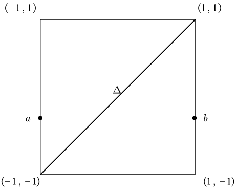

# Chapter 0 : Introduce

## Notation(标记)

$$
\Z &=& \text{integers,即整数}\\
\Q &=& \text{rational numbers,即有理数}\\
\C &=& \text{complex numbers,即复数}\\
\mathbb{I} &=& [0,1],\text{the(closed) unit interval,一个单位的闭区间}\\
$$

$\R^n$被称为$n$维实空间(或欧式空间),当然$\R^n$是$n$个$\R$的笛卡尔积.同样地,$\R^2$同胚于$\C$.

若$(x_1,x_2,\cdots,x_n)\in \R^n$接着,范数定义为$\|x\| = \sqrt{\sum_{i = 1}^n x_i^2}$当$n = 1$时有$\|x\| = |x|$,即为$x$的绝对值.

我们认为$\R^n$是一个$\R^{n+1}$的子空间,其由所有的最后一个坐标为$0$的$(n+1)$-元组构成
$$
S^n = \{x\in \R^{n+1} : \|x\| = 1\}
$$
$S^n$称为一个$n-$球面($\text{n - sphere}$)(半径为$1$且以原点为中心).不难发现$S^n \subset \R^{n+1}$($S^1\subset \R^2$为圆).

不难发现一个$0-$球包含$\{1,-1\}$两个点是一个离散的两点空间.不难发现$S^n$可以作为$S^{n+1}$的一个"赤道"(比如若把地球视为$S^3$则赤道就是一个$S^2$),这是因为
$$
S^n = \R^{n+1}\cap S^{n+1} = \{(x_1,\cdots,x_{n+2})\in S^{n+1}:x_{n+2} = 0\}
$$
接下来继续把$S^n$类比于地球.其北极点定义为$(0,0,\cdots,0,1)\in S^n$,其南极点定义为$(0,0,\cdots,0,-1)\in S^n$.既然有了南北概念,那"南北半球"中的点也可以找到一个对称关系,对于$x = (x_1,\cdots,x_{n+1})\in S^n$可以定义其对称点为$-x = (-x_1,\cdots,-x_{n+1})\in S^n$其中$x$到$-x$之间的距离为$2$.

既然定义了球面这一概念,我们或许可以将球面填充成一个完整的球,不难发现球中任意一个点都满足其距离球心长度小于等于$1$,即
$$
D^n = \{x\in \R^n : \|x\| \leq 1\}
$$
$D^n$就称为一个$n-$实球($\text{n-ball}$或$n-$盘$\text{n-disk}$).显然有$S^{n-1}\subset D^n \subset \R^n$;不难发现$S^{n-1}$是$D^n$在$\R^n$中的边界
$$
\Delta^n = \{(x_1,x_2,\cdots,x_{n+1})\in \R^{n+1}: \text{对于每个}x_i \geq 0 , \sum x_i =1\}
$$
$\Delta^n$称为一个标准$n$维单形($\text{standard n - simplex}$).显然有$\Delta^0$是一个点,$\Delta^1$是一个单位的闭区间,$\Delta^2$是一个三角形(包括其内部),$\Delta^3$是一个(实)四面体,以此类推.不难发现$\Delta^n \approx D^n$,尽管读者在习题$2.11$前并不想构建一个同胚映射

> 这是一个练习:$\R^n$的一个包含了一个内点的紧凸子集是同胚于$D^n$的;这就揭示了$\Delta^n$,$D^n$和$I^n$是同胚的.

这有一个标准的从$S^n \setminus\{\text{北极点}\}$到$\R^n$的一个同胚映射,称作赤平投影(球面投影,$\text{stereographic projection}$).使用$N$表示北极点,接着定义映射$\sigma : S^n \setminus\{N\} \to \R^n$为一个$\R^n$到一条经过$x$和$N$的直线(是$n+1$维的)的交点.

根据熟知的点斜式写法可以将后一直线写为$tx + (1-t)N$的形式.从而,其上的点具有如下坐标$(tx_1,\cdots,tx_n,tx_{n+1} +(1-t))$.当$t = (1-x_{n+1})^{-1}$时最后一个坐标为$0$.

从而
$$
\sigma(x) = (tx_1,\cdots,tx_n)
$$
其中$t = (1-x_{n+1})^{-1}$.这时按照惯例应当检查$\sigma$是否是一个同胚映射.

不难发现$\sigma(x) = x$当且仅当$x$在$S^{n-1}$的赤道上.

## Brouwer Fixed Point Theorem

有了先前的记号,我们现在可以对于$\text{Brouwer\, fixed\, point\, theorem}$进行一个简单的证明:

若$f : D^n \to D^n$是连续的,接着这样就存在一个$x \in D^n$并且$f(x) = x$.

当$n = 1$时,定理就有一个简单的证明.实球$D^1$是一个闭区间$[-1,1]$.

接下来我们看一个关于$f$在区域$D^1 \times D^1$内的图.

定理0.1. 每一个连续的$f : D^1 \to D^1$都有一个不动点

[证明]

令$f(-1) = a$并且$f(1) = b$,若$f(-1) = -1$或者$f(1) = 1$自然证毕($-1$和$1$即为一个不动点)

因此,我们假设如图所示的一个函数满足$f(-1) = a>-1$并且$f(1) = b<1$.

令$G$为$f$的图像并且$\Delta$作为单位函数的图像(当然是一个对角线),接下来,我们必须证明$G \cap \Delta \neq \varnothing$.

一个好的想法是利用连通性论证去展示任意一个从$a$到$b$的$D^1 \times D^1$中的路径必然要经过$\Delta$.

由于$f$是一个连续函数,$G = \{(x,f(x)) : x\in D^1\}$是连通的($G$是一个由$x \mapsto (x,f(x))$给出的连续映射$D^1 \to D^1 \times D^1$的像)

定义$A = \{(x,f(x)): f(x)>x\}$以及$B = \{(x,f(x)) : f(x)<x\}$

注意到$a \in A$并且$b \in B$,于是有$A,B$均非空,若$G \cap \Delta = \varnothing$,则$G$是一个无交并
$$
G= A\cup B
$$
最后,这就导致无论是$A$和$B$都是$G$中的开集,这也就与$G$的连通性产生了矛盾$\Box$
