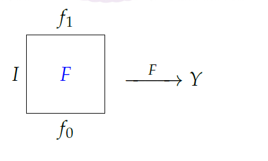

# Chapter 1 : Some Basic Topological Notions

## Homotopy(同伦)

人们经常用另一个更简单的函数来代替一个复杂的函数,这个函数在某种程度上近似于它,并具有原函数的重要性质.一个相关的概念是将一个功能“变形”为另一个功能:稍微"扰动"一个函数可能会产生一个与旧函数相似的更简单的新函数.

定义: 若$X,Y$为拓扑空间且$f_0,f_1$为从$X$到$Y$的连续映射,若存在一个连续映射$F : X \times \mathbb{I} \to Y$且
$$
\text{对于任意的}x \in X ,F(x,0) = f_0(x)\text{以及} F(x,1) = f_1(x) \text{对于任意的}x \in X
$$
则称$f_0$同伦于$f_1$记作$f_0 \simeq f_1$.$F$称为一个同伦.如果要展现一个同伦,经常写$F:f_0 \simeq f_1$.

> 在$\text{Si Li}$的$\text{Introduction to Algebratic Topology}$中给出了一个很有意思的展现同伦的方式
>
> 

若$f_t: X \to Y$由$f_t(x) = F(x,t)$所定义,则同伦$F$给出了一个单参数的连续映射族,将$f_0$变形为$f_1$,我们可以用$f_t$来描述在$t$时刻的变形.

本文给出同伦的一些基本性质,并利用点集拓扑的一个初等引理为同伦的性质作铺垫.

引理 $1.1$($\text{Gluing lemma}$). 假设一个拓扑空间$X$由有限个子集$X_i$的并所组成,即$X = \bigcup_{i = 1}^n X_i$.若对于某个拓扑空间$Y$,有连续函数$f_i : X_i \to Y$在重叠部分相同(对于所有的$i,j$都有$f_i \mid X_i\cap X_j = f_j \mid X_i \cap X_j$),则存在唯一一个连续函数$f:X \to Y$使得对于每个$i$都有$f \mid X_i = f_i$.

[证明]

令$f(x) = f_i (x),x \in X_i$不难验证$f$是一个映射,由于$f \mid X_i = f_i$,且$X = \bigcup_{i = 1}^n X_i$,于是唯一性得到保证,接下来验证$f$是连续的.

根据我们在点集拓扑中的学习可以得知,若$f$是连续的,则$Y$中的开集的逆像为$X$中的开集,于是$Y$中闭集的逆像也为$X$中的闭集.

那么令$C$为$Y$上的闭集,则
$$
f^{-1}(C) &=& X \cap f^{-1}(C) = (\bigcup X_i)\cap f^{-1}(C)\\
&=& \bigcup(X_i \cap f^{-1}(C))\\
&=& \bigcup f_i^{-1}(C)
$$
由于$f_i$是连续的,于是得知$f_i^{-1}(C)$是闭集,于是得到$f^{-1}(C)$是闭集(闭集的有限并).$\Box$

$\text{Gluing}$引理还有另外一个针对开集的版本,证明方法是一致的.

引理 $1.1'$ 假设一个拓扑空间$X$有(可能是无穷的)开覆盖$X = \bigcup_i X_i$,若对于某个拓扑空间$Y$,有连续函数$f_i : X_i \to Y$在重叠部分相同则存在唯一的一个连续函数$f:X\to Y$使得$f\mid X_i = f_i$.

定理$1.2$ 同伦在所有$X \to Y$的连续映射所组成的集合中是一个等价关系.

[证明]

1. 自反性: 构建$F(x,t) = f(x)$即可得到$f\simeq f$.

2. 传递性: 考虑$F:f_1 \simeq f_2$和$G:f_2 \simeq f_3$.

   于是我们可以构建$H : X \times \mathbb{I} \to Y$使得
   $$
   H(x,t) = \left\{
   \begin{array}{c}
   F(x,2t) , &0\leq t \leq 1/2\\
   G(x,2t -1), &1/2 \leq t \leq 1\\
   \end{array}
   \right.
   $$
   由于重叠部分$\{(x,1/2)\}$的值相同,于是得到$H$是连续的,因此$f_1 \simeq f_3$.

3. 对称性: 假设$f \simeq g$,于是存在$F(x,t)$使得$F(x,1) = g(x)$且$F(x,0) = f(x)$于是我们可以令$G(x,t) = F(x,1-t)$由于$F$是连续的,于是$G$也是连续的.不难发现在$G$下有$g \simeq f$.

因此同伦是一个等价关系.$\Box$

定义: 若$f : X \to Y$是连续的,它的同伦类是一个等价类
$$
[f] = \{\text{连续函数}g : X \to Y , g\simeq f\}
$$
这些同伦类所构成的族用$[X,Y]$表示.

定理$1.3$ 令$f_i : X \to Y$以及$g_i : Y \to Z$,$i = 0,1$是连续的.若$f_0 \simeq f_1$且$g_0 \simeq g_1$,则$g_0 \circ f_0 \simeq g_1 \circ f_1$,即$[g_0 \circ f_0] = [g_1 \circ f_1]$.

[证明] 

令$F : f_0 \simeq f_1$以及$G: g_0 \simeq g_1$是同伦.首先,我们证明
$$
g_0 \circ f_0 \simeq g_1 \circ f_1
$$
构建$H:X \times \mathbb{I} \to Z$为$H(x,t) = G(f_0(x),t)$.由于$f_0$是一个连续函数,于是得知$H$是连续的.此外,$H(x,0) = G(f_0(x),0) = g_0(f_0(x)) = g_0 \circ f_0(x)$且$H(x,1) = g_1 \circ f_0(x)$于是得到
$$
g_0 \circ f_0 \simeq g_1 \circ f_0
$$
接下来证明$g_1 \circ f_0 \simeq g_1 \circ f_1$

构建$K: X \times \mathbb{I} \to Z$为$K(x,t) = g_1(F(x,t))$于是由于$g_1$和$F$是连续函数,有$K$是连续的.此外$K(x,0) = g_1 \circ f_0(x)$且$K(x,1) = g_1 \circ f_1 (x)$于是由于同伦是一个等价关系得到$g_0 \circ f_0 \simeq g_1 \circ f_1$.

因此可以得知$[g_0\circ f_0]= [g_1 \circ f_1]$.$\Box$

于是我们可以考虑全体拓扑空间所构成的范畴$\text{Top}$,由于同伦是其态射集$\text{Hom}(X,Y)$上的等价关系,于是得到

推论$1.4$ 同伦是范畴$\text{Top}$上的同余.

> 定义 : 范畴$\mathscr{C}$上的同余是在对于所有$\mathscr{C}$上的态射类$\bigcup_{(A,B)}\text{Hom}(A,B)$上的一个等价关系$\sim$,满足
>
> 1. $f \in \text{Hom}(A,B)$且$f \sim f'$则$f' \in \text{Hom}(A,B)$
> 2. $f\sim f'$,$g \sim g'$且合成$g \circ f$存在,则$g\circ f \sim g' \circ f'$
>
> 定理$0.4$ 令$\mathscr{C}$为一个带有同余$\sim$的范畴,且令$[f]$为态射$f$的等价类.按照以下步骤定义$\mathscr{C'}$
> $$
> \text{obj }\mathscr{C'} &=& \text{obj }\mathscr{C}\\
> \text{Hom}_{\mathscr{C'}}(A,B) &=& \{[f] : f\in \text{Hom}(A,B)\}\\
> [g]\circ [f] &=& [g\circ f]
> $$
> 则$\mathscr{C'}$也是一个范畴,称为$\mathscr{C}$的商范畴
>
> [证明]
>
> 1. 不难发现$\text{Hom}_{\mathscr{C'}}$之间是两两不相交的(由1. 可以得到)
> 2. 由于$[g \circ f] = [g]\circ [f]$于是可以得到$[(g \circ f)\circ h] = [g \circ f]\circ [h] = [g]\circ ([f]\circ [h]) = [g \circ (f\circ h)]$.
> 3. 不难发现$[1_A]$即$\mathscr{C'}$上的恒等映射
>
> 因此$\mathscr{C'}$确实是一个范畴$\Box$

[证明]

使用定理$1.2$可以直接得到同伦是一个等价关系且满足1.,而使用定理$1.3$可以得到同伦关系满足2.$\Box$

我们可以从定理$0.4$得知这是一个以拓扑空间$X$作为对象,且$\text{Hom}$集为$\text{Hom}(X,Y)= [X,Y]$,态射合成为$[g]\circ [f] = [g \circ f]$的商范畴.

定义: 上面描述的商范畴称为__同伦范畴__,用$\text{hTop}$表示.

> $0.17$ 令$\mathscr{C,A}$为范畴,$\sim$为$\mathscr{C}$上的同余.若$T : \mathscr{C}\to \mathscr{A}$为一个当$f \sim g$时$T(f) = T(g)$的函子,则$T$定义了一个函子$T' : \mathscr{C'} \to \mathscr{A}$(其中$\mathscr{C'}$为一个商范畴)通过对于每个$X \in \text{obj }\mathscr{C}$都有$T'(X) = T(X)$且对于每个态射$f$都有$T'([f]) = T(f)$.
>
> [证明]
>
> 由于$T$是一个函子,于是可以得知$T(X)\in \text{obj }\mathscr{A}$因此$T'(X)\in \text{obj }\mathscr{A}$.
>
> 接着考虑$g,f : A \to A'$有$g \sim f$时$T(g) = T(f)$.因此$T([f]) = T(f) = T'([f])$.
>
> 由于$[g \circ f] = [g]\circ [f]$因此$T'([g])\circ T'([f]) = T(g)\circ T(f)$由于$T$是一个函子于是$T(g)\circ T(f) = T(g \circ f) = T'([g \circ f])$,又因为$T(1_A) = T'([1_A]) = 1_{T'A}$因此得到$T'$确实是一个函子

我们将要构建所有的函子$T: \text{Top} \to \mathscr{A}$,其中$\mathscr{A}$是一些"代数"范畴(比如$\text{Ab,Groups,Rings}$),它们满足若$f \simeq g$则$T(f)\simeq T(g)$.除了识别同伦映射这个自然而然产生的想法以外,这个事实使同伦变得很有价值,因为它保证了$\mathscr{A}$中的代数问题是由一个经$T$的拓扑问题所引发的且比原问题更简单.$0.17$证明了上述$T$给出了一个函子$\text{hTop}\to \mathscr{A}$,所以同伦范畴事实上是非常基本的.

$\text{hTop}$中的等价又是什么呢?

定义: 对于一个连续映射$f : X \to Y$,若有一个连续映射$g: Y \to X$满足$g \circ f \simeq 1_X$且$f \circ g \simeq 1_Y$则$f$是一个__同伦等价__.若有一个同伦等价$f:X \to Y$则两个空间$X$和$Y$具有相同的伦型.

如果重写这个定义,就会发现$f$是一个同伦等价当且仅当$[f]\in [X,Y]$是一个$\text{hTop}$中的等价(即存在$[g]\in [Y,X]$使得$[g]\circ [f] = [1_X]$且$f \circ g = [1_y]$).因此,从$\text{hTop}$到更为熟悉的$\text{Top}$的传递是通过删除括号且将$=$替换为$\simeq$完成的.

显然有同胚空间具有相同的伦型,但是反过来说是错误的,我们将在定理$1.12$中展示.

接下来的两个结果表明同伦与一些有趣的问题相关.

定义: 令$X$和$Y$为拓扑空间,令$y_0 \in Y$在$y_0$处的常值映射是一个函数$c : X \to Y$满足对于所有的$x \in X$都有$c(x)= y_0$,若对于连续映射$f : X \to Y$有$f \simeq c$则$f$称为一个零伦.

定理$1.5$ 令$\C$表示复数,令$\Sigma_\rho \subset \C \approx \R^2$表示一个以原点$0$为圆心,$\rho$为半径的圆,且令$f_\rho^n : \Sigma_\rho \to \C \setminus \{0\}$为一个限制在$\Sigma_\rho$上$z \mapsto z^n$的映射.若没有$f_\rho^n$($n \geq 1$且$\rho >0$)是零伦,则代数基本定理成立(每一个复系数多项式都有一个复数根)

[证明]

考虑复系数多项式
$$
g(z)= z^n + a_{n - 1}z^{n-1}+\cdots+a_1z + a_0
$$
选取$\rho >\max \{1,\sum_{i = 0}^{n - 1}|a_i|\}$并且定义$F :\Sigma_\rho \times \mathbb{I} \to \C$如下
$$
F(z,t) = z^n+\sum_{i= 0}^{n-1}(1-t)a_iz^i
$$
若我们可以证明$F$的像包含在$\C \setminus\{0\}$中,则显然有$F :g \mid \Sigma_{\rho}\simeq f_\rho^n$;也就是说我们需要证明$F(z,t)\neq 0$(这个限制是至关重要的,因为,正如我们将在定理$1.13$中看到的,每一个在"可收缩"空间中有值的连续函数,例如$\C$中,都是零伦的)

反过来,若存在$t\in \mathbb{I}$使得$F(z,t) = 0$且$|z| = \rho$,则$z^n = -\sum_{i = 0}^{n-1}(1-t)a_iz^i$.于是可以根据三角不等式得到$\rho>1$时有
$$
\rho^n \leq \sum_{i = 0}^{n-1} (1-t)|a_i|\rho^i \leq \sum_{i=0}^{n-1} |a_i|\rho^i \leq (\sum_{i = 0}^{n -1}|a_i|)\rho^{n-1}
$$
两边同时消去$\rho^{n-1}$则得到$\rho \leq \sum_{i = 0}^{n - 1}|a_i|$这与前文的选定矛盾.

假设$g$没有复数根,定义$G : \Sigma_\rho \times \mathbb{I}\to \C \setminus\{0\}$使得$G(z,t) = g((1-t)z)$(因为$g$没有根,于是得到$G$的所有取值都位于$\C\setminus\{0\}$中).

但是$G(z,1) = g(0) = a_0$是一个常值映射,即$g\mid \Sigma_\rho$同伦于一个常值映射,由于$g\mid \Sigma_\rho$还同伦于$f_\rho^n$因此$f_\rho^n$同伦于一个常值映射,这与假设矛盾.$\Box$

> 稍后,我们将在推论$1.23$中看到$\C \setminus \{0\}$就是圆$S^1 = \Sigma_1$.准确来说$\C \setminus \{0\}$与$S^1$有着相同的伦型.

一个常见的问题是将映射$f : X \to Z$扩张到更大的空间$Y$上,其图表为

运用到同伦上则得到一个这样的问题:若$f_1,f_0 : X \to Z$则若我们可以将$f_0 \cup f_1 : X \times \{0\}\cup X \times \{1\}\to Z$扩张到整个$X \times \mathbb{I}$上,则$f_1 \simeq f_0$.

定理$1.6$ 令$f:S^n \to Y$是一个映射到$Y$的连续映射则下述条件等价

$(\text{i})$ $f$是零伦.

$(\text{ii})$ $f$可以被扩张为一个连续映射$D^{n+1}\to Y$.

$(\text{iii})$ 若$x_0 \in S^{n}$且$k : S^n \to Y$是一个映射到$f(x_0)$的常值映射,则存在一个同伦$F: f \simeq k$使得对于任意的$t \in \mathbb{I}$均有$F(x_0,t) = f(x_0)$.

[证明]

$(\text{i}) \Rightarrow (\text{ii})$.假设$F: f \simeq c$其中$c(x) = y_0$对于所有的$x \in S^n$成立.定义$g : D^{n +1}\to Y$如下
$$
g(x) =\left\{
\begin{array}{c}
y_0 , &\text{若}0 \leq \|x\| \leq 1/2\\
F(x/\|x\|,2-2\|x\|), &\text{若}1/2\leq \|x\| \leq 1\\
\end{array}
\right.
$$
空穴来风,必有其因: 若$x \neq 0$则$x/\|x\|\in S^n$若$1/2\leq \|x\|\leq 1$,则$2 - 2\|x\|\in \mathbb{I}$,若$\|x\| = 1/2$则$2 - 2\|x\| = 1$即$F(x/\|x\|,1) = y_0$.

因此使用$\text{Gluing}$引理得知$g$是一个连续函数,且$x \in S^n \Leftrightarrow \|x\| = 1$即$g(x) = f(x,0) = f(x)$于是$g(x)$确实是$f(x)$的一个扩张.

$(\text{ii})\Rightarrow (\text{iii})$.假设$g: D^{n + 1}\to Y$是$f$的一个扩张.定义$F : S^n \times \mathbb{I} \to Y$如下
$$
F(x,t) = g((1-t)x+tx_0)
$$
注意到$(1-t)x+tx_0 \in D^{n+1}$,因为这是一个连接于$x$和$x_0$之间的线段上的点.因此显然有$F$是连续的.有$F(x,0) = g(x) = f(x)$,$F(x,1) = g(x_0) = f(x_0)$对于所有的$x \in S^n$均成立.因此$F :f \simeq k$其中$k : S^n \to Y$是一个映射到$f(x_0)$的常值映射.最终$F(x_0,t) = g(x_0) = f(x_0)$对于所有的$t \in \mathbb{I}$成立.

$(\text{iii})\Rightarrow (\text{i})$.显然成立$\Box$

对比于引理$0.2$,若$Y = S^n$且$f$是恒等映射,则引理$0.2$(尚未正式公布)推出$f$不是一个零伦.

## Convexity, Contractibility, and Cones(凸性,可收缩性和锥体)

我们给上一个证明中所用到的$D^{n+1}$的特性起个名. 

定义 $\R^m$上的一个子集$X$若满足对于一对点$x,y \in X$连接$x,y$的线段都包含于$X$则称$X$是凸的.换句话说,若$X$是凸的,则对于所有的$x,y \in X$,$t \in \mathbb{I}$有$tx+(1-t)y\in X$.

很容易给出几个凸集的例子.具体的有$\mathbb{I}^n,\mathbb{R}^n,D^n$以及$\Delta^n$.将球面$S^n$视为$\R^{n+1}$的子集时其不是凸的.

定义 若$1_X$是一个零伦则空间$X$是可收缩的.

定理 $1.7$ : 每一个凸集$X$均为可收缩的.

[证明]

对于$x_0 \in X$,定义$c: X \to X,c(x) = x_0$对于所有$x \in X$成立.定义$F: X \times \mathbb{I} \to X$为$F(x,t) = tx_0 + (1-t)x$.可以很轻易地发现$F:1_X \simeq c$.$\Box$

一个半球是可收缩的,但不是凸的,所以定理$1.7$反过来是不成立的.在证明引理$1.6$后,我们观察到引理$0.2$表示$S^n$不可收缩.

### $\text{Exercise}$

$1.1$ 令$x_0 ,x_1 \in X$且令$f_i :X \to X$,$i= 0,1$表示一个映射到$x_i$的常值映射.证明$f_0 \simeq f_1$当且仅当存在一个连续映射$F :\mathbb{I} \to X$使得$F(0) =x_0$且$F(1) = x_1$.

($\Rightarrow$)若$f_0 \simeq f_1$则存在一个连续函数$H:X \times \mathbb{I} \to X$使得$H(x,0) = x_0,H(x,1) = x_1$对于任意的$x \in X$均成立.且$H$连续

那么,我们选定一个$x \in X$,令$F(t) = H(x,t)$得到$F$连续且$F(0) = x_0$且$F(1) = x_1$

($\Leftarrow$)若存在$F: \mathbb{I}  \to X$使得$F(0) = x_0$且$F(1) = x_1$.

那么对于$f_0$和$f_1$有$F(0) = f_0(x)$且$F(1) = f_1(x)$对于任意的$x \in X$均成立.

由于$F$是一个连续函数,于是考虑$H: X \times \mathbb{I} \to X$使得$H(x,t) = F(t)$对于任意的$x \in X$成立,因此得到$H$是一个连续函数,且$H(x,0) = f_0(x),H(x,1) = f_1(x)$于是得到$f_0 \simeq f_1$.

$1.2$ 

$(\text{i})$ 若$X \approx Y$且$X$是可收缩的,则$Y$也是可收缩的.

$(\text{ii})$ 若$X$,$Y$为$\text{Euclidean}$空间的子空间,$X \approx Y$且$X$是凸的,证明$Y$不一定是凸的.

$(\text{i})$ 若$X$是可收缩的,则$1_X \simeq c$其中$c$为某个映射到$x_0\in X$的常值映射,于是存在$H(x,t)$使得$H(x,0) = x$且$H(x,1) = x_0$.

由于$X\approx Y$,因此存在$h :X\to Y$使得$h$连续且有一个连续逆,因此$h \circ H$也是一个连续函数,由于$h(x_0)$在$Y$上只是一个点,因此得到$h\circ H(x,0) = h(x)$且$h \circ H(x,1) = h(x_0)$且由于$H$是一个连续函数,$h \circ H$也是连续的,因此$h \circ H$为一个$h(x)$到$h\circ c$的同伦,由于$h$是一个同胚映射,因此$h$显然是一个双射,则有$h(X) = Y$于是$1_Y$可以写为$h(x) \mapsto h(x)$的形式,由于$h \circ c$是一个$Y$上的常值映射,因此得到了$Y$是一个可收缩空间.

$(\text{ii})$ 考虑立体投影$\pi :S^2 \setminus \{(0,0,1)\} \to \mathbb{E}^2$,不难发现$\pi$是一个同胚,$\mathbb{E}^2$是一个凸集,但是$S^2 \setminus\{(0,0,1)\}$不是.

$1.3$ 令$R: S^1 \to S^1$为一个旋转$\alpha$弧度的映射,证明$R \simeq 1_S$,其中$1_S$是$S^1$的恒等映射.进而得到每个连续映射$f : S^1 \to S^1$均同伦于一个连续映射$g : S^1 \to S^1$其中$g(1) = 1$($1 = e^{2\pi i 0} \in S^1$)

考虑映射$F : S^1 \times \mathbb{I} \to S^1$为$F(x,t)$为一个旋转$t\alpha$弧度的映射,不难发现由于$R$是一个连续映射,于是$F$也是一个连续映射.因此$R \simeq 1_S$.

接着

若存在$f$且不存在$g$满足$g(1) = 1$使得$f \simeq g$.由于$f$和$g$均为$S^1$上的映射,于是可以根据$\text{Euler}$公式将其转化为$[0,2\pi)$上的映射.

于是无论$f$还是$g$作为一个连续函数都可以视为一个旋转$\alpha$度的映射或沿着某个轴对称的映射,因此必然有$f \simeq g$.

$1.4$ 

$(\text{i})$ 若$X$是$\R^n$的一个凸子集且$Y$是一个$\R^m$的凸子集,则$X \times Y$是$\R^{n+m}$上的一个凸子集

$(\text{ii})$ 若$X,Y$是可收缩的,则$X \times Y$是可收缩的.

$(\text{i})$ 对于$X \times Y$中任意一点$x$都可以写为$x = (x_1,x_2)$的形式,其中$x_1 \in X,x_2 \in Y$

由于$X$是$\R^n$的一个凸子集,因此对于任意的对于所有的$x_1,y_1 \in X,t \in \mathbb{I}$都有$tx_1+(1-t)y_1$中所有点都处于$X$内.同理对于$x_2,y_2 \in Y,t\in \mathbb{I}$也有$tx_2 + (1-t)y_2 \in Y$.

于是对于$x = (x_1,x_2),y= (y_1,y_2)$考虑$tx +(1-t)y = (tx_1+(1-t)y_1,tx_2+(1-t)y_2)\in X \times Y$,因此得到$X \times Y$是$\R^{n+m}$上的一个凸子集.

$(\text{ii})$ 若$X$是可收缩的,则$1_X\simeq c$其中$c$为映射至$x_0 \in X$的一个常值映射,即存在一个连续映射$F(x,t)$使得$F(x,0) = x$且$F(x,1) = x_0$.同理由于$Y$是可收缩的,于是存在一个连续有映射$G(y,t)$使得$G(y,0) = y$且$G(y,1) = y_0 \in Y$.

令$H((x,y),t) = (F(x,t),G(y,t))$有$H((x,y),0) = (x,y)$为$1_{X\times Y}$且$H((x,y),1) = (x_0,y_0)$为$X\times Y$上的一个常值映射,于是得知$X \times Y$是可收缩的.

$1.5$ 令$X = \{0\}\cup \{1,1/2,\cdots,1/n ,\cdots\}$且$Y$为一个可数离散空间.证明$X,Y$没有相同的伦型.

显然有$X$是一个紧集,因此考虑$h :X\to Y$由于$Y$是一个可数离散空间,我们有$\{h^{-1}(y):y \in Y\}$构成了$X$的一个开覆盖.由于$X$是紧的,因此$\{h^{-1}(y): y \in Y\}$有一个有限子覆盖.

由于$X$具有无穷多个元素因此必然存在一个子覆盖$U = h^{-1}(y)$使得$U$包含了$X$中无穷多个元素,即在$U$之外至多有有限个点.

现在假设$f : X\to Y$是一个同伦等价,那么就存在某个$g: Y \to X$使得同伦$H : f \circ g \simeq 1_Y$.但是由于$H(\{y\} \times \mathbb{I}) $是一个连通映射的连续像,因此它本身也是连通的.由于$Y$是离散空间,因此得到$H(y,0) = H(y,1)$对于所有的$y \in Y$都成立.

但是由于$f$的像是有限的,且$Y$具有无穷多个元素,因此必然存在$y$使得$y\notin \text{Im }f$即,$y \neq f(g(y))$因此有$H(y,0) = f(g(y)) \neq y = 1_Y$造成矛盾.因此$X$与$Y$没有相同的伦型.

