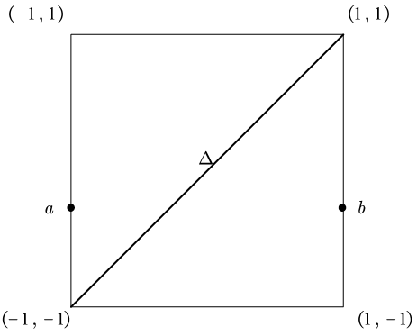
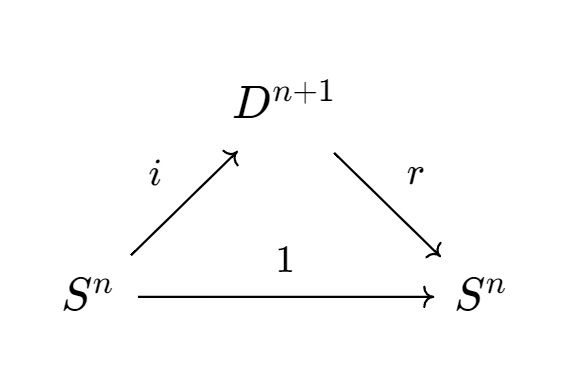
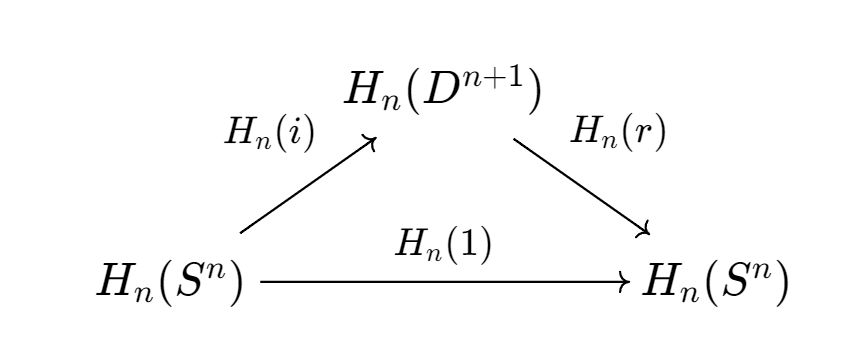
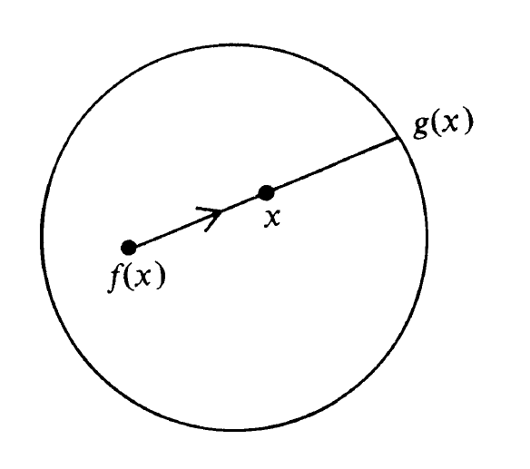

# Chapter 0 : Introduce

## Notation(标记)

$$
\Z &=& \text{integers,即整数}\\
\Q &=& \text{rational numbers,即有理数}\\
\C &=& \text{complex numbers,即复数}\\
\mathbb{I} &=& [0,1],\text{the(closed) unit interval,一个单位的闭区间}\\
$$

$\R^n$被称为$n$维实空间(或欧式空间),当然$\R^n$是$n$个$\R$的笛卡尔积.同样地,$\R^2$同胚于$\C$.

若$(x_1,x_2,\cdots,x_n)\in \R^n$接着,范数定义为$\|x\| = \sqrt{\sum_{i = 1}^n x_i^2}$当$n = 1$时有$\|x\| = |x|$,即为$x$的绝对值.

我们认为$\R^n$是一个$\R^{n+1}$的子空间,其由所有的最后一个坐标为$0$的$(n+1)$-元组构成
$$
S^n = \{x\in \R^{n+1} : \|x\| = 1\}
$$
$S^n$称为一个$n-$球面($\text{n - sphere}$)(半径为$1$且以原点为中心).不难发现$S^n \subset \R^{n+1}$($S^1\subset \R^2$为圆).

不难发现一个$0-$球包含$\{1,-1\}$两个点是一个离散的两点空间.不难发现$S^n$可以作为$S^{n+1}$的一个"赤道"(比如若把地球视为$S^3$则赤道就是一个$S^2$),这是因为
$$
S^n = \R^{n+1}\cap S^{n+1} = \{(x_1,\cdots,x_{n+2})\in S^{n+1}:x_{n+2} = 0\}
$$
接下来继续把$S^n$类比于地球.其北极点定义为$(0,0,\cdots,0,1)\in S^n$,其南极点定义为$(0,0,\cdots,0,-1)\in S^n$.既然有了南北概念,那"南北半球"中的点也可以找到一个对称关系,对于$x = (x_1,\cdots,x_{n+1})\in S^n$可以定义其对称点为$-x = (-x_1,\cdots,-x_{n+1})\in S^n$其中$x$到$-x$之间的距离为$2$.

既然定义了球面这一概念,我们或许可以将球面填充成一个完整的球,不难发现球中任意一个点都满足其距离球心长度小于等于$1$,即
$$
D^n = \{x\in \R^n : \|x\| \leq 1\}
$$
$D^n$就称为一个$n-$实球($\text{n-ball}$或$n-$盘$\text{n-disk}$).显然有$S^{n-1}\subset D^n \subset \R^n$;不难发现$S^{n-1}$是$D^n$在$\R^n$中的边界
$$
\Delta^n = \{(x_1,x_2,\cdots,x_{n+1})\in \R^{n+1}: \text{对于每个}x_i \geq 0 , \sum x_i =1\}
$$
$\Delta^n$称为一个标准$n$维单纯形($\text{standard n - simplex}$).显然有$\Delta^0$是一个点,$\Delta^1$是一个单位的闭区间,$\Delta^2$是一个三角形(包括其内部),$\Delta^3$是一个(实)四面体,以此类推.不难发现$\Delta^n \approx D^n$,尽管读者在习题$2.11$前并不想构建一个同胚映射

> 这是一个练习:$\R^n$的一个包含了一个内点的紧凸子集是同胚于$D^n$的;这就揭示了$\Delta^n$,$D^n$和$I^n$是同胚的.

这有一个标准的从$S^n \setminus\{\text{北极点}\}$到$\R^n$的一个同胚映射,称作赤平投影(球面投影,$\text{stereographic projection}$).使用$N$表示北极点,接着定义映射$\sigma : S^n \setminus\{N\} \to \R^n$为一个$\R^n$到一条经过$x$和$N$的直线(是$n+1$维的)的交点.

根据熟知的点斜式写法可以将后一直线写为$tx + (1-t)N$的形式.从而,其上的点具有如下坐标$(tx_1,\cdots,tx_n,tx_{n+1} +(1-t))$.当$t = (1-x_{n+1})^{-1}$时最后一个坐标为$0$.

从而
$$
\sigma(x) = (tx_1,\cdots,tx_n)
$$
其中$t = (1-x_{n+1})^{-1}$.这时按照惯例应当检查$\sigma$是否是一个同胚映射.

不难发现$\sigma(x) = x$当且仅当$x$在$S^{n-1}$的赤道上.

## Brouwer Fixed Point Theorem

有了先前的记号,我们现在可以对于$\text{Brouwer\, fixed\, point\, theorem}$进行一个简单的证明:

若$f : D^n \to D^n$是连续的,接着这样就存在一个$x \in D^n$并且$f(x) = x$.

当$n = 1$时,定理就有一个简单的证明.实球$D^1$是一个闭区间$[-1,1]$.

接下来我们看一个关于$f$在区域$D^1 \times D^1$内的图像.

定理$0.1$. 每一个连续的$f : D^1 \to D^1$都有一个不动点

[证明]

令$f(-1) = a$并且$f(1) = b$,若$f(-1) = -1$或者$f(1) = 1$自然证毕($-1$和$1$即为一个不动点)

因此,我们假设如图所示的一个函数满足$f(-1) = a>-1$并且$f(1) = b<1$.

令$G$为$f$的图像并且$\Delta$作为单位函数的图像(当然是一个对角线),接下来,我们必须证明$G \cap \Delta \neq \varnothing$.

一个好的想法是利用连通性论证去展示任意一个从$a$到$b$的$D^1 \times D^1$中的路径必然要经过$\Delta$.

由于$f$是一个连续函数,$G = \{(x,f(x)) : x\in D^1\}$是连通的($G$是一个由$x \mapsto (x,f(x))$给出的连续映射$D^1 \to D^1 \times D^1$的像)

定义$A = \{(x,f(x)): f(x)>x\}$以及$B = \{(x,f(x)) : f(x)<x\}$

注意到$a \in A$并且$b \in B$,于是有$A,B$均非空,若$G \cap \Delta = \varnothing$,则$G$是一个无交并
$$
G= A\cup B
$$
最后,这就导致无论是$A$和$B$都是$G$中的开集,这也就与$G$的连通性产生了矛盾$\Box$

不幸的是,当$n >1$时,没有人知道如何调整这个基本的拓扑结论.这就必须提出一些新的想法.这里有一个使用单纯逼近定理的证明($\text{[Hirsch]}$).接下来还有一些通过分析的证明(看$\text{[Dunford and Schwartz,pp. 467 - 470]}$ $\text{or}$ $\text{[Milnor (1978)]}$).最基础的想法是通过一个平滑函数$g : D^n \to D^n$去逼近,一个连续函数$f : D^n \to D^n$,如果所有的$g$都有一个不动点,则$f$有一个不动点;这样我们就可以把解析技术应用在光滑函数上.

这里有一个使用代数拓扑方法对于$\text{Brouwer}$不动点定理的证明:

我们终将证明,对于每个$n \geq 0$,都有一个满足以下条件的同调函子$H_n$:对于每个拓扑空间$X$都有$\text{Abel}$群$H_n(X)$并且对于每个连续的函数$f : X\to Y$都存在一个同态$H_n(f): H_n(X)\to H_n(Y)$,且$g$与$f$的合成定义如下
$$
H_n(g \circ f) = H_n(g)\circ H_n(f)
$$
且
$$
H_n(1_X)\text{是}H_n(X)\text{的恒等映射}
$$
其中,$1_X$是$X$的恒等映射.
$$
H_n(D^{n+1}) = 0 \text{对于所有的}n \geq 1\\
H_n(S^n)\neq 0 \text{对于所有的}n \geq 1
$$
利用这些$H_n$,现在我们证明$\text{Brouwer}$定理.

定义 : 拓扑空间$Y$的子空间$X$若存在一个连续的映射$r : Y \to X$使得对于所有的$x\in X$均有$r(x) = x$则$X$称为是$Y$的缩回.这样的$r$称为一个回缩映射.

> 1. 回想包含在拓扑空间$Y$的拓扑空间$X$是一个$Y$的子空间若$X$的子集$V$在$X$中是开的当且仅当对于某些$Y$中的开子集$U$有$V = X \cap U$.不难看出这保证了包含映射$i: X \hookrightarrow Y$是连续的,由于若$U$在$Y$中是开的,则$i^{-1}(U) = X\cap U$在$X$中是开的.
>
>    这可以平移到群论上: 包含在群$G$群$H$是一个$G$的子群当且仅当$i: H\hookrightarrow G$是一个同态(这就说明$H$的代数运算与$G$是一致的)
>
> 2. 我们可以使用函数来重新表示缩回映射的定义.若$i : X \hookrightarrow Y$是一个包含映射,则连续函数$r: Y\to X$是一个缩回映射当且仅当
>
>    
> $$
>    r \circ i = 1_X
> $$
>
> 3. 对于$\text{Abel}$群,我们可以证明$G$的子群$H$是$G$的一个缩回当且仅当$H$是$G$的直和(即存在$K \leq G$使得$K \cap H= e$且$K + H = G$)
>
>    [证明]
>
>    根据$2$中的结论我们可以得知$\mathscr{r} : G \to H$是一个缩回映射当且仅当
>    $$
>    \mathscr{r} \circ i = 1_H
>    $$
>    即$\mathscr{r} : G \to H$是一个同态,且有$\mathscr{r}(h) = h$,那么$\text{Ker}\, \mathscr{r} = \{g\in G : r(g) = e\}\lhd G$(由于$\mathscr{r}(h) = h$于是对于$\forall h \neq e \land h \in H$由$h \notin \text{Ker }\mathscr{r}$,即$H \cap \text{Ker }r = \{e\}$)由群的同态基本定理得到$G / \text{Ker }r \simeq H$再由$\text{Lagrange}$定理得到$|G| = |H||\text{Ker}\mathscr{r}|$,于是对于$hr\in H \text{Ker }\mathscr{r} \leq G(r \in \text{Ker }\mathscr{r})$(由于$G$为$\text{Abel}$群于是$H \text{Ker }\mathscr{r}$是一个子群)由$\mathscr{r}(hr) = h$,且由于对于任意的$r_1,r_2 \in \text{Ker }\mathscr{r}$若$r_1 \neq r_2$由$hr_1 \neq hr_2$于是可以得到$H \text{Ker }\mathscr{r} = G$.使用加法代替群中的乘法运算,并且令$K:= \text{Ker} \mathscr{r}$可以得知$H+K = G$
>
>    同理,若$H$是$G$的直和就可以得到一个$K$使得$KH = G$且$K \cap H = \{e\}$那么由于$G$为$\text{Abel}$群有$H\lhd G$于是可以构建一个群同态$\mathscr{r}: G \to H$.由于$G = KH$于是可以构建一个群同态$kh \mapsto h$使得$\text{Ker }\mathscr{r} = K$.不难验证$\mathscr{r} \circ i = 1_H$.
>
>    $\Box$

引理$0.2$ : 若$n \geq 0$则$S^n$不是$D^{n+1}$的缩回.

[证明]

假设存在一个缩回映射$r : D^{n+1} \to S^n$,接着将会有一个由拓扑空间与连续函数组成的交换图表

(不难看出此即$r \circ i = 1$,合成为$S^n$的一个恒等映射).引入$H_n$得到$\text{Abel}$群和同态所构成的交换图表

利用$H_n$的性质($H_n(g) \circ H_n(f) = H_n(g \circ f)$)可以得到这个新的图表是交换的.由于我们对于$H_n$有$H_n(D^{n+1}) = 0$的约束,于是得到$H_n(S^n) = 0$,但是前文定义了$H_n(S^n) \neq 0$于是造成了矛盾,即不存在缩回映射$r$使得$S^n$作为$D^{n+1}$的缩回.$\Box$

注意到这个同调函子$H_n$将一个拓扑问题转化成了一个代数问题.

我们发现引理$0.2$在$n  = 0$时有一个初等的证法.显然有缩回映射$r : Y \to X$是一个满射.特别地,一个缩回映射$r:D^1 \to S^0$在从$[-1,1]$投射到一个两点集$\{\pm 1\}$时是连续的,这与连通集的连续像是连通的相矛盾.

定理$0.3$ ($\text{Brouwer}$) 若$f : D^n \to D^n$是连续的,则$f$有一个不动点.

[证明]

假设对于任意的$x \in D^n$均有$f(x) \neq x$.因此$f(x)$和$x$是互异的点,也就可以确定一条直线.定义$g:D^n \to S^{n-1}$($D^n$的边界)为将$x$映射为$f(x)$到$x$的射线与$S^{n-1}$相交的点.显然有$x \in S^{n-1}$可以推出$g(x) = x$.接下来我们只需要证明$g$是连续的.

由于$f$是一个连续函数,于是对于以$x$为中心,以$\delta$为半径的开球$B$使得其内所有$x'$均满足$\|g(x)- g(x')\| < \varepsilon$.于是我们可以得到$g^{-1}(O)$是一个$x$的邻域(其中$O$为以$g(x)$为球心,$\varepsilon$为半径的开球),也就是说$g$是一个连续函数.

而根据前文的推导得知,对于任意的$x \in  S^{n-1}$都有$g(x) = x$也就是说此时$S^{n-1}$作为$D^n$的一个缩回.这与引理$0.2$相矛盾.$\Box$

这一定理根据$\text{Schauder}$的工作(这就解释了为什么这里的证明用的是$[\text{Dunford and Schwartz}]$)可以推广到无限维空间:若$D$是一个$\text{Banach}$空间中的一个紧凸子集,则任意的连续函数$f : D \to D$有一个不动点.这个证明涉及到使用$\text{Brouwer}$适用的定义在$D$的有限维子空间上连续函数序列来逼近$f \setminus 1_D$.

### $\text{Exercise}$

$* 0.1$ 对于$\text{Abel}$群,我们可以证明$G$的子群$H$是$G$的一个缩回当且仅当$H$是$G$的直和(即存在$K \leq G$使得$K \cap H= e$且$K + H = G$)

(前文已证)

$0.2$ 利用定理$0.3$和前文的注释的证明过程证明$n = 1$时的$\text{Brouwer}$不动点定理.

对于$n = 1$时,有$D^1 = [-1,1]$且$S^0 = \{\pm 1\}$.于是对于任意的$f: D^1 \to D^1$假设$f$没有不动点,即$f(x)\neq x$于是可以根据$0.3$的证明过程构造从$f(x)$出发经过$x$的射线,其与$S^0$交于$g(x)$上,即$g(x) \in \{\pm 1\}$.

那么接下来我们证明$g$是连续的,不难得知我们只需要对于$(a,b),-1<a<1<b$有$g^{-1}((a,b))$是一个开集即可.

那么由于$f$是一个连续函数,有$|x - x'|<\delta \Leftrightarrow |f(x) - f(x')|<\varepsilon$于是若$g(x) = 1$,则$x>f(x)$于是可以得到对于$x'$满足$|x-x'|<\delta$且$x'>f(x)$时有$g(x') = 1$,那么就得到$g^{-1}((a,b))$确实是$D^1$上的开集.那么$g$确实是一个连续函数.

根据后续的证明过程可以得到$\text{Brouwer}$不动点定理成立.

$0.3$ 假设$n \geq 1$,且$i= 0,n$时$H_i(S^n) = \Z$且在其他情况下有$H_i(S^n) = 0$,使用引理$0.2$的证明工具证明$S^n$上的赤道不是一个缩回.

假设存在一个缩回映射$S^n \to S^{n-1}$.由于$H_n(S^{n-1}) = 0$于是根据$0.2$的证明过程可以得知$H_n(S^n) = 0$但是由于$H_n(S^n)\neq 0$于是造成矛盾.

$0.4$ 令$X$为一个同胚于$D^n$的拓扑空间,则每个连续函数$f: X \to X$都存在一个不动点.

记$h :X\to D^n$为同胚映射,于是可以得到$hfh^{-1}:D^n \to D^n$由于$f,h,h^{-1}$均为连续函数,于是$hfh^{-1}$也是一个连续函数,因此根据$\text{Brouwer}$不动点定理可以得知$hfh^{-1}$存在一个不动点$x$,即$hfh^{-1}(x) = x$有$fh^{-1}(x) = h^{-1}(x)$而$h^{-1}(x)\in X$于是得到$f:X \to X$存在一个不动点.

$0.5$ 令$f,g : \mathbb{I \to I \times I}$是连续的;令$f(0) = (a,0)$以及$f(1) = (b,1)$且令$g(0) = (0,c)$以及$g(1) = (1,d)$其中$a,b,c,d \in \mathbb{I}$.证明存在某个$s,t \in \mathbb{I}$使得$f(s) = g(t)$.也就是说,路径是相交的.

由于$\mathbb{I}$与$D^1$同胚,于是$f(\mathbb{I}) = \mathbb{I\times I \to I \times I} = g(\mathbb{I})$有一个不动点$(x,y)$于是令$x = s,t = y$即可得到$f(s) = g(t)$

$0.6$ ($\text{Perron}$) 令$A = [a_{ij}]$为一个$n \times n$实矩阵且对于每个$i,j$都有$a_{ij}>0$.证明$A$有一个正特征值$\lambda$且有一个对应的特征向量$x = (x_1,x_2,\cdots,x_n)$其中对于每个$i$都有$x_i >0$

定义$\sigma: \R^n \to \R$,$\sigma((x_1,x_2,\cdots,x_n)) = \sum_{i = 1}^n x_i$接着定义$g: \Delta^{n - 1}\to \Delta^{n - 1}$为$g(x) = Ax/\sigma(Ax)$,其中$ x\in \Delta^{n - 1}\subset \R^n$是一个列向量.

接下来我们先证明$g$是一个连续映射.

首先由于对于任意的$x \in \Delta^{n - 1}$,由于$A$是一个矩阵,于是$Ax$可以视为一个线性变换,且$\sigma(Ax)$有定义,由于$a_{ij}>0$于是有$\sigma(Ax)\neq 0 $,于是$g(x)$确实是一个映射.

接下来验证$g$是连续的.由于$Ax$作为一个线性变换是连续的,且$\sigma$也是连续的.于是两个连续函数的商以及合成也是连续的,于是$g$是连续的.

而$\Delta^{n -1}$显然与$D^{n}$同胚.于是我们可以使用$\text{Brouwer}$不动点定理得知$g$有一个不动点$x$.即$Ax/\sigma(Ax) = x$于是得到$Ax = \sigma(Ax)x$其中$\sigma(Ax) = \sum_{i= 1}^n\sum_{j = 1}^n a_{ij}x_j$是一个正数.不难发现$x$就是我们所求的特征向量,$\sigma(Ax)$也就是正特征值$\lambda$.

## 范畴与函子

定义: 一个范畴$\mathscr{C}$由三个成分组成: 一类对象($\text{object}$),$\text{obj } \mathscr{C}$;每一个有序对$A,B \in \text{obj }\mathscr{C}$间的态射所构成集合$\text{Hom}(A,B)$;合成$\text{Hom}(A,B) \times \text{Hom}(B,C)\to \text{Hom}(A,C)$记为$(f,g)\mapsto g\circ f$.对于$\text{obj }\mathscr{C}$中每个$A,B,C$均满足以下公理:

$(\text{i})$ $\text{Hom}(A,B)$的族是两两不相交的.

$(\text{ii})$ 若定义了合成,则合成是满足结合律的.

$(\text{iii})$ 对于每个$A\in\text{obj }\mathscr{C}$都存在一个恒等态射$1_A \in \text{Hom}(A,A)$对于任意的$f \in \text{Hom}(B,A)$满足$1_A \circ f = f$且对于任意的$g \in \text{Hom}(A,C)$满足$g \circ 1_A = g$.

(剩余内容日后补充)

